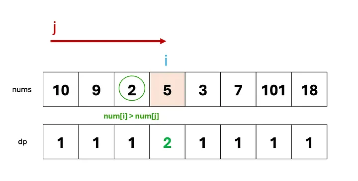
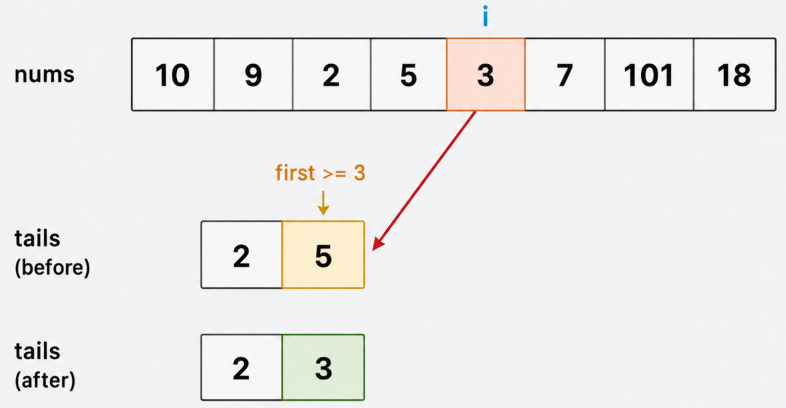
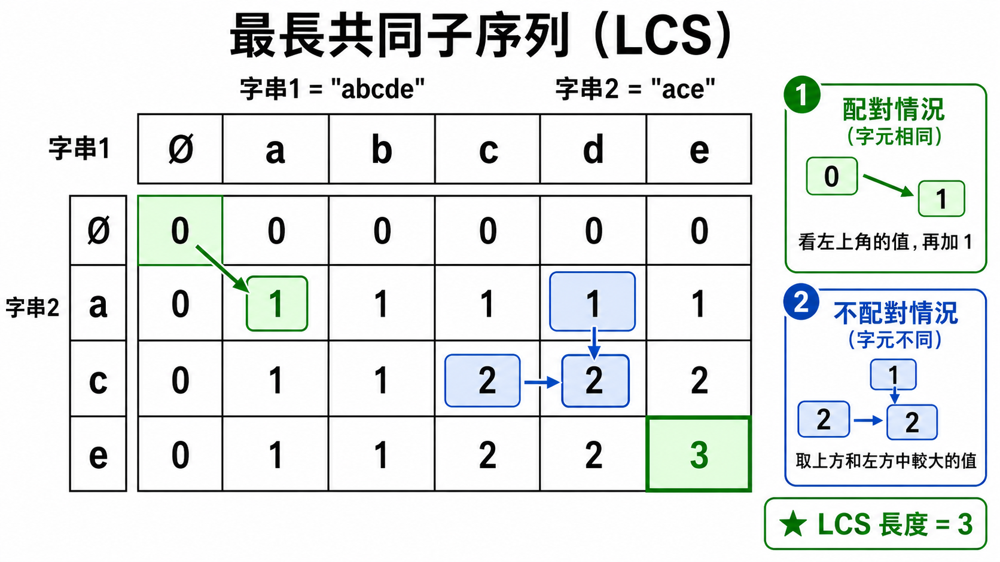
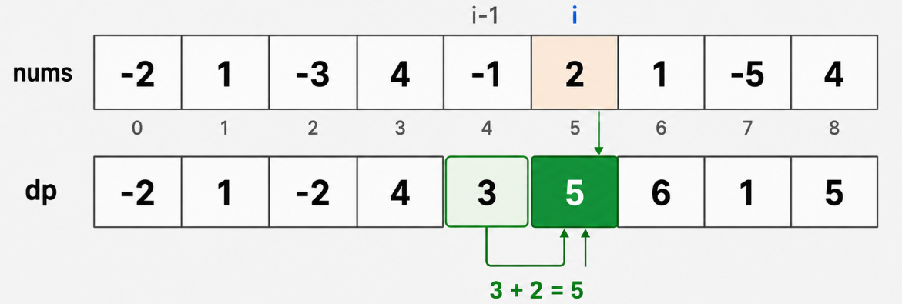
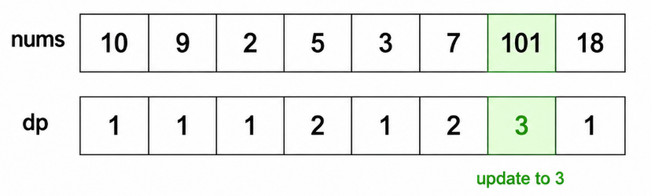
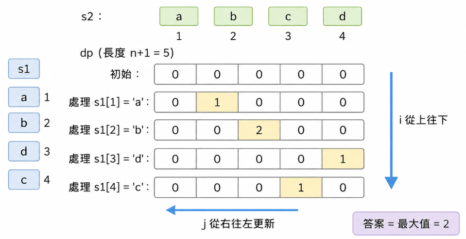
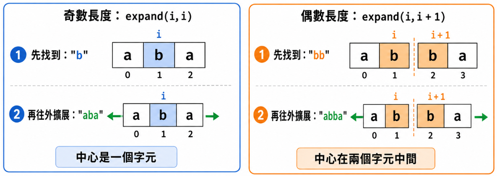

最麻煩的東西來啦，誰寫到 DP 誰倒楣

<!-- more -->
---
## 一維 DP 只跟「前面」有關
- Longest Increasing Subsequence (LIS) O(n^2)
- Longest Increasing Substring O(n) 
- Maximum Subarray O(n)

---
## 二維 DP 兩個方向在比較
- Longest Common Subsequence (LCS) O(mn)
- Longest Common Substring O(mn) 相比LCS 少考慮 `text1[i - 1] != text2[j - 1]` 的狀況，因為Substring要連續不能中斷
- Longest Palindromic Subsequence (LPS)（反轉後，利用LCS來解） O(n^2)
- Edit Distance

---
## 中心擴展 對稱結構
- palindromic substrings O(n^2)
- Longest palindromic substrings O(n^2)

---
## 背包 DP：選或不選  
- 01 Knapsack：每個物品只能選一次  
- 原始：二維 DP，物品 index × 容量  
- 優化：一維 DP，容量倒序  
- LeetCode 416, 494, 1049, 474
### 01 Knapsack 可行性 LeetCode 416
分兩個背包，重量一樣
只問能不能裝滿，不問最大 profit

bool canPartition(vector<int>& nums) {
	int n = nums.size();
	int sum = 0;
	for (auto num : nums) {
		sum += num;
	}
	if (sum % 2)
		return false;

	int target = sum / 2;

	vector<bool> dp(target + 1, false);
	dp[0] = true;
	
	for (int num : nums) {
		//正著跑會讓 01 背包變成「同一個物品可以重複使用」。
		for (int i = target; i >= num; i--) {
			//dp[i] 表示目前看過的num中，是否能湊出總和 i
			dp[i] = dp[i] || dp[i - num]; //看有沒有人可以跟num組成i
		}
	}
	return dp[target];
}


### 01 Knapsack 最大價值 LeetCode 474
每個字串只能選一次，限制是 `0` 的數量和 `1` 的數量，價值是選到幾個字串

int findMaxForm(vector<string>& strs, int m, int n) {
	vector<vector<int>> dp(m + 1, vector<int>(n + 1, 0));
	for(string &str : strs){
		int zeros = count(str.begin(), str.end(), '0');
		int ones = str.size() - zeros;

		for(int i = m; i >= zeros; i--){
			for(int j = n; j >= ones; j--){
				dp[i][j] = max(dp[i][j], dp[i - zeros][j - ones] + 1); // 不拿str, 拿str
			}
		}
	}
	return dp[m][n];
}


---
## 走方格 DP：從相鄰格轉移
- Unique Paths：只能往右或往下走，計算有幾種走法 O(mn)
- Unique Paths II：有障礙物的走方格 O(mn)
- Minimum Path Sum：從左上走到右下，找最小路徑和 O(mn)
- Triangle：從上往下走，找最小路徑和 O(n^2)
- Minimum Falling Path Sum：從上一列走到下一列，找最小路徑和 O(n^2)
- LeetCode 62, 63, 64, 120, 931

---
## 狀態機 DP：根據狀態轉移
- Best Time to Buy and Sell Stock：買賣股票
- 狀態通常分成「持有股票」和「沒有持有股票」
- 每一天根據前一天的狀態決定要買、賣、或不動
- LeetCode 121, 122
### 只能買賣一次 LeetCode 121

int maxProfit(vector<int>& prices) {
	int profit = 0;
	int min = prices[0];
	for (auto price : prices) {
		if (min < price)
			profit = max(profit, price - min);
		else
			min = price;
	}
	return profit;
}

### 買賣無限次 LeetCode 122


int maxProfit(vector<int>& prices) {
	int profit = 0;
	int min = prices[0];
	for (auto price : prices) {
		if (min < price)
			profit += price - min;

		min = price;
	}
	return profit;
}

---
## Sequence DP: Subsequences, Substrings, and Palindromes

### sequence 隨機挑
#### subsequence 子序列
sequence 之中，依照由左到右的順序，挑幾個數字出來，就是 subsequence
1 3 5 2 9 的子序列是 3 9  、1 5 2 9。

---
#### Longest Increasing Subsequence （ LIS ）最長遞增子序列
**leetcode 300. Longest Increasing Subsequence**

「最長遞增子序列」。所有子序列當中，遞增的、最長的子序列，可能有許多個。
1 3 5 2 9 的 LIS 是 1 3 5 9 。
##### 一維DP解 `n^2`

int lengthOfLIS(vector<int>& nums) {
    int n = nums.size();
    vector<int> dp(n, 1);
    int ans = 1;

    for (int i = 0; i < n; i++) {
        for (int j = 0; j < i; j++) {
            if(nums[j] < nums[i])
                dp[i] = max(dp[i], dp[j] + 1);
        }
        ans = max(ans, dp[i]);
    }
    return ans;


##### Greedy + Binary Search，O(n log n)

int lengthOfLIS(vector<int>& nums) {
	//Greedy + Binary Search，O(n log n)
	//lower_bound：找出vector中「大於或等於」val的「最小值」的位置
	vector<int> tails;

	for (int num : nums) {
		auto it = lower_bound(tails.begin(), tails.end(), num);

		if (it == tails.end()) {
			tails.push_back(num);
		} else {//找到大於num的數字，要替換掉他
			*it = num;
		}
	}

	return tails.size();
}


---
#### Longest Common Subsequence（LCS）最長共同子序列
**leetcode 1143. Longest Common Subsequence**
兩個 sequence 之間，所有共同子序列當中，最長的那一個。
A = a b c d e
B = a c b e
它們的 LCS 可能是：a c e 、 a b e
LCS 可能有許多個，但是長度一樣長

##### 二維DP解

int longestCommonSubsequence(string text1, string text2) {
	int m = text1.size();
	int n = text2.size();

	vector<vector<int>> dp(m + 1, vector<int>(n + 1, 0));

	for (int i = 1; i <= m; i++) {
		for (int j = 1; j <= n; j++) {
			if (text1[i - 1] == text2[j - 1])
				dp[i][j] = dp[i - 1][j - 1] + 1;
			else
				dp[i][j] = max(dp[i - 1][j], dp[i][j - 1]);
		}
	}

	return dp[m][n];
}


---
#### Longest Palindromic Subsequence（LPS）最長回文子序列
**leetcode 516. Longest Palindromic Subsequence**
所有回文子序列當中，最長的那一個
a b c b d a
其中一個 LPS 是：a b b a 長度是 `4`
##### 二維DP解
`dp[i][j] = s[i......j] ` 這段區間中的最長回文子序列**長度**


int longestPalindromeSubseq(string s) {
	int n = s.size();
	vector<vector<int>> dp(n, vector<int>(n, 0));

	for (int i = 0; i < n; i++) {
		dp[i][i] = 1; //最短的答案至少是長度 1
	}

	for (int len = 2; len <= n; len++) {
		for (int i = 0; i + len - 1 < n; i++) {
			int j = i + len - 1;

			if (s[i] == s[j]) {
				dp[i][j] = dp[i + 1][j - 1] + 2; //中間的 也就是無頭[i+1] 無尾[j-1] 再加上頭尾+2
			} else {
				dp[i][j] = max(dp[i + 1][j], dp[i][j - 1]); //挑頭或挑尾
			}
		}
	}

	return dp[0][n - 1];
}


##### LCS輔助解
回文正著讀、反著讀都一樣。
所以如果一段是回文子序列，它會同時出現在原字串和反轉字串裡。

int longestPalindromeSubseq(string s) {
	int n = s.size();
	string rev = s;
	reverse(rev.begin(), rev.end());
	vector<vector<int>> dp(n + 1, vector<int>(n + 1, 0));

	for(int i = 1;i <= n;i++){
		for(int j = 1;j <= n;j++){
			if(s[i-1] == rev[j-1])
				dp[i][j] = dp[i-1][j-1] + 1;
			else
				dp[i][j] = max(dp[i-1][j],dp[i][j-1]);
		}
	}
	return dp[n][n];
}


---
### Subarray 、 Substring 連續挑
連續挑一段出來，不能跳過中間的元素。
1 3 5 2 9
它的 subarray 是：3 5 2 、 1 3
#### Maximum Subarray
**Leetcode 53. Maximum Subarray**
最大連續子陣列和
##### 一維DP解

int maxSubArray(vector<int>& nums) {
	int n = nums.size();
	vector<int> dp(n);
	dp[0] = nums[0];

	int ans = dp[0];

	for (int i = 1; i < n; i++) {
		dp[i] = max(nums[i], dp[i - 1] + nums[i]); //max(不選前一個, 選前一個)
		ans = max(ans, dp[i]);
	}
	return ans;
}


##### Kadane 找出最大連續子陣列總和 == 壓縮成常數

int maxSubArray(vector<int>& nums) {
	int cur = nums[0];
	int ans = nums[0];

	for (int i = 1; i < nums.size(); i++) {
		cur = max(nums[i], cur + nums[i]); //max(不選前一個, 選前一個) 選擇重新開始，還是接續下去
		ans = max(ans, cur);
	}
	return ans;
}


---
#### Longest Increasing Subarray 
**Leetcode 674. Longest Continuous Increasing Subsequence**
1 3 5 2 9
它的 Longest Increasing Subarray  是：1 3 5 ，長度是 `3`
但它們的 Longest Increasing Subsequence（LIS）可以是：1 3 5 9，長度是 `4`。

##### 一維DP解

int findLengthOfLCIS(vector<int>& nums) {
	int n = nums.size();
	if (n == 0)
		return 0;

	vector<int> dp(n, 1);
	int ans = 1;

	for (int i = 1; i < n; i++) {
		if (nums[i] > nums[i - 1]){
			dp[i] = dp[i-1] + 1;
		}
		ans = max(ans, dp[i]);
	}
	return ans;
}


---
#### Longest Common Substring 最長共同子字串
**Leetcode 718. Maximum Length of Repeated Subarray**

A = abcdef
B = zbcdf

它們的 Longest Common Substring 是：bcd 長度是 `3`
但它們的 Longest Common Subsequence（LCS） 可以是：bcdf 長度是 `4`
##### 二維DP解
- 相比LCS 少考慮 `text1[i - 1] != text2[j - 1]` 的狀況，因為Substring要連續不能中斷

int findLength(vector<int>& nums1, vector<int>& nums2) {
	int m = nums1.size();
	int n = nums2.size();

	vector<vector<int>> dp(m + 1, vector<int>(n + 1, 0));
	int ans = 0;
	for (int i = 1; i <= m; i++) {
		for (int j = 1; j <= n; j++) {
			if (nums1[i - 1] == nums2[j - 1]) {
				dp[i][j] = dp[i - 1][j - 1] + 1;
				ans = max(ans, dp[i][j]);
			}
		}
	}
	return ans;
}

##### 壓縮成一維寫法
- 現在是要偷看左邊的舊資料，所以左邊不能先被更新。
	- `for (int j = n; j >= 1; j--)`

int findLength(vector<int>& nums1, vector<int>& nums2) {
    int m = nums1.size();
    int n = nums2.size();

    vector<int> dp(n + 1, 0);
    int ans = 0;

    for (int i = 1; i <= m; i++) {
        for (int j = n; j >= 1; j--) {
            if (nums1[i - 1] == nums2[j - 1]) {
                dp[j] = dp[j - 1] + 1;
                ans = max(ans, dp[j]);
            } else {
                dp[j] = 0;
            }
        }
    }
    return ans;
}


---
#### palindromic substrings 回文子字串
**數出有幾個回文子字串**
**Leetcode 647. palindromic substrings**
##### O(n^3) 暴力枚舉 `i, j` + 檢查回文

bool isPalindrome(string s, int i, int j) {
	while (i <= j) {
		if (s[i] != s[j]) {
			return false;
		}
		i++;
		j--;
	}
	return true;
}
int countSubstrings(string s) {
	int count = 0;
	for (int i = 0; i < s.length(); i++) {
		for (int j = i; j < s.length(); j++) {
			if (isPalindrome(s, i, j)) {
				count++;
			}
		}
	}
	return count;
}

##### 中心擴展

void expand(string& s, int left, int right, int& ans) {
	while (left >= 0 && right < s.size() && s[left] == s[right]) {
		ans++;
		left--;
		right++;
	}
}
int countSubstrings(string s) {
	int ans = 0;
	int n = s.size();

	for (int i = 0; i < n; i++) {
		expand(s, i, i, ans);     // 奇數 中間數左右一樣
		expand(s, i, i + 1, ans); // 偶數
	}

	return ans;
}


---
#### Longest Palindromic Substring 最長回文子字串
**Leetcode 5. Longest Palindromic Substring**
**比起 Palindromic Substring 多紀錄 start、maxLen而已**

s = a b c b d a
它們的 Longest Palindromic Substring 是：b c b 長度是 `3`
但它們的 Longest Palindromic Subsequence（LPS） 可以是：a b c b a 長度是 `5`

最短的答案至少是長度 `1`：a、b、c、b、d 都可以是回文
##### 中心擴展

void expand(string& s, int left, int right, int& start, int& maxLen) {
	while (left >= 0 && right < s.size() && s[left] == s[right]) {
		int len = right - left + 1;
		if(len > maxLen){
			maxLen = len;
			start = left;
		}
		left--;
		right++;
	}
}
string longestPalindrome(string s) {
	int n = s.size();

	int start = 0;
	int maxLen = 1;

	for (int i = 0; i < n; i++) {
		expand(s, i, i, start, maxLen);     // 奇數
		expand(s, i, i + 1, start, maxLen); // 偶數
	}

	return s.substr(start, maxLen);
}

