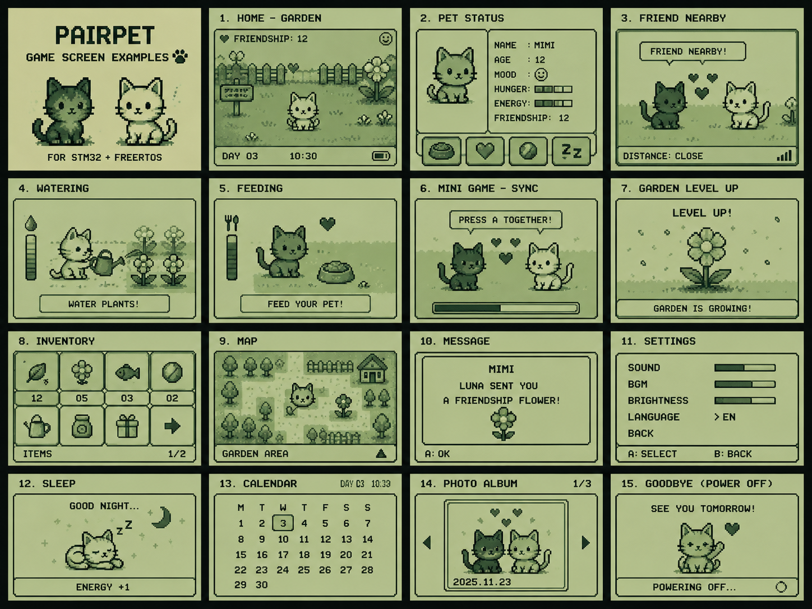
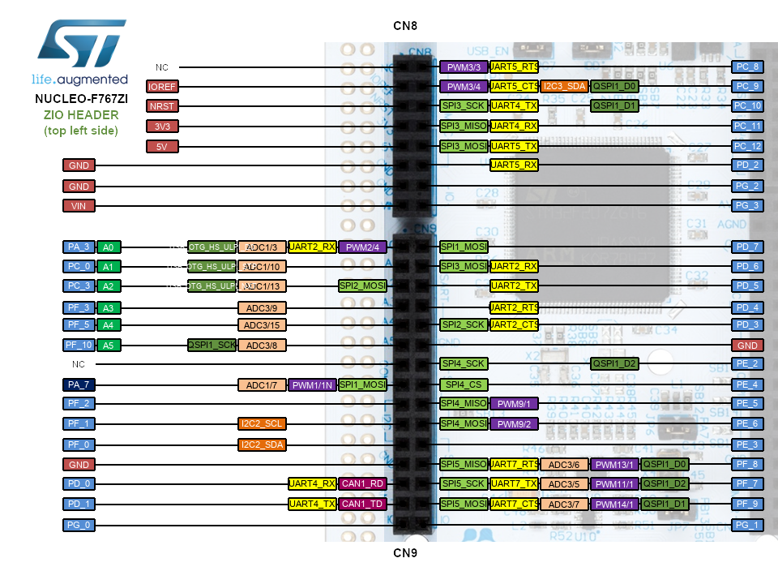
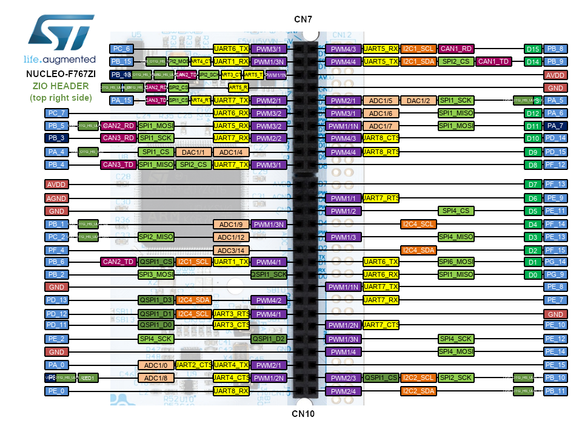
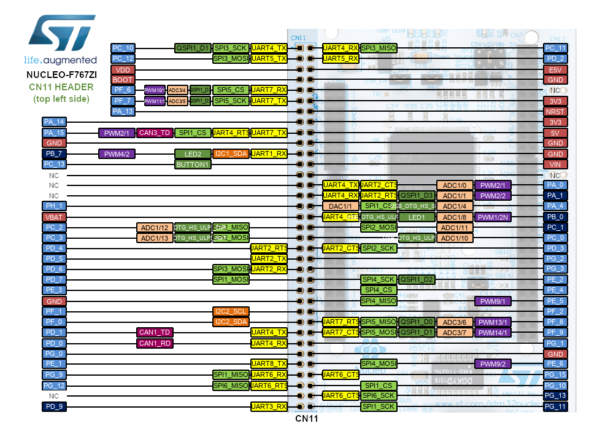
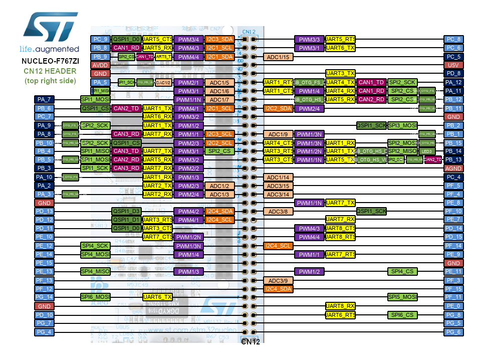

由於面試不順利，決定來亡羊補牢，補點小專案
一次性加了那麼多東西，最好是組的起來 : )

<!-- more -->
---
# 專案規劃與準備清單
## 系列文章

- Part 1：專案規劃與準備清單
- 
- 
- 
- 

> 以下都是目前幻想出來的
> 
> Part 6：顯示系統：ILI9341 TFT 與 SPI 繪圖
> SPI 初始化、ILI9341 driver、畫 pixel/rect/bitmap、DMA 或局部更新。
> 
> Part 7：Game Task：電子寵物狀態機
> 把 input 和 display 串起來，做寵物狀態、飢餓/心情/互動、簡單 animation。
> 
> Part 8：感測器整合：MPU-6050 與 BME280
> I2C register driver、校正資料、週期性 sensor task、motion / environment event。timeout、> retry、bus error。
> 
> Part 9：通訊模組：BLE 與 NFC 互動
> UART AT command、BLE RSSI / proximity、PN532 UID 讀取。NFC 走 UART / I2C / SPI 哪個比較適合。
> 
> Part 10：資料儲存：SPI Flash 與存檔格式
> W25Q128 erase/write/read、CRC、A/B slot、防止寫到一半斷電。
> 
> Part 11：音效、震動與回饋系統
> Timer PWM 蜂鳴器、震動馬達、非阻塞 feedback task。
> 
> Part 12：系統整合與 Debug 筆記
> 邏輯分析儀看 SPI/I2C/UART、log 格式、常見 bug、task 卡死、stack 不夠、priority 設錯。

---
## 目的
這個專案主要是為了補強 STM32 韌體開發能力，練習內容包含：

- 使用 **FreeRTOS** 設計多任務架構，例如 input、display、game、BLE、NFC、sensor、storage、audio 與 haptic task
- 使用 **SPI** 驅動 TFT 螢幕與外部 SPI Flash
- 使用 **I2C** 整合 IMU 與環境感測器
- 使用 **UART** 控制 BLE / NFC 模組，並保留 debug console
- 使用 **GPIO** 處理按鍵、五向導航鍵與外部中斷
- 使用 **Timer / PWM** 控制蜂鳴器音效、震動馬達回饋與可能的背光亮度
- 練習各類周邊的 driver 開發、初始化流程、錯誤處理與 timeout / retry 機制
- 使用邏輯分析儀驗證 SPI、I2C、UART 與 GPIO interrupt timing
- 以一個接近產品原型的方式，整合顯示、輸入、感測、通訊、儲存、音效與觸覺回饋

這個專案會先使用 **NUCLEO-F767ZI** 完成 FreeRTOS 架構、周邊 driver 與系統整合；
未來如果功能穩定，再考慮移植到較小型或內建 BLE 的 STM32 平台，例如 STM32WB55，做成更接近可攜式產品的版本。

---
## 一個有趣的小目標
雖然這個專案一開始是因為想補強韌體開發能力，但我不想只是為了找工作或練習周邊，而硬湊一堆功能。
因此想做一個覺得有趣，而且每個功能都能自然整合進去的小裝置。

所以最後決定做一台 Game Boy 風格的互動電子寵物裝置。
可以顯示像素風寵物畫面，支援按鍵操作、BLE 靠近偵測、NFC touch 互動、感測器輸入、音效、震動回饋與資料儲存。

---
## 為什麼從 STM32 開始
Arduino、ESP32、STM32 都有成熟的開發生態，也都可以做到 interrupt、timer、RTOS、UART / SPI / I2C、感測器控制與實機整合。ESP32 有 FreeRTOS，Arduino 也不是完全不能碰底層；同樣地，STM32 也可以透過不同系列或外部模組支援無線連線。
### Arduino、ESP32、STM32 三者比較

#### Arduino 
Arduino 的預設開發模式偏向快速驗證與高階封裝，很多硬體初始化、driver 細節與資源配置已經被 framework 處理掉。但容易停留在呼叫 library 完成功能，而不是完整理解底層初始化與硬體互動流程。

#### ESP32 
ESP32 的功能整合度高，實務上常會同時接觸 FreeRTOS、Wi-Fi / BLE stack、dual-core、ESP-IDF 架構與平台特定 API。這些內容很有價值，但學習路線比較容易往連網 SoC、應用整合與 Espressif 生態

#### STM32 
STM32 的開發流程則比較直接圍繞一般 MCU 韌體常見的核心主題，例如 clock tree、GPIO、interrupt、DMA、timer、UART / SPI / I2C、memory layout、RTOS integration，以及 driver layer。

### 以韌體工程師的角度
IC 設計公司的產品類型很多，不同公司的 firmware / driver 工作也不一樣，例如：

* **MediaTek** 不只做 wireless chip，也有手機 SoC、IoT、TV、networking、automotive 與 ASIC 相關產品。
* **Realtek** 不只做音效 IC，也有 Ethernet、Wi-Fi、Bluetooth、網通 IC、audio codec 與 multimedia SoC。
* **Novatek** 主要在 display driver IC、TCON、TDDI、TV / display SoC。
* **Phison** 和 **Silicon Motion** 則比較偏 NAND flash controller、SSD controller、eMMC / UFS storage controller。

所以從 IC 設計公司的角度來看，韌體工程師接觸的不是單一情境，而是依產品線不同，去設定與驗證不同的硬體 IP block，例如：

* **SoC**：可能會碰到 clock、boot flow、power management、interrupt、DMA。
* **網通晶片**：可能會碰到 Ethernet / Wi-Fi / Bluetooth driver、MAC、PHY、queue、封包收發。
* **Display IC**：可能會碰到 panel init sequence、display timing、MIPI command、gamma table。
* **Audio codec**：可能會碰到 I2S / PCM、PLL、sample rate、audio path。
* **SSD controller**：可能會碰到 NAND flash、ECC、FTL、wear leveling、bad block management 與 NVMe / SATA command flow。

這些產品線雖然不同，但都需要看硬體文件、理解 memory map、設定 register、處理 interrupt / DMA，並透過實機驗證硬體行為。STM32 不能直接模擬這些 IC 公司的晶片環境，但適合用來建立這些共通基本功。

---
## 為什麼選擇 FreeRTOS
這個專案雖然是做一台 Game Boy 風格的互動電子寵物裝置，但韌體架構不打算完全照以前 Game Boy 那種方式來設計。以前的 Game Boy 是一台硬體架構相對固定的遊戲主機，CPU、顯示控制、音效、按鍵輸入、記憶體映射與卡匣資料讀取都有明確分工。
遊戲程式通常會以主迴圈為核心，配合 VBlank interrupt、timer interrupt、按鍵掃描，以及固定時機的畫面資料更新，來完成輸入處理、遊戲狀態更新、畫面繪製與音效控制。
這種設計很適合當時的遊戲主機，因為它的主要任務很明確：根據每一個 frame 更新輸入、遊戲邏輯、畫面與音效。

但這次的專案目標不只是做一個像 Game Boy 的外觀或畫面，而是想把顯示、輸入、感測、BLE、NFC、儲存、音效與震動回饋都整合在同一個小系統裡。這些功能各自有不同的更新頻率與即時性需求，如果全部塞在同一個 bare-metal while loop 裡，後續很容易變成一堆狀態判斷、delay、flag 與 callback 互相交錯，程式架構會越來越難維護。

透過 FreeRTOS，可以練習 task priority、queue、semaphore、mutex、software timer，以及 interrupt 與 task 之間的資料同步。因為實際 firmware 開發常常需要處理多個模組同時運作、共享資源保護、事件通知、timeout 與錯誤恢復。

---
## 準備的物品
約花 **TWD 4,000**，其中 **NUCLEO-F767ZI 約 TWD 830**，**DSLogic Plus 邏輯分析儀約 TWD 2,100**。
| 類別       | 名稱與規格                                                           | 技術                                               | 價格     | 連結                                                                                                                                                                                                                                              |
| ---------- | -------------------------------------------------------------------- | -------------------------------------------------- | -------- | ------------------------------------------------------------------------------------------------------------------------------------------------------------------------------------------------------------------------------------------------- |
| 主開發板   | **STM32 Nucleo-144 NUCLEO-F767ZI 開發板，STM32F767ZIT6 MCU**         | STM32、FreeRTOS、SPI、I2C、UART、GPIO、DMA         | NT$831   | [淘寶](https://item.taobao.com/item.htm?id=583380635561&mi_id=0000RMdeV8pkSiinzletEtaWPGkHazcy2VVPjIQ47AACO2k) / [spec](找不到韌體工作之亡羊補牢專案/spec/rm0410-stm32f76xxx-and-stm32f77xxx-advanced-armbased-32bit-mcus-stmicroelectronics.pdf) |
| 顯示器     | **3.2 吋 ILI9341 TFT LCD，320×240，支援 SPI / 16-bit parallel 介面** | SPI、TFT driver、bitmap、tilemap、sprite、DMA      | NT$316   | [淘寶](https://item.taobao.com/item.htm?id=606268548585&mi_id=0000Zc9-ZRRVV7yVcx3mkuX6IJ4hIfQXhPZtoFB8o1q-zVQ) / [spec](找不到韌體工作之亡羊補牢專案/spec/ILI9341_spi_screen.pdf)                                                                 |
| BLE 模組   | **E104-BT5032A-TB BLE 5.0 UART 模組，nRF52832**                      | UART、AT command、BLE advertising、scanning、RSSI  | NT$287   | [淘寶](https://item.taobao.com/item.htm?id=680293406829&mi_id=0000SXUQRir-8Dg4lgiYtEcUYPgfcy65ASHsEIYCNFFeuaI) / [spec](找不到韌體工作之亡羊補牢專案/spec/E104-BT5032A-TB.pdf)                                                                    |
| NFC 模組   | **PN532 NFC / RFID 讀寫模組**                                        | UART / I2C / SPI、NFC frame、UID 讀取              | NT$93    | [淘寶](https://item.taobao.com/item.htm?id=1003555893697&mi_id=0000dUqHjZ-jVVNQset-qRyMF-oA0XsbTLhhRvkzSaXKOgQ) / [spec](找不到韌體工作之亡羊補牢專案/spec/PN532_NFC.pdf)                                                                         |
| IMU 感測器 | **MPU-6050 / GY-521 六軸 IMU 模組，加速度計 + 陀螺儀**               | I2C、register driver、motion detect、EXTI          | NT$30    | [淘寶](https://item.taobao.com/item.htm?id=1050364010446&mi_id=0000M0mxSUpmGCAlQPhcoNxcgYrVVborBh1-aIGY0BBwkj8)                                                                                                                                   |
| 環境感測器 | **BME280 3.3V 環境感測模組，溫度 / 濕度 / 氣壓**                     | I2C、sensor calibration、週期性 sensor task        | NT$106   | [淘寶](https://item.taobao.com/item.htm?id=943493996162&mi_id=0000AEM-zEjLt-kQZOz0pYtun3PXTmeIlyVvkxle7LqDxAQ) / [spec](找不到韌體工作之亡羊補牢專案/spec/BME280-3.3V.pdf)                                                                        |
| 外部 Flash | **W25Q128 SPI NOR Flash 模組，128 Mbit / 16 MB**                     | SPI、Flash erase/write、CRC、A/B save slot         | NT$20    | [淘寶](https://item.taobao.com/item.htm?id=953014550610&mi_id=00001RZA5Tcr5u4JsWQL-hdUrpNUTCpT5s5EjdvpsLNyZ6M)                                                                                                                                    |
| 邏輯分析儀 | **DSLogic Plus 個人版，16 通道邏輯分析儀，最高 400 MS/s**            | Protocol decode、timing debug、firmware validation | NT$2,104 | [淘寶](https://item.taobao.com/item.htm?id=43809938149&mi_id=00001lxOP9eS7zxlMeHXEzrbyfajgSorK7RKRDj35p6DkPU)                                                                                                                                     |
| 震動回饋   | **微型直流震動馬達模組，GPIO 控制**                                  | GPIO / PWM、haptic task                            | NT$24    | [淘寶](https://item.taobao.com/item.htm?id=584941055869&mi_id=0000t2_irSNoegzocnOlO9q6ACLuc0ceklWzlw-XOPV2OmM)                                                                                                                                    |
| 音效       | **無源蜂鳴器模組，低電位觸發**                                       | Timer PWM、audio task                              | NT$6     | [淘寶](https://item.taobao.com/item.htm?id=522555899513&mi_id=0000JcheWQ096V7htVrWv97yU8VqJIVP1J01c9aiKqTNNrE)                                                                                                                                    |
| 操作輸入   | **五向導航按鍵模組，方向鍵 + 中央確認鍵**                            | GPIO、debounce、input event queue                  | NT$17    | [淘寶](https://item.taobao.com/item.htm?id=584800322960&mi_id=0000vRwpW49P7md48pxranLfqJqK6iCb8OLfTrDFLnQMEDY)                                                                                                                                    |
| 操作輸入   | **類比搖桿 / 遊戲輸入擴充模組**                                      | GPIO / ADC、按鍵事件                               | NT$32    | [淘寶](https://item.taobao.com/item.htm?id=726753606812&mi_id=00009T3Y2MeVX2nWYHduKFOOXG2Mm6IBU0Suqx9YOAbpPH8)                                                                                                                                    |
| 按鍵       | **12×12×7.3mm 直插式輕觸開關，方頭，20 顆**                          | GPIO、debounce、short / long press                 | NT$14    | [淘寶](https://item.taobao.com/item.htm?id=556956143399&mi_id=00006Z7MgE9Hw_UGpvu1AL7S9KkaBwAS0pwbUHOHOgE7n24)                                                                                                                                    |
| 按鍵配件   | **12×12mm 輕觸開關用圓形按鍵帽，白色，10 顆**                        | 按鍵手感、外觀原型                                 | NT$2     | [淘寶](https://item.taobao.com/item.htm?id=568451377652&mi_id=0000Xy3kQMuSJgE5NFLRbc89pDRqBF3Xknt84E0xToun9F0)                                                                                                                                    |
| 原型接線   | **MB-102 透明麵包板， 165×55mm，2 片**                               | 模組整合、快速測試、原型接線                       | NT$24    | [淘寶](https://item.taobao.com/item.htm?id=522572405070&mi_id=0000TliBLEr7bitnb1g3BJBtxuk-azyk8G4xW2bLkccPf9A)                                                                                                                                    |
| 原型接線   | **21cm 杜邦線組，40P 彩排線，母對母 / 公對公 / 母對公各 1 組**       | 開發板、麵包板與模組接線                           | NT$58    | [淘寶](https://item.taobao.com/item.htm?id=558182761958&mi_id=0000ZLpDM_1_yXS5i7AO6paFaX3ahsQwG9XXOlAFREM2zi8)                                                                                                                                    |

