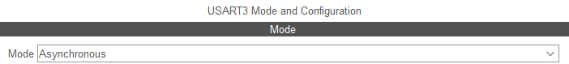
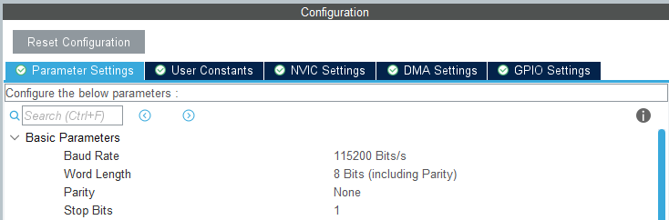
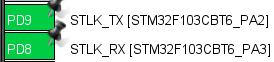
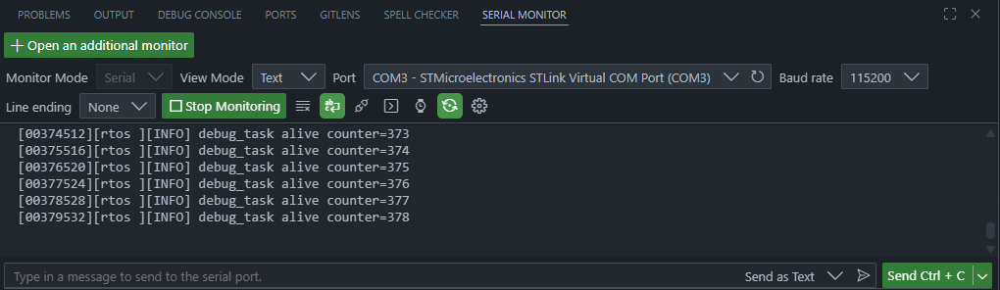

Part 1 講了一堆偉大的規劃，越來越覺得做不起來了。
沒關係，環境搭起來、燒一燒板子就成功一半啦。

<!-- more -->
---
## 系列文章

- 
- Part 2：開發環境與 FreeRTOS 架構
- 

---
## 本篇目標
- 建立 STM32CubeMX / STM32CubeIDE 專案，並啟用 FreeRTOS
- 完成最小硬體設定，包含系統時脈、UART log 輸出與板上 LED heartbeat
- 建立最小可驗證的 FreeRTOS 範例，確認 scheduler 可以正常運作
- 規劃專案資料夾結構，為後續 driver / app / board 分層做準備

---
## 專案下載

本篇文章對應的完整範例專案已整理在 GitHub Release 中，
如果想直接對照程式碼或跳過環境建立流程，可以從以下連結下載

[🍦下載本篇範例專案-Part 2🍦](https://github.com/likeyou600/gb_project/releases/tag/Part2)

---
## 建立 STM32CubeIDE / CubeMX / FreeRTOS專案
因為新版的 STM32CubeIDE 已經跟 STM32CubeMX 脫鉤，
用 CubeMX 建好專案，再匯入 CubeIDE。

### 0. 下載連結
- [STM32CubeIDE](https://www.st.com/en/development-tools/stm32cubeide.html)
- [STM32CubeMX](https://www.st.com/en/development-tools/stm32cubemx.html)
  - 用 STM32CubeMX 的版本，STM32CubeMX2是新MCU用的

### 1. 建立 STM32CubeMX 專案
1. Start My Project from Board
2. Board Selector -> NUCLEO-F767ZI
3. Project Manager
   - Project Name: gb_f767zi
   - Project Location : `\Desktop\gb_project\firmware`
   - Toolchain / IDE: STM32CubeIDE
   - 左側選到 Code Generator
   - 開啟 Generate peripheral initialization as a pair of '.c/.h' files per peripheral
     - 若沒有選，main.c 會變成什麼都塞在一起，很難維護。
     - 選了就會變成分檔模式
4. Generate Code

### 2. 匯入 STM32CubeIDE
1. File -> Import
2. Select STM32CubeMX/STM32CubeIDE Project
3. Directory Select : `\Desktop\gb_project\firmware`
4. Finish

### 3. 確認專案可以簡單編譯
1. 在 STM32CubeIDE 中選取 `gb_f767zi`
2. Project -> Build Project
3. 確認沒有 error

### 4. 啟用 FreeRTOS
1. 用 STM32CubeMX 打開：
   - `firmware/gb_f767zi/gb_f767zi.ioc`

2. 啟用 FreeRTOS：
   - Categories: Middleware and Software Packs -> FREERTOS
   - Interface: CMSIS_V2
   - Advanced Settings: USE_NEWLIB_REENTRANT: Enabled

3. 修改 HAL timebase：
   - Categories: System Core -> SYS
   - Timebase Source: TIM6

4. Generate Code

5. 回到 STM32CubeIDE build：
   - Project -> Build Project

#### 設定原因
- FreeRTOS 使用 CMSIS_V2，是因為 CMSIS-RTOS v2 API 較新，介面也比較適合之後建立多 task 架構。

- 啟用 USE_NEWLIB_REENTRANT，是為了讓 newlib C library 在多 task 環境下比較安全，尤其之後可能會使用 `printf`、`snprintf`、字串處理等功能。不過這會增加 RAM 使用量。

- HAL timebase 改成 TIM6，是因為 FreeRTOS 通常會使用 SysTick 作為 RTOS tick。如果 HAL 也使用 SysTick，兩者會共用同一個 tick 來源，容易造成 timing 或 delay 行為混淆。改用 TIM6 後，SysTick 給 FreeRTOS 使用，TIM6 給 HAL timebase 使用，責任比較清楚。

### 5. 此時的資料夾架構


gb_project/
└─ firmware/
   └─ gb_f767zi/
      ├─ gb_f767zi.ioc            # CubeMX 設定檔，管理 pinout、clock、peripheral、FreeRTOS
      ├─ STM32F767ZITX_FLASH.ld   # Flash linker script
      ├─ STM32F767ZITX_RAM.ld     # RAM linker script
      ├─ Core/
      │  ├─ Inc/                  # 專案 header、HAL config、FreeRTOSConfig
      │  ├─ Src/                  # main、FreeRTOS task、interrupt、HAL init
      │  └─ Startup/              # MCU startup assembly
      ├─ Drivers/
      │  ├─ CMSIS/                # ARM / STM32 CMSIS device definitions
      │  └─ STM32F7xx_HAL_Driver/ # STM32F7 HAL driver
      └─ Middlewares/
         └─ Third_Party/
            └─ FreeRTOS/          # FreeRTOS kernel source


---
## 最小硬體設定

在接上 TFT、BLE、NFC、感測器之前，先確認開發板本身可以穩定運作。
只先處理系統時脈、UART debug console / `printf()` 輸出。

### 系統時脈設定
系統時脈是在 STM32CubeMX 的 `Clock Configuration` 頁面設定。
先使用 CubeMX 針對 NUCLEO-F767ZI 產生的預設 clock tree，不特別手動調整 PLL、HSE 或 prescaler。

設定位置：
1. 打開 `gb_f767zi.ioc`
2. 切到上方的 `Clock Configuration`
3. 確認頁面沒有紅色錯誤提示
4. 先保持 CubeMX 預設值

Clock 設定會影響 CPU、UART、SPI、I2C、Timer 與 FreeRTOS tick。  
如果 clock 設錯，後面可能會出現：
- UART terminal 顯示亂碼
- Timer / PWM 頻率不準
- SPI 速度不如預期
- I2C timing 異常
- `osDelay()` 或 timeout 行為看起來怪怪的

等後續接上 TFT、Flash 或蜂鳴器時，如果需要調整 SPI 或 Timer 速度，再回來修改 clock tree。

### UART debug console
#### NUCLEO-F767ZI 硬體設計
NUCLEO-F767ZI 板上除了主 MCU 之外，還有一顆 ST-LINK。  
ST-LINK 除了負責燒錄與 debug，也可以把主 MCU 的 UART 訊號轉成電腦上的 Virtual COM Port。

以 NUCLEO-F767ZI 來說，板子硬體上預設會把主 MCU 的 `USART3` 訊號接到 ST-LINK Virtual COM Port 電路。  
也就是：`STM32F767ZI USART3 -> ST-LINK UART bridge -> USB -> PC terminal`

#### UART、USART 差異

* `UART`：Universal Asynchronous Receiver / Transmitter，只支援非同步序列通訊
* `USART`：Universal Synchronous / Asynchronous Receiver / Transmitter，同時支援同步與非同步模式

一般 debug console 使用的是非同步序列通訊，也就是常見的 `TX / RX / baud rate` 用法。
所以即使 CubeMX 裡顯示的是 `USART3`，這裡實際上會把它當作一般 UART debug console 使用。

同步模式可以想成 USART 額外提供一條 clock 訊號，資料會跟著 clock 一起傳輸。
非同步 UART 則沒有 clock，雙方只要事先約好 baud rate，例如 `115200`，就能透過 TX / RX 傳資料。

#### NUCLEO-F767ZI .ioc 設定
前面提到 NUCLEO-F767ZI 板子電路上預設會把主 MCU 的 `USART3` 接到 ST-LINK 的 Virtual COM Port。  
所以在 CubeMX 裡，我們需要把對應的腳位設定成 `USART3` 功能，並設定 UART 的通訊參數。

CubeMX 設定位置：
1. 打開 `gb_f767zi.ioc`
2. 切到 Pinout & Configuration
3. 左側選擇 Connectivity -> USART3
4. 確認上方 Mode 為 `Asynchronous`
 
5. 下方 Parameter Settings
6. 確認設定為常見的 `115200 8N1`：

7. 接著右側的Pinout view

```text
PD8  -> USART3_TX
PD9  -> USART3_RX
```

---
### UART printf retarget
STM32 裡直接使用 `printf()` 時，預設不會自動從 UART 輸出。  
所以需要把 C library 的 `_write()` 函式導到 UART。
在 `Core/Src/syscalls.c` 裡找到 `_write()`，修改成：

上面補上
#include "stm32f7xx_hal.h"
#include "usart.h"

__attribute__((weak)) int _write(int file, char *ptr, int len)
{
  (void)file;
  HAL_UART_Transmit(&huart3, (uint8_t *)ptr, len, HAL_MAX_DELAY);
  // int DataIdx;
  // for (DataIdx = 0; DataIdx < len; DataIdx++)
  // {
  //   __io_putchar(*ptr++); //原本的只是weak symbol
  // }
  return len;
}


UART handle 通常可以在下面兩個檔案確認：

Core/Src/usart.c
Core/Inc/usart.h


`Core/Inc/usart.h` 裡可能會看到：

extern UART_HandleTypeDef huart3;


#### 測試 printf 輸出
完成 retarget 後，可以先在 FreeRTOS scheduler 啟動前測試一次：

printf("[00000000][main][INFO] system boot\r\n");


#### PC 端 terminal 設定
電腦端可以使用任一種 serial terminal，例如：
- vscode extensions - Serial Monitor

- PuTTY
- MobaXterm

設定如下：

Port      : ST-LINK Virtual COM Port 對應的 COM port
Baud rate : 115200
Data bits : 8
Parity    : None
Stop bits : 1
Flow Ctrl : None


---
## FreeRTOS 最小範例

為了確認 FreeRTOS scheduler 正常運作
建立兩個小 task：
- `heartbeat_task`
- `debug_task`

### heartbeat_task

`heartbeat_task` 的用途很單純：讓板上 LED 固定閃爍。

如果 LED 持續閃爍，至少可以確認：

- MCU 沒有卡死
- FreeRTOS scheduler 有正常運作
- 這個 task 有被排程執行

概念如下：


void heartbeat_task(void *argument)
{
    (void)argument;
    for (;;)
    {
        HAL_GPIO_TogglePin(GPIOB, GPIO_PIN_0);
        osDelay(500);
    }
}


這裡的 GPIO pin 要依照 CubeMX 對 NUCLEO-F767ZI 板上 LED 的設定調整。  
如果後面發現 LED 沒有閃，先不要懷疑 FreeRTOS，先確認 LED pin 是否對應正確。

### debug_task

`debug_task` 用來週期性印出系統狀態。

初期只需要確認 UART log 可以輸出：


void debug_task(void *argument)
{
    (void)argument;

    uint32_t counter = 0;

    for (;;)
    {
        printf("[%08lu][rtos ][INFO] debug_task alive counter=%lu\r\n",
               HAL_GetTick(),
               counter++);

        osDelay(1000);
    }
}


### 確認 FreeRTOS scheduler 正常運作
因為 CubeMX 專案是這個流程
`main.c -> osKernelInitialize() -> MX_FREERTOS_Init() -> osKernelStart()`
把 task 建立放在 freertos.c 的 USER CODE BEGIN RTOS_THREADS 最符合 CubeMX 的做法。

int main(void){
    ...
    /* Init scheduler */
    osKernelInitialize();  /* Call init function for freertos objects (in cmsis_os2.c) */
    MX_FREERTOS_Init();

    /* Start scheduler */
    osKernelStart();
    ...
}



/* Private variables ---------------------------------------------------------*/
/* USER CODE BEGIN Variables */
osThreadId_t heartbeatTaskHandle;
const osThreadAttr_t heartbeatTask_attributes = {
  .name = "heartbeat",
  .stack_size = 256 * 4,
  .priority = (osPriority_t) osPriorityLow,
};

osThreadId_t debugTaskHandle;
const osThreadAttr_t debugTask_attributes = {
  .name = "debug",
  .stack_size = 512 * 4,
  .priority = (osPriority_t) osPriorityLow,
};

/* USER CODE END Variables */

void MX_FREERTOS_Init(void) {
  /* USER CODE BEGIN RTOS_THREADS */
  /* add threads, ... */
  heartbeatTaskHandle = osThreadNew(heartbeat_task, NULL, &heartbeatTask_attributes);
  debugTaskHandle = osThreadNew(debug_task, NULL, &debugTask_attributes);
  /* USER CODE END RTOS_THREADS */
}


目前最小系統完成後，預期會看到兩個現象：

1. 板上 LED 每 500 ms 閃爍一次

<video class="rebakery-lazy-video" controls preload="none" playsinline controlslist="nodownload" poster="IMG_9082-poster.png">
  <source data-src="IMG_9082.MP4" type="video/mp4">
  你的瀏覽器不支援影片播放。
</video>

2. UART terminal 每 1 秒輸出一次 debug log


[00001000][rtos][INFO] debug_task alive counter=0
[00002000][rtos][INFO] debug_task alive counter=1
[00003000][rtos][INFO] debug_task alive counter=2



這樣就代表 Part 2 的基礎環境已經成立。

---

## 規劃專案資料夾結構

CubeMX 產生的 `Core/` 和 `Drivers/` 先盡量保持乾淨。  
自己寫的 app、driver wrapper、board support code 另外整理，避免之後 CubeMX 重新產生程式時混在一起。

目前先規劃成這樣：


gb_project/
└─ firmware/
   └─ gb_f767zi/
      ├─ Core/                  # CubeMX 產生：main、gpio、usart、freertos 等
      ├─ Drivers/               # CubeMX 產生：STM32 HAL / CMSIS
      ├─ Middlewares/           # CubeMX 產生：FreeRTOS 等 middleware
      │
      ├─ App/                   # 專案主要邏輯
      │  ├─ Inc/
      │  │  ├─ app_main.h
      │  │  ├─ app_config.h
      │  │  └─ app_log.h
      │  ├─ Src/
      │  │  ├─ app_main.c
      │  │  └─ app_log.c
      │  ├─ Tasks/              # FreeRTOS task / thread 邏輯
      │  ├─ Services/           # 跨功能服務，例如 log、storage、input manager
      │  ├─ Game/               # 遊戲規則、狀態機、場景流程
      │  └─ UI/                 # 畫面、選單、顯示邏輯
      │
      ├─ Board/                 # 跟目前這塊板子相關的包裝，給 APP 快速操作用
      │
      └─ Components/            # 外部 IC / 可重用元件 driver
         ├─ ili9341/
         ├─ mpu6050/
         ├─ bme280/
         ├─ w25q128/
         └─ pn532/


目前各資料夾的定位先暫定如下：
- `App/`
  - 專案主要邏輯
  - 之後的 task、event、state machine 會放在這裡
  - App/ 盡量不要直接依賴特定板子的 pin 腳，例如 LD1_Pin、GPIOB、huart3。這些硬體細節應該透過 Board/ 包起來。

- `Board/`
  - 放「這塊板子」相關的硬體對應與 wrapper。
  - 例如 LED、UART、GPIO mapping
  - GPIO / UART / SPI / I2C 的 board-level 操作

- `Components/`
  - 之後放 ILI9341、MPU6050、BME280、W25Q128、PN532 等 driver

這樣做的原因是希望之後如果從 F767ZI 移植到其他 STM32 板子，能把變動集中，而不是讓 app 邏輯散落在各處。

### 修改 .cproject，讓專案引入 APP 程式碼

#### 1. 加入 Source Folder
.cproject 裡有兩組 `<sourceEntries>`，Debug 和 Release 都要加入。


<cconfiguration id="com.st.stm32cube.ide.mcu.gnu.managedbuild.config.exe.debug>
<cconfiguration id="com.st.stm32cube.ide.mcu.gnu.managedbuild.config.exe.release>
    <sourceEntries>
        <entry flags="VALUE_WORKSPACE_PATH|RESOLVED" kind="sourcePath" name="Core"/>
        <entry flags="VALUE_WORKSPACE_PATH|RESOLVED" kind="sourcePath" name="Middlewares"/>
        <entry flags="VALUE_WORKSPACE_PATH|RESOLVED" kind="sourcePath" name="Drivers"/>

        #新添加
        <entry flags="VALUE_WORKSPACE_PATH|RESOLVED" kind="sourcePath" name="App"/>
        <entry flags="VALUE_WORKSPACE_PATH|RESOLVED" kind="sourcePath" name="Board"/>
        <entry flags="VALUE_WORKSPACE_PATH|RESOLVED" kind="sourcePath" name="Components"/>
    </sourceEntries>


這個設定的意思是，App/ Board/ Components/裡面的 .c 會被編譯

#### 2. 加入 Include Paths
在 `.cproject` 裡，**Debug** 和 **Release** 是分開設定的。
每個 build configuration 裡，又會分成兩種 include paths：
* **C compiler include paths**
* **Assembler include paths**

所以總共會有四個地方需要設定。

其中最常用的是 **C compiler include paths**，主要是給 `.c` 檔在編譯時尋找 `.h` 標頭檔，例如：

之後程式可以直接 include
#include "app_main.h"
------------------------
而不用寫成：
#include "../../App/Inc/app_main.h"


而 **Assembler include paths** 則是給 `.s` / `.S` 組語檔使用，例如 startup assembly 需要 include 其他檔案時會用到。

一般 STM32 專案主要會用到 C compiler include paths。不過 CubeIDE 會把 **C** 和 **Assembler** 的 include paths 分開管理，所以建議 Debug / Release 兩邊，以及 C / Assembler 兩種 include paths 都一起加上，設定會比較一致，也比較不容易漏掉。



<cconfiguration id="com.st.stm32cube.ide.mcu.gnu.managedbuild.config.exe.debug>
<cconfiguration id="com.st.stm32cube.ide.mcu.gnu.managedbuild.config.exe.release>
    <tool id="com.st.stm32cube.ide.mcu.gnu.managedbuild.tool.c.compiler>
    <tool id="com.st.stm32cube.ide.mcu.gnu.managedbuild.tool.assembler>

        <listOptionValue builtIn="false" value="../App/Inc"/>
        <listOptionValue builtIn="false" value="../App/Tasks/Inc"/>
        <listOptionValue builtIn="false" value="../App/Services/Inc"/>
        <listOptionValue builtIn="false" value="../App/Game/Inc"/>
        <listOptionValue builtIn="false" value="../App/UI/Inc"/>

        <listOptionValue builtIn="false" value="../Board/Inc"/>

        <listOptionValue builtIn="false" value="../Components/ili9341/Inc"/>
        <listOptionValue builtIn="false" value="../Components/mpu6050/Inc"/>
        <listOptionValue builtIn="false" value="../Components/bme280/Inc"/>
        <listOptionValue builtIn="false" value="../Components/w25q128/Inc"/>
        <listOptionValue builtIn="false" value="../Components/pn532/Inc"/>


## 本篇小結
Codex 太神啦，居然自動幫我把 .cproject 改好了。

以前做 FSW 的時候，通常不太需要在專案初期特別考慮這些設定，但這次才發現，像是：
`Generate peripheral initialization as a pair of '.c/.h' files per peripheral`
這種選項其實還滿有趣的。會影響程式碼產生的結構，也會影響後續維護、模組切分跟版本管理的方式。
