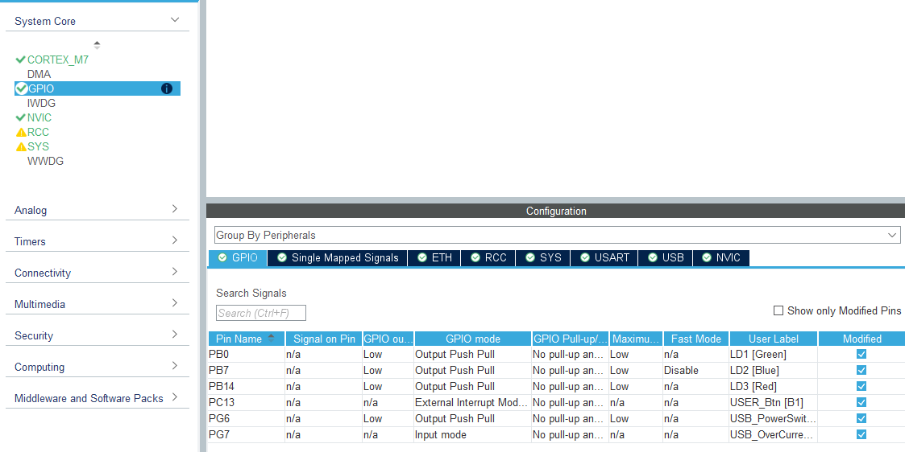
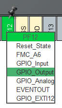
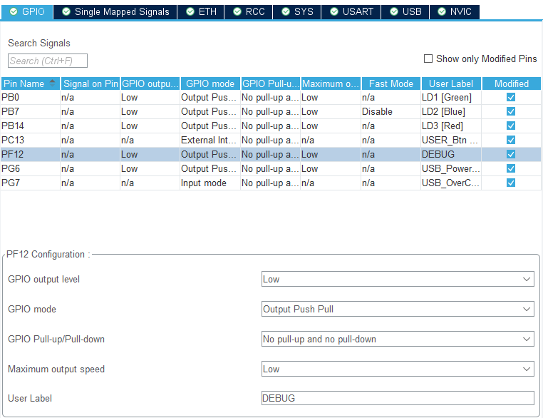
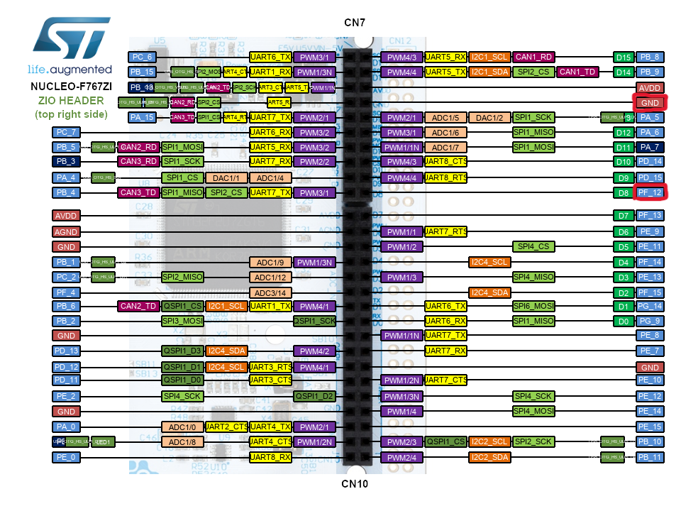
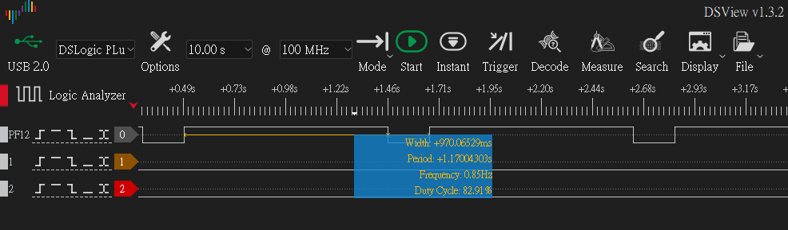
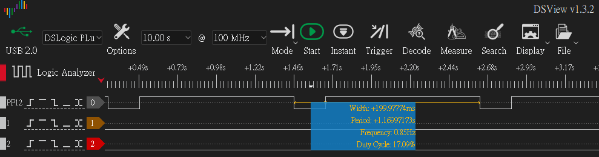

Part 2 終於把環境搭起來了🍵，接下來就是
最無聊最恐怖又有點有趣的練習FreeRTOS

<!-- more -->
---
# Logger Service 與 FreeRTOS 除錯觀察
## 系列文章
- 
- 
- Part 3：Logger Service 與 FreeRTOS 除錯觀察
- 
- 
---
## 前言
系統跑起來之後，下一個最常做的事情就是印 log，
你不印點東西出來，基本上就是在通靈。
雖然說當下寫這篇，就算接邏輯分析儀也像在通靈，看不出個所以然ㄏㄏ

---
## 本篇目標
- Log service
  - 建立非同步 `logger_task`，統一處理 UART log 輸出
  - 使用 FreeRTOS queue 實作 log 的 producer / consumer 模型
  - 讓各 task 透過 `LOG_INFO()`、`LOG_WARN()`、`LOG_ERROR()` 將 log message 送進 `log_queue`

- 除錯與觀察
  - 觀察 task priority 對 `logger_task` 與 `heartbeat_task` 的影響
  - 使用 stack high water mark 檢查 task stack 使用量
  - Debug GPIO / 邏輯分析儀試用

---
## 專案下載

本篇文章對應的完整範例專案已整理在 GitHub Release 中，
如果想直接對照程式碼或跳過環境建立流程，可以從以下連結下載

[🍦下載本篇範例專案-Part 3🍦](https://github.com/likeyou600/gb_project/releases/tag/Part3)

---

## Log Service : producer / consumer

### 為什麼需要 logger_task
Part 2 已經可以透過 USART3 / ST-LINK Virtual COM Port 印出 log。  
如果每個 task 都直接呼叫 `printf()` 或 `HAL_UART_Transmit()`，小範例還可以接受，但專案變大後會有幾個問題：

- 多個 task 同時印 log，輸出可能交錯
- `HAL_UART_Transmit()` 是 blocking，會卡住呼叫它的 task
- driver、service、task 如果都直接操作 UART，之後會很難管理
- log 格式、log level、timestamp 不容易統一
- 後續改 DMA 輸出方式較複雜

所以目前先做一個小型 log service。

### 為什麼用 producer / consumer 管理 log，而不是 mutex
雖然 STM32F767ZI 是單核心 MCU，但在 FreeRTOS 裡仍然會有 task 切換。  
也就是說，同一時間只有一個 task 在跑，不代表共享資源就不需要保護。

如果只是要保護 UART debug console，可以用 mutex 來保護，
概念是，同一時間只允許一個 task 使用 UART，其他 task 必須等待。

osMutexAcquire(uart_mutex, osWaitForever);
printf("[INFO][game] state=%lu\r\n", state);
osMutexRelease(uart_mutex);


但這樣會有個缺點，就是每個 task 都知道 UART 的存在，職責切得不太乾淨，
因此改用 **producer / consumer** 模型，把「產生 log」和「輸出 log」拆開。
各個 task 只負責產生 log，當 log producer，丟進 `log_queue`。  
`logger_task`，則作為 log consumer，負責輸出 log。

雖然 `logger_task` 本身也可能被 FreeRTOS scheduler 切走。  
但這時候影響的是 log 輸出時間可能延後，而不是 log 內容互相交錯。
等 scheduler 再切回 `logger_task` 時，它會繼續處理 queue 裡的 log。

簡單來說：
- mutex：保護共享資源，避免多個 task 同時使用 UART
- producer / consumer：讓其他 task 不直接碰 UART，而是交給 `logger_task` 統一處理

### Logger 資料流

🌕Init side:🌕
    app_main_init()
        |
        | log_service_init()
        |   -> osMessageQueueNew(APP_LOG_QUEUE_DEPTH,
        |                        sizeof(log_service_message_t),
        |                        NULL)
        v
    log queue ready
------------------------
🌗Producer side:🌗
    debug_task
    heartbeat_task
    其他未來的 task
        |
        | #include "Log/log_service.h"
        | LOG_INFO(...)
        | LOG_WARN(...)
        | LOG_ERROR(...)
        v
    log_service_submit()
        |
        | osMessageQueuePut(logQueueHandle, ...)
        v
    log queue
------------------------
🌚Consumer side:🌚
    logger_task
        |
        | log_service_process()
        |   -> osMessageQueueGet(logQueueHandle, ...)
        |   -> format log line
        |   -> board_uart_write_debug()
        |      -> HAL_UART_Transmit()
        v
    USART3 / ST-LINK Virtual COM Port

### 資料夾結構

App/
├─ Services/
│  └─ Log/
│     ├─ log_service.c
│     └─ log_service.h
└─ Tasks/
   ├─ Inc/
   │  ├─ logger_task.h
   └─ Src/
      ├─ logger_task.c


### LOG 格式定義

[00001234][INFO ][RTOS-debug_task] debug_task alive counter=0
[00001240][WARN ][game] state=IDLE action=FEED
[00001255][ERROR][lcd] spi_timeout retry=1


欄位如下：

- `timestamp`：系統時間，目前使用 `HAL_GetTick()`，單位是 ms
- `level`：log 等級，目前有 `INFO`、`WARN`、`ERROR`
- `module`：log 來源，例如 `MAIN`、`RTOS`、`LCD`、`GAME`...
- `message`：實際訊息內容
  
### Logger 參數設定

//是否啟用 log service
#define APP_LOG_ENABLE 1

//log queue 最多暫存幾筆 log message
#define APP_LOG_QUEUE_DEPTH 8

//module 名稱最大長度，包含字串結尾 '\0'
#define APP_LOG_MODULE_NAME_MAX_LEN 32

//message 最大長度，包含字串結尾 '\0'
#define APP_LOG_MESSAGE_MAX_LEN 80


### LOG_INFO / LOG_WARN / LOG_ERROR 巨集
目前在 `log_service.h` 裡定義：


#define LOG_INFO(module, format, ...) \
  log_service_submit(APP_LOG_LEVEL_INFO, module, format, ##__VA_ARGS__)

#define LOG_WARN(module, format, ...) \
  log_service_submit(APP_LOG_LEVEL_WARN, module, format, ##__VA_ARGS__)

#define LOG_ERROR(module, format, ...) \
  log_service_submit(APP_LOG_LEVEL_ERROR, module, format, ##__VA_ARGS__)



#include "Log/log_service.h"

使用方式：
LOG_INFO("RTOS-log_service", "debug_task alive counter=%lu", counter++);
LOG_WARN("LCD", "spi_timeout retry=%lu", retry);
LOG_ERROR("GAME", "invalid_state=%lu", state);



---
## 除錯與觀察
除了真正實作 Task、Service，
最無聊的事情就是除錯與觀察🍵

### Task Priority：先用 log timestamp 觀察

FreeRTOS scheduler 會根據 task priority 和 task 狀態決定目前要執行哪個 task。
我們創立一個 `busy_task` 製造 CPU 壓力，再透過 log timestamp 觀察不同 priority 的差異。

目前測試的 task：


logger_task    : osPriorityNormal
debug_task     : osPriorityLow
heartbeat_task : osPriorityLow


`busy_task` 用來做對照測試：
- 測試 A：busy_task : osPriorityNormal
- 測試 B：busy_task : osPriorityLow

`busy_task` 會故意做一段 busy loop，跑完後印出 log，接著短暫 delay


for (;;)
{
    //此迴圈約花 900ms~1100ms
    for (volatile uint32_t i = 0U; i < 5000000UL; i++)
    {
    }
    LOG_INFO("busy", "busy loop done counter=%lu", counter++);
    osDelay(10U);
}


`debug_task` 則維持每 1 秒印一次 log：


for (;;)
{
    LOG_INFO("RTOS-debug_task", "debug_task alive counter=%lu", counter++);
    osDelay(1000U);
}


#### 測試 A：`busy_task` 是 normal priority

這時候 `busy_task` priority 比 `debug_task`、`heartbeat_task` 高。  


[00000019][INFO ][RTOS-log_service] log_service_init called
[00000833][INFO ][busy] busy loop done counter=0
[00000838][INFO ][RTOS-debug_task] debug_task alive counter=0
[00001653][INFO ][busy] busy loop done counter=1
[00002471][INFO ][busy] busy loop done counter=2
[00003289][INFO ][busy] busy loop done counter=3
[00003294][INFO ][RTOS-debug_task] debug_task alive counter=1
[00004108][INFO ][busy] busy loop done counter=4
[00004926][INFO ][busy] busy loop done counter=5
[00005744][INFO ][busy] busy loop done counter=6
[00005749][INFO ][RTOS-debug_task] debug_task alive counter=2


且此時的 heartbeat_task 出現延遲 Toggle。

這代表：
- 較高 priority 的 busy_task 長時間佔用 CPU
- 低 priority 的 debug_task 只能等 busy_task 進入 delay 後才有機會跑

#### 測試 B：`busy_task` 是 low priority

這時候 `busy_task` 和 `debug_task`、`heartbeat_task` priority 一樣。  

觀察到的 log 會比較接近，debug_task 大約每 1000 ms 執行一次，busy_task 也持續執行。
且此時的 heartbeat_task 沒有延遲 Toggle，
系統沒有明顯卡住。


[00000019][INFO ][RTOS-log_service] log_service_init called
[00000025][INFO ][RTOS-debug_task] debug_task alive counter=0
[00000845][INFO ][busy] busy loop done counter=0
[00001032][INFO ][RTOS-debug_task] debug_task alive counter=1
[00001680][INFO ][busy] busy loop done counter=1
[00002038][INFO ][RTOS-debug_task] debug_task alive counter=2
[00002514][INFO ][busy] busy loop done counter=2
[00003044][INFO ][RTOS-debug_task] debug_task alive counter=3
[00003348][INFO ][busy] busy loop done counter=3
[00004050][INFO ][RTOS-debug_task] debug_task alive counter=4


#### 小結
priority 較高的 task 會優先被排程

如果高 priority task 長時間不 block / delay
低 priority task 會被延後，甚至可能餓死

如果 task 有適當呼叫 osDelay()
其他 task 才有機會執行

### Stack High Water Mark：觀察 task stack 使用量

每個 FreeRTOS task 都有自己的 stack。

如果 stack 設太小，程式可能會出現很難追的錯誤；  
如果 stack 設太大，又會浪費 RAM。

FreeRTOS 提供 high water mark，可以用來觀察某個 task 還剩下多少 stack 空間。
在 CMSIS-RTOS v2 裡，可以使用：

uint32_t stack_space = osThreadGetStackSpace(osThreadGetId());


但這樣每個 task 都要自己加一段 log，之後會變得很散，
所以這邊加入一個 `monitor_task`，定期觀察各個 task 還剩下多少 stack 空間，
這樣所有 task 的 stack 狀態都可以集中觀察。

monitor_task
    |
    | app_tasks_get_logger_handle()
    | app_tasks_get_debug_handle()
    | app_tasks_get_heartbeat_handle()
    | app_tasks_get_busy_handle()
    | app_tasks_get_monitor_handle()
    v
osThreadGetStackSpace(thread_id)
    |
    v
LOG_INFO("monitor", "%s stack_space=%lu", ...)


開啟 monitor_task 後，UART terminal 會定期看到類似：

[00015110][INFO ][RTOS-monitor_task] logger stack_space=250
[00015116][INFO ][RTOS-monitor_task] debug stack_space=314
[00015122][INFO ][RTOS-monitor_task] heartbeat stack_space=222
[00015128][INFO ][RTOS-monitor_task] monitor stack_space=310


這些數值代表「該 task 曾經剩下的最小 stack 空間」，
數值越小，代表 stack 越接近用完。

之後如果 task 裡面有：

- 較大的 local buffer
- `printf()` / `snprintf()`
- 字串格式化
- driver 暫存資料
- 較深的 function call

就要特別注意 stack 使用量。

### Debug GPIO / 邏輯分析儀試用

除了透過 UART log 觀察程式狀態之外，我們也可以使用 GPIO 當作 debug marker（除錯標記）。

做法是在想量測的程式片段前後切換 GPIO：


HAL_GPIO_WritePin(DEBUG_GPIO_Port, DEBUG_Pin, GPIO_PIN_SET);

/* code section to measure */

HAL_GPIO_WritePin(DEBUG_GPIO_Port, DEBUG_Pin, GPIO_PIN_RESET);


當程式執行到 `HAL_GPIO_WritePin(..., GPIO_PIN_SET)` 時，debug pin 會被拉高。

當程式執行到 `HAL_GPIO_WritePin(..., GPIO_PIN_RESET)` 時，debug pin 會被拉低。

如此一來，只要用邏輯分析儀觀察高電位寬度，就能知道這段程式大約執行了多久。

#### 選擇一個可用的 GPIO
但!!!
目前 CubeMX 已經定義好的 GPIO 幾乎都有既定用途，不能隨便拿來當 debug pin。
以 `PB0、PB7、PB14` 來說，已經被用來控制板子上的 LED，也就是我們前面做的 heartbeat_task LED
如果直接拿這些 pin 來當 debug marker，可能會影響原本板子上的功能，也會讓觀察結果變得混亂。

因此我們需要先打開 `gb_f767zi.ioc`，重新找一個目前沒有被使用的 pin。
這裡以 `PF12` ( GPIO Port F 的第 12 號腳位 ) 為例，將它設定成 `GPIO_Output`。

在 STM32 中，GPIO 腳位會依照不同的 **Port** 分組
- 例如 `GPIOA`、`GPIOB`、`GPIOC` 到 `GPIOF` 等

之所以要設定成 `GPIO_Output`，是因為我們要做的是：
  - 讓 MCU 透過程式主動把某個 pin 拉高或拉低。
  - 這個 pin 不是 MCU 拿來讀取外部訊號，而是由 MCU 自己輸出 High / Low 給邏輯分析儀觀察。

#### GPIO 詳細設定

這裡主要會設定幾個項目：

- GPIO output level
- GPIO mode
- Pull-up / Pull-down
- Maximum output speed
- User Label

##### GPIO output level

這個選項決定 GPIO 初始化完成後，預設要輸出高電位還是低電位。

這裡設定為：`GPIO output level = Low`

也就是開機初始化時，先讓 debug pin 輸出低電位。
這樣可以避免 debug pin 一開機就維持高電位，讓後續用邏輯分析儀觀察時比較清楚。

常見選項：
- `Low`
  - 初始化後輸出低電位
  - 適合 debug marker、LED 預設關閉、控制腳位預設不啟動的情境

- `High`
  - 初始化後輸出高電位
  - 適合外部電路需要 MCU 一開機就拉高控制腳的情境

以 debug GPIO 來說，通常會選 `Low`。  
因為我們希望只有被量測的程式區段執行時，pin 才會被拉高。

##### GPIO mode
這個選項決定 GPIO 的輸出型態。

這裡設定為：`GPIO mode = Output Push Pull`

`Output Push Pull` 是一般 GPIO 輸出高低電位時最常用的模式。
- 輸出 High 時，MCU 主動把 pin 拉到高電位
- 輸出 Low 時，MCU 主動把 pin 拉到低電位

也就是說，High 和 Low 都是由 MCU 主動驅動。
這很適合拿來做 debug marker，因為邏輯分析儀可以很清楚地看到電位切換。

常見選項：
- `Output Push Pull`
  - 一般 GPIO 輸出模式
  - 適合 LED 控制、debug pin、chip select、reset pin 等需要明確輸出高低電位的情境

- `Output Open Drain`（開漏輸出）
  - 只能主動拉低，不能主動輸出高電位
  - 如果要看到高電位，通常需要外部或內部 pull-up
  - 常見於 I2C、共享訊號線，或多個裝置可能一起控制同一條線的情況

以 debug GPIO 來說，通常不需要 Open Drain（開漏輸出）。  
因為我們只是要讓 MCU 自己輸出清楚的 High / Low，所以選 `Output Push Pull` 比較直覺。

##### Pull-up / Pull-down
這個選項決定是否啟用 MCU 內部的上拉或下拉電阻。

這裡設定為：`Pull-up/Pull-down = No pull-up and no pull-down`

因為這個 pin 是由 MCU 主動輸出電位，不是浮接輸入，所以不需要額外開啟內部上拉或下拉。

常見選項：
- `No pull-up and no pull-down`
  - 不啟用內部上拉或下拉
  - 適合 GPIO output，或外部電路已經有明確電位的情況

- `Pull-up`
  - 啟用內部上拉
  - 當 pin 沒有被外部訊號主動拉高或拉低時，會預設偏向高電位
  - 常用在按鍵輸入、開漏輸出訊號，或需要避免輸入腳浮接的情況

- `Pull-down`
  - 啟用內部下拉
  - 當 pin 沒有被外部訊號主動拉高或拉低時，會預設偏向低電位
  - 常用在按鍵輸入，或希望訊號預設為 Low 的情況

以 debug GPIO 來說，因為 MCU 已經會主動輸出 High / Low，所以選 `No pull-up and no pull-down` 就可以了。
##### Maximum output speed

這個選項決定 GPIO 輸出切換時的速度能力。

這裡設定為：`Maximum output speed = Low`

目前只是用來量測 task 裡某段程式的執行時間，GPIO 切換頻率不高，所以 `Low` 就足夠。

常見選項：
- `Low`
  - 切換速度較慢
  - 雜訊較少，功耗也較低
  - 適合 LED、一般控制腳、debug marker 等不需要高速切換的用途
- `Medium`
  - 速度比 Low 高一些
  - 適合稍微頻繁切換的 GPIO 訊號
- `High`
  - 適合比較高速的 GPIO 訊號
  - 例如較快的控制訊號，或需要較短上升 / 下降時間的情境
- `Very High`
  - 速度最高
  - 通常用在高速訊號，或對時序要求比較嚴格的情境

不過速度越高不代表一定越好。
GPIO 切換越快，訊號邊緣越陡，也比較容易帶來 EMI 或雜訊問題。
所以一般 debug marker 如果只是量測 task 區段、driver 執行時間，通常先用 `Low` 就好。
如果之後要量測非常短的時間，或是邏輯分析儀看到的邊緣不夠清楚，再考慮改成 `High` 或 `Very High`。

##### User Label
這個選項可以幫 GPIO 取一個比較好讀的名稱。

這裡設定為：`User Label = DEBUG`

設定 User Label 之後，CubeMX 產生程式碼時，就會自動產生對應的 pin 名稱。

之後程式就可以使用：
- `DEBUG_Pin`
- `DEBUG_GPIO_Port`

來操作這個 GPIO。
這樣比直接在程式裡寫 `GPIO_PIN_12` 或 `GPIOF` 更清楚。
因為看到 `DEBUG_Pin` 時，就能直接知道這支 pin 是拿來做 debug marker 用的。

#### 產生程式碼

設定完成後按下 Generate Code。

產生程式碼之後，可以打開 `Core/Inc/main.h` 確認，應該會看到：


#define DEBUG_Pin GPIO_PIN_12
#define DEBUG_GPIO_Port GPIOF


這代表 CubeMX 已經幫我們把 PF12 對應到 `DEBUG_Pin` 和 `DEBUG_GPIO_Port`。

之後只要在程式中操作這兩個 define，就可以控制 PF12 的高低電位。

#### 確認實際接腳位置

接著可以從 NUCLEO-F767ZI 的接腳圖確認 PF12 的實際位置。

找到 PF12 之後，將邏輯分析儀的其中一個 channel 接到 PF12。
同時也要記得將邏輯分析儀的 GND 接到開發板的 GND。

這樣邏輯分析儀才有共同參考電位，量到的 High / Low 才會正確。

#### 使用邏輯分析儀觀察執行時間
搭配 `busy_task` 測試：

for (;;)
{
    board_debug_pin_set();
    for (volatile uint32_t i = 0U; i < 5000000UL; i++)
    {
    }
    board_debug_pin_reset();

    osDelay(200U);
}


在這個例子中，`board_debug_pin_set()` 會先把 debug GPIO 拉高。
接著程式會進入一個空的 busy loop
等這個迴圈跑完之後，再透過 `board_debug_pin_reset()` 把 GPIO 拉低。

因此在邏輯分析儀上看到的高電位寬度，就是這個 busy loop 大約花費的時間。

##### 觀察 busy loop 時間
實際觀察可以看到，GPIO 被拉高後，迴圈大約執行了 970 ms。
這個數值不是固定不變的。

它可能會受到以下因素影響：
- 編譯最佳化設定
- 是否開啟 UART log
- 目前系統中其他 task 的執行情況
- interrupt 發生的頻率
- RTOS scheduler 切換時機
所以這裡量到的 970 ms，比較適合當成目前程式狀態下的觀察結果，而不是絕對不變的執行時間。

##### 觀察 osDelay 時間

當 GPIO 被拉低之後，程式會進入`osDelay(200U)`，
因此低電位維持的時間，大約就是當初設定的 200 ms。

這也剛好可以驗證：

高電位代表 busy loop 執行時間。  
低電位代表 task delay 的時間。

透過這種方式，我們可以很直覺地看到 task 在什麼時候忙碌、什麼時候進入 delay。

#### 適合使用的情境
不過這裡先不把它拿來精準分析 task priority。

因為 task priority 對執行結果的影響，還會牽涉到很多因素，例如：

- RTOS tick
- task 是否進入 blocking 狀態
- queue 是否有資料
- semaphore / mutex 是否被卡住
- interrupt 是否頻繁發生
- scheduler 實際切換時機

之後在開發 driver 或分析程式執行時間時，這種方式會很常用。

例如：
- SPI 傳輸時間
- I2C sensor read 時間
- UART parser 處理時間
- display update 時間
- 某個 task 中重要區段的執行時間

只要把想觀察的程式片段用 debug GPIO 包起來，就可以透過邏輯分析儀看到它大約花了多少時間。

---
## 本篇小結
開發板到貨了，也就代表最痛苦無聊的邏輯分析儀也到貨了，
不得不說，在寫這 Part 的 **除錯與觀察** 是最痛苦的，
有 AI 輔助的情況下，logger_task 其實花一點點時間就完成了，除了整體架構，例如 Log 要放在 Service 之類的設計，又多花了一些時間討論。

但邏輯分析儀量 GPIO 高低電位、再配合 task priority 做實驗，真的花了大概多 4 到 5 倍的時間吧 ==
