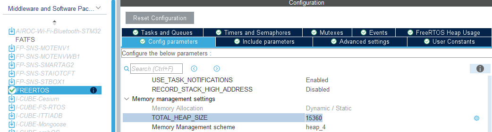
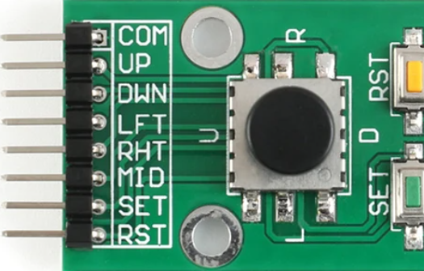
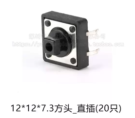
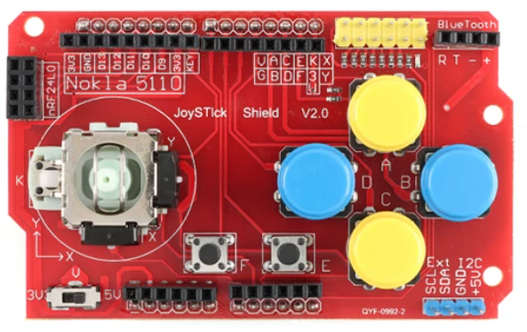
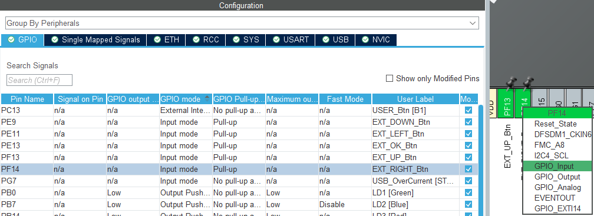
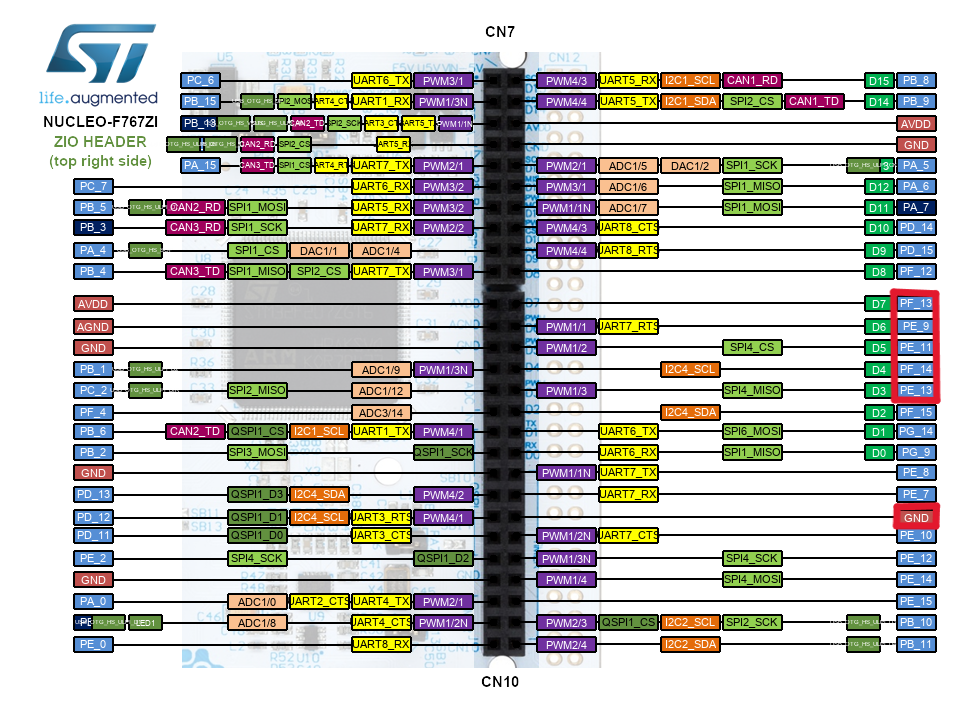
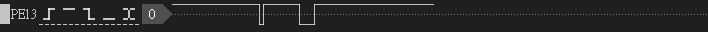

Part 3 練習了 FreeRTOS Queue 和 Logger Service。
雖然除錯很重要啦，但，沒有接任何外部設備就超無聊。
這 Part 就把買來的不同類型按鍵試著接接看!!

<!-- more -->

---
# Input System：GPIO、Debounce 與 Event Queue
## 系列文章

- 
- 
- 
- Part 4：Input System：GPIO、Polling Debounce 與 Event Queue
- 
- 
<!-- -  -->

---
## 前言
按鍵跟鍵盤系統其實不是只有按下跟沒按這麼簡單。

以鍵盤來說，光是電路層面就可能會遇到鬼鍵、多鍵同時按下這些問題。比較完整的鍵盤裡面還會有自己的 MCU 或控制器，負責掃描按鍵矩陣、做 debounce（防彈跳）跟 rollover（多鍵同時輸入），最後才把整理好的按鍵結果送給電腦。

所以如果我們是在 STM32 上自己接按鍵，那這些事情就不能期待電腦或遊戲系統幫你處理，而是要自己在韌體裡做一套輸入系統。這套系統要先把底層細節處理掉，像是 debounce、輸入序列、長按短按判斷等等。

最後再把結果整理成一層介面給遊戲系統用。這樣遊戲邏輯就不用自己去管底層 GPIO 或按鍵掃描，只要知道玩家現在做了什麼操作就好。

---
## 本篇目標
- Input Service
  - 認識並測試五向鍵、輕觸開關與 Joystick Shield 的基本輸入方式
  - 建立獨立的 `input_task`，透過 polling 週期性掃描按鍵狀態
  - 使用 FreeRTOS queue 實作 input event 的 producer / consumer 模型
  - 讓其他 task 透過 `input_service_get_event()` 取得 input event
  - 使用 timestamp debounce 實作按鍵防彈跳處理

---
## 專案下載

本篇文章對應的完整範例專案已整理在 GitHub Release 中，
如果想直接對照程式碼或跳過環境建立流程，可以從以下連結下載

[🍦下載本篇範例專案-Part 4🍦](https://github.com/likeyou600/gb_project/releases/tag/Part4)

---
## 注意事項
操作到這 Part 時，專案裡已經有不少 task 同時運作。
因此先把 FreeRTOS HEAP SIZE 從預設的 15360 Bytes，加到 32768 Bytes。

## 目前有的輸入模組

### 五向導航按鍵模組

預計用途：
- `COM`：GND
- `UP / DOWN / LEFT / RIGHT`：方向操作
- `MID`：確認鍵
- `SET`：選單鍵
- `RST`：目前先不一定使用，避免和系統 reset 混淆

### 12×12 輕觸開關

紅線為一條鐵片，為同一端
  - 一條接 GPIO
  - 一條接 3.3v / GND

### Joystick Shield

這塊原本是 Arduino 用的 Joystick Shield，上面有類比搖桿和多顆按鍵。
這一篇會先以五向鍵和輕觸開關為主，Joystick Shield 暫時當作備用測試模組。

---
## 輸入系統設計 Polling

這 Part 先用最直覺的 Polling 做法，簡單來講就是週期掃描有沒有人按按鍵，
而另一種方法就是按鍵 Interrupt，不過那個留到下 Part 再來討論。 

### 0. 輸入事件資料流

🌕Init side:🌕
    MX_GPIO_Init()
        |
        | 設定按鍵
        |
        | EXT_UP_Btn     -> GPIO Input
        | EXT_DOWN_Btn   -> GPIO Input
        | EXT_LEFT_Btn   -> GPIO Input
        | EXT_RIGHT_Btn  -> GPIO Input
        | EXT_OK_Btn     -> GPIO Input
        |
        v
    LCD GPIO ready
-----------
    app_main_init()
        |
        | input_service_init()
        |   -> osMessageQueueNew(APP_INPUT_EVENT_QUEUE_DEPTH,
        |                        sizeof(input_event_t),
        |                        NULL)
        v
    input event queue ready
------------------------
🌗Producer side:🌗
    input_task
        |
        v
    for (;;) polling loop
        |
        | 
        v
    scan buttonMap[]
        |
        | input_task_scan_button(...)
        |   -> board_input_is_pressed(...)
        |      -> HAL_GPIO_ReadPin(...)
        v
    raw GPIO state
        |
        | timestamp debounce
        | stable pressed detected
        | press/release/short/long pressed detected
        v
    input_service_post_event(key, action)
        |
        | osMessageQueuePut(inputEventQueueHandle, ...)
        v
    input event queue
        |
        | osDelay(APP_INPUT_SCAN_PERIOD_MS)
        v
    next polling cycle
------------------------
🌚Consumer side:🌚
    input_debug_task
    game_task，之後 Part 6 實作
        |
        | #include "Input/input_service.h"
        | input_service_get_event(&event, osWaitForever)
        |   -> osMessageQueueGet(inputEventQueueHandle, ...)
        v
    input_event_t
        |
        | event.key
        | event.action
        | event.timestamp
        v
    input_debug_task:
        LOG_INFO("input", ...)
    
    game_task:
        根據目前遊戲狀態處理 INPUT_KEY_- / INPUT_ACTION_*


### 1. 資料夾結構

App/
├─ Services/
│  └─ Input/
│     ├─ input_service.c
│     └─ input_service.h
└─ Tasks/
   ├─ Inc/
   │  ├─ input_debug_task.h
   │  └─ input_task.h
   └─ Src/
      ├─ input_debug_task.h
      └─ input_task.c


### 2. GPIO Input (board_input) 設定

第一步先把實體 GPIO 設定好。  
這裡還不急著處理 event 或 debounce，先確認每顆按鍵都有穩定的 HIGH / LOW 來源，避免腳位浮動造成誤判。

注意一定要選 pull-up / pull-down 其中一個，因為我們的按鍵是最普通的
- internal pull-up 的話，一端接 GPIO，另一端接 GND；按下後 GPIO 會被接到 GND，所以讀到 LOW。

STM32 板子                     按鍵

3.3V
 │
[Internal Pull-up]
 │
GPIO ------------------------- 按鍵腳1
                               │
                               │ 按下才接通
                               │
GND  ------------------------- 按鍵腳2


- internal pull-down 的話，一端接 GPIO，另一端接 3.3V；按下後 GPIO 會被接到 3.3V，所以讀到 HIGH。

STM32 板子                     按鍵

GPIO ------------------------- 按鍵腳1
 │                             │
[Internal Pull-down]           │ 按下才接通
 │                             │
GND                            │
                               │
3.3V ------------------------- 按鍵腳2


- No pull-up and no pull-down，是給有辦法主動輸出訊號的按鍵板用的

STM32 板子                     按鍵擴充板

GPIO  <----------------------- OUT，主動輸出 HIGH 或 LOW

GND   ------------------------ GND

3.3V  ------------------------ VCC


我們這邊綁定到五個 GPIO 腳位
  - PF13，UP 按鍵
  - PE9，DOWN 按鍵
  - PE11，LEFT 按鍵
  - PF14，RIGHT 按鍵
  - PE13，OK 按鍵

都選好之後，別忘記按下 Generate Code，接著就可以開始寫對應的韌體了。
這裡把按鍵輸入歸類到 `board_input` 資料夾，和 `board_gpio`（debug 用）、`board_led` 區分開來。
接著實作 `board_input` wrapper，目的是之後如果換腳位或換板子，只要改 `board_input` 這層即可。


typedef enum
{
    BOARD_INPUT_INT_USER = 0,
    BOARD_INPUT_EXT_UP,
    BOARD_INPUT_EXT_DOWN,
    BOARD_INPUT_EXT_LEFT,
    BOARD_INPUT_EXT_RIGHT,
    BOARD_INPUT_EXT_OK
} board_input_t;

bool board_input_is_pressed(board_input_t input)
{
    switch (input)
    {
        case BOARD_INPUT_INT_USER:
        return HAL_GPIO_ReadPin(USER_Btn_GPIO_Port, USER_Btn_Pin) == GPIO_PIN_RESET;
        case BOARD_INPUT_EXT_UP:
        return HAL_GPIO_ReadPin(EXT_UP_Btn_GPIO_Port, EXT_UP_Btn_Pin) == GPIO_PIN_RESET;
        case BOARD_INPUT_EXT_DOWN:
        return HAL_GPIO_ReadPin(EXT_DOWN_Btn_GPIO_Port, EXT_DOWN_Btn_Pin) == GPIO_PIN_RESET;
        case BOARD_INPUT_EXT_LEFT:
        return HAL_GPIO_ReadPin(EXT_LEFT_Btn_GPIO_Port, EXT_LEFT_Btn_Pin) == GPIO_PIN_RESET;
        case BOARD_INPUT_EXT_RIGHT:
        return HAL_GPIO_ReadPin(EXT_RIGHT_Btn_GPIO_Port, EXT_RIGHT_Btn_Pin) == GPIO_PIN_RESET;
        case BOARD_INPUT_EXT_OK:
        return HAL_GPIO_ReadPin(EXT_OK_Btn_GPIO_Port, EXT_OK_Btn_Pin) == GPIO_PIN_RESET;
        default:
        return false;
    }
}


### 3. Input Service 設計

GPIO wrapper 只知道硬體按鍵有沒有被按下，但遊戲邏輯不應該直接依賴硬體腳位。  
所以中間再加一層 Input Service，把硬體輸入轉成上層看得懂的 input event。

Input Service 主要處理三個部分：
- 按鈕綁定
- Input event 設計
- Input event queue 設計

#### 按鈕綁定

針對每顆 Service 開出來的按鈕和 `board_input` 定義的硬體按鍵建立 mapping。  


typedef struct
{
    input_key_t key;
    board_input_t board_input;
} input_button_hw_t;

static const input_button_hw_t buttonMap[] = {
    { INPUT_KEY_UP, BOARD_INPUT_EXT_UP },
    { INPUT_KEY_DOWN, BOARD_INPUT_EXT_DOWN },   
    { INPUT_KEY_LEFT, BOARD_INPUT_EXT_LEFT },
    { INPUT_KEY_RIGHT, BOARD_INPUT_EXT_RIGHT }, 
    { INPUT_KEY_OK, BOARD_INPUT_EXT_OK },
};


這個 mapping 之後會被 `input_task` 掃描。  

#### Input event 設計

接著定義 event 的格式。  
這裡先把一次輸入拆成三個資訊：哪一顆按鍵、是哪一種動作，以及事件發生的時間點。

input event 分成三個部分：
- 按到哪一顆按鍵
- 觸發的動作類型
- timestamp


typedef enum
{
    INPUT_KEY_TEST = 0,
    INPUT_KEY_UP,
    INPUT_KEY_DOWN,
    INPUT_KEY_LEFT,
    INPUT_KEY_RIGHT,
    INPUT_KEY_OK,
} input_key_t;

typedef enum
{
    INPUT_ACTION_PRESS,
    INPUT_ACTION_RELEASE,
    INPUT_ACTION_SHORT,
    INPUT_ACTION_LONG,
} input_action_t;

typedef struct
{
    input_key_t key;
    input_action_t action;
    uint32_t timestamp;
} input_event_t;


這樣做的好處是，後面的 consumer task 不需要知道這個 event 是從 polling 來的，還是從 EXTI 來的。  
只要 event 格式一致，遊戲邏輯就可以用同一套方式處理輸入。

#### Input event queue 設計

Queue 是 Input Service 和其他 task 之間的分界線。  
`input_task` 偵測到按鍵後，把事件丟進 queue；其他 task 則用 blocking 的方式等待事件。

初始化時先建立固定深度的 message queue：

#define INPUT_EVENT_QUEUE_DEPTH 8

osMessageQueueId_t inputEventQueueHandle;

void input_service_init(void) 
{
    inputEventQueueHandle = osMessageQueueNew(
        INPUT_EVENT_QUEUE_DEPTH,
        sizeof(input_event_t),
        NULL
    );
}


`input_service_post_event()` 是 producer side 使用的 API。  
它負責把 key、action 和當下 tick 包成 `input_event_t`，再送進 FreeRTOS message queue。


osStatus_t input_service_post_event(input_key_t key, input_action_t action)
{
  input_event_t event = {
    .key = key,
    .action = action,
    .timestamp = HAL_GetTick(),
  };

  if (inputEventQueueHandle == NULL)
  {
    return osErrorResource;
  }

  return osMessageQueuePut(inputEventQueueHandle, &event, 0U, 0U);
}


`input_service_get_event()` 則是 consumer side 使用的 API。  
之後不管是 debug task 還是 game task，都可以透過這個函式取得整理好的輸入事件。


osStatus_t input_service_get_event(input_event_t *event, uint32_t timeout)
{
  if ((inputEventQueueHandle == NULL) || (event == NULL))
  {
    return osErrorParameter;
  }

  return osMessageQueueGet(inputEventQueueHandle, event, NULL, timeout);
}


### 4. Input Task 設計

接下來建立真正負責掃描按鍵的 `input_task`。  
第一版先故意寫得很直覺：每隔一段時間掃一次 `buttonMap[]`，讀取每顆按鍵的 GPIO 狀態，然後把 event 丟進 queue。



void input_task(void *argument)
{
  (void)argument;

  for (;;)
  {
    for (size_t i = 0U; i < (sizeof(buttonMap) / sizeof(buttonMap[0])); i++)
    {
      bool raw_pressed = board_input_is_pressed(buttonMap[i].board_input);
      if (raw_pressed)
      {
        input_service_post_event(buttonMap[i].key, INPUT_ACTION_PRESS);
      }
    }

    osDelay(APP_INPUT_SCAN_PERIOD_MS);
  }
}



上面這版還沒有真正判斷 `raw_pressed`，所以實際使用時會太吵。  
但它很適合當成第一步測試：只要 terminal 看得到 event，就代表 queue 和 consumer 的基本流程已經接起來了。

### 5. Consumer input_debug_task 設計

`input_debug_task` 是目前最簡單的 consumer。  
它不負責判斷遊戲行為，只是把收到的 input event 印出來，方便先確認按鍵、action 和 timestamp 是否符合預期。

void input_debug_task(void *argument)
{
  input_event_t event;

  for (;;)
  {
    if (input_service_get_event(&event, osWaitForever) == osOK)
    {
      LOG_INFO("input", "key=%s action=%s tick=%lu", input_service_key_text(event.key),
               input_service_action_text(event.action), event.timestamp);
    }
  }
}


### 6. 按鍵 timestamp debounce + Event 判斷
前面的第一版 input task 可以驗證 queue 流程，但還不能直接拿來當正式輸入。  
按鍵輸入最麻煩的地方通常不是讀 GPIO，而是按鍵彈跳，

機械按鍵按下或放開時，訊號不會是完美的一次 high / low 切換。  
它可能會在幾毫秒內抖動很多次，如果不做 debounce，按一次按鍵可能會被判斷成很多次。

主流有兩種做法：
  - timestamp debounce
    - 最適合一般按鍵、方向鍵、A/B 鍵、選單鍵
    - 可以用在我們買的輸入模組，較沒有那麼重要的
  - software timer debounce
    - 適合事件驅動 debounce、低功耗設計、不想讓 input task 固定週期掃描的情境
    - 可以用在 User Button、電源鍵、喚醒鍵或少數重要按鍵

software timer debounce 留給下一篇搭配 EXTI 一起介紹。


typedef struct
{
  bool stable_pressed;
  bool last_raw_pressed;
  uint32_t last_change_tick;
  uint32_t press_start_tick;
} input_button_state_t;

static input_button_state_t buttonState[sizeof(buttonMap) / sizeof(buttonMap[0])];

static bool input_task_update_debounce(input_button_state_t *state, bool raw_pressed, uint32_t now)
{
  // 如果這次讀到的 GPIO 狀態跟上次不一樣，代表按鍵可能正在變化，所以先記錄下這個變化的時間點。
  // 按鍵剛按下時，GPIO 可能會因為彈跳變成這樣：
  // false → true → false → true → true
  // 所以程式前面這段會一直更新 last_change_tick。
  if (raw_pressed != state->last_raw_pressed)
  {
    state->last_raw_pressed = raw_pressed;
    state->last_change_tick = now;
  }

  // GPIO 狀態至少維持 APP_INPUT_DEBOUNCE_MS 沒再亂跳，才相信它是真的按下或放開。
  if ((now - state->last_change_tick) >= APP_INPUT_DEBOUNCE_MS)
  {
    // 如果是按下按鍵：raw_pressed = true、stable_pressed = false
    // 如果是放開按鍵：raw_pressed = false、stable_pressed = true
    if (raw_pressed != state->stable_pressed)
    {
      state->stable_pressed = raw_pressed;
      return true;
    }
  }

  return false;
}

static void input_task_handle_button_event(const input_button_hw_t *hw, input_button_state_t *state, uint32_t now)
{
  // 如果是穩定按下，就記錄按下的時間點，並送出 PRESS event。
  if (state->stable_pressed)
  {
    state->press_start_tick = now;

    (void)input_service_post_event(hw->key, INPUT_ACTION_PRESS);
    return;
  }

  // 如果是穩定放開，就送出 RELEASE event，
  // 再根據按下的時間長短來決定是 SHORT 還是 LONG。
  uint32_t press_duration = now - state->press_start_tick;
  input_action_t action = INPUT_ACTION_SHORT;

  (void)input_service_post_event(hw->key, INPUT_ACTION_RELEASE);

  // 按下時間 < 300 ms  -> short press ; >= 300 ms -> long press
  if (press_duration >= APP_INPUT_LONG_PRESS_MS)
  {
    action = INPUT_ACTION_LONG;
  }

  (void)input_service_post_event(hw->key, action);
}

static void input_task_process_button(const input_button_hw_t *hw, input_button_state_t *state, bool raw_pressed)
{
  uint32_t now = HAL_GetTick();

  if (input_task_update_debounce(state, raw_pressed, now))
  {
    input_task_handle_button_event(hw, state, now);
  }
}

void input_task(void *argument)
{
  (void)argument;

  for (;;)
  {
    for (size_t i = 0U; i < (sizeof(buttonMap) / sizeof(buttonMap[0])); i++)
    {
      bool raw_pressed = board_input_is_pressed(buttonMap[i].board_input);
      
      input_task_process_button(&buttonMap[i], &buttonState[i], raw_pressed);
    }

    osDelay(APP_INPUT_SCAN_PERIOD_MS);
  }
}



### 7. 測試結果
接線完成後，預期按下按鍵時可以在 terminal 看到 log。  


//短按
[00002872][INFO ][input] key=OK action=PRESS tick=2872
[00002992][INFO ][input] key=OK action=RELEASE tick=2992
[00002997][INFO ][input] key=OK action=SHORT tick=2992

//長按
[00004022][INFO ][input] key=OK action=PRESS tick=4022
[00004502][INFO ][input] key=OK action=RELEASE tick=4502
[00004507][INFO ][input] key=OK action=LONG tick=4502


從邏輯分析儀可以看到，這顆 OK button 平時維持在 HIGH。  
因為這個 GPIO 使用 pull-up 設定，所以按鍵沒按時會被拉到高電位。

當按下按鍵時，GPIO 會被接到 GND，因此訊號會變成 LOW。

如果是短按，可以看到低電位只維持一小段時間；  
如果是長按，訊號則會持續維持在 LOW，直到放開按鍵後才回到 HIGH。

---
## 本篇小結
做這 Part 時真的是多災多難，首先 12×12 輕觸開關都還沒認真搞清楚，就蝦雞巴接上去麵包板，
還花了好幾個小時接線==，哪來的天兵。
雖然有買五向導航按鍵模組，但覺得方向不太對，一直沒有用，直到輕觸開關用不了，才拿出來接。
一接上去不得了，也還是沒有任何反應，接了邏輯分析儀也看不太懂，都沒有變化。

後來才發現，自己生成的文章教學都沒有認真看，`2. GPIO Input (board_input) 設定`，
就像這章節所說，如果按鈕沒有很高級，就要把 GPIO 設定成 pull-up / pull-down 的其中一個。

接著又因為把章節目標想得太遠了，想要 timestamp debounce 、 Event 判斷，
結果又跟 EXTI 、software timer debounce 全搞在一起做，下場就是這篇寫了快三天。
