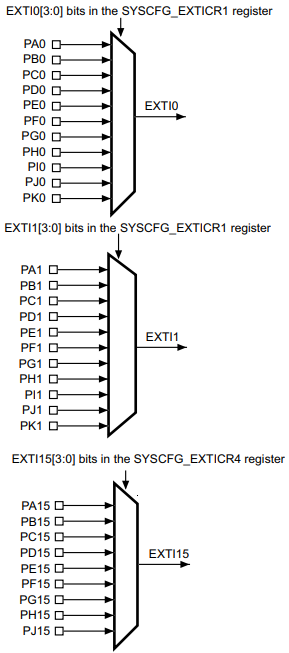
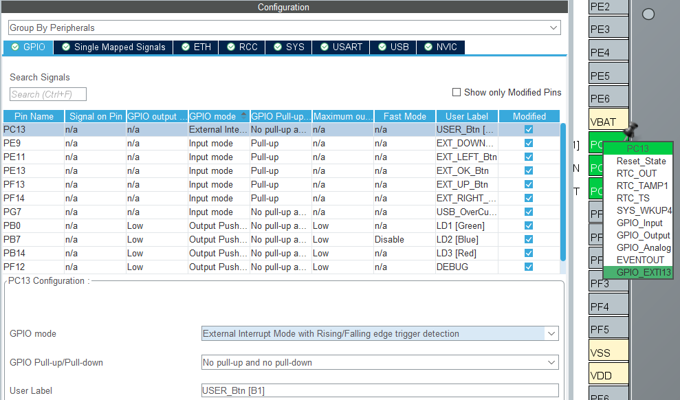
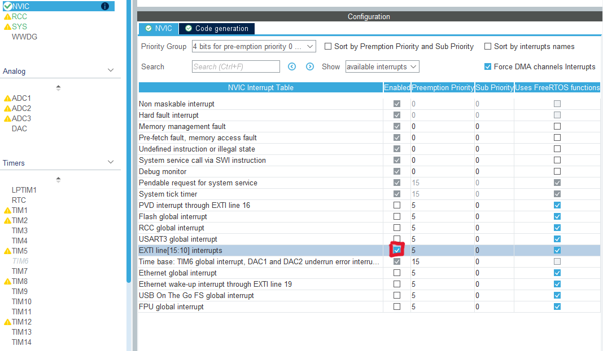

Part 4 練習了 Polling 版本的 Input，想當然學過 OS 的各位肯定也很懷念 Interrupt。
沒有錯，就是有一天要讓自己的胃滿足 大滿足，所以今天的企劃就是，
早餐吃到飽

<!-- more -->
---
# Input System：EXTI、ISR Notify 與 Software Timer Debounce
## 系列文章
- 
- 
- 
- 
- Part 5：Input System：EXTI、ISR Notify 與 Software Timer Debounce
- 
<!-- -  -->

---
## 前言
好，既然都把 EXTI 拆出來這章節了，那就來好好研究研究吧。
畢竟這章節是面試常考題呢，曾經我就被瑞昱問過 UART 的完整 Interrupt 流程呢。

---
## 本篇目標
- Input Service
  - 使用 NUCLEO-F767ZI User Button + EXTI，練習 interrupt 只負責通知，不直接處理完整按鍵邏輯
  - 實作 EXTI + software timer debounce，將中斷觸發後的按鍵狀態整理成穩定的 input event

---
## 專案下載

本篇文章對應的完整範例專案已整理在 GitHub Release 中，
如果想直接對照程式碼或跳過環境建立流程，可以從以下連結下載

[🍦下載本篇範例專案-Part 5🍦](https://github.com/likeyou600/gb_project/releases/tag/Part5)

---
## 名詞介紹
在進入實作前，先整理幾個這段會一直出現的名詞。

- `STM32 HAL`
  - HAL 是 Hardware Abstraction Layer 的縮寫，是 ST 提供的一層硬體抽象 API。
  - 透過 HAL，我們可以用像 `HAL_XXXX()`、`HAL_XXXXHandler()` 這類函式操作 GPIO、中斷、Timer 等周邊，而不需要一開始就直接操作 register。

- `GPIO HAL Driver`
  - GPIO HAL Driver 是 STM32 HAL 裡專門負責 GPIO 的 driver。
  - 例如前面 Polling 版本用到的 `HAL_GPIO_ReadPin()`，以及這裡 EXTI 會用到的 `HAL_GPIO_EXTI_IRQHandler()`、`HAL_GPIO_EXTI_Callback()`，都屬於 GPIO HAL Driver 相關的 API。
  
- `EXTI`
  - External Interrupt/Event Controller，是 MCU 裡負責偵測外部 GPIO 或內部 peripheral event 是否觸發 interrupt / event 的硬體模組。
  - 以 User Button 為例，按鍵接在 `PC13`，所以 GPIO 狀態變化會對應到 `EXTI13`。
  - 可以把 EXTI 想成公司各個門口的感應器，負責發現「哪個門口有人進來」、「哪個按鈕被按下」這類事件。

- `IRQ`
  - Interrupt Request，中斷請求。
  - 當 EXTI 偵測到指定的 rising edge 或 falling edge 後，就會產生 IRQ，通知 CPU 有中斷事件需要處理。
  - 可以把 IRQ 想成感應器送出的通知訊號：不是直接處理事情，而是先告訴系統「有事件發生了」。

- `NVIC`
  - Nested Vectored Interrupt Controller，是 Cortex-M 裡負責管理中斷的控制器。
  - 它會決定某個 IRQ 是否有被啟用、優先權是多少，以及 CPU 要不要進入對應的中斷處理流程。
  - 可以把 NVIC 想成公司的總機或櫃台主管，收到各個感應器送來的通知後，判斷這件事要不要處理、優先順序怎麼排，以及要叫誰來處理。

- `ISR`
  - Interrupt Service Routine，也就是中斷服務程式。
  - 當 IRQ 被 NVIC 接受後，CPU 會跳到對應的 ISR 執行，例如 `EXTI15_10_IRQHandler()`。
  - 在 STM32 HAL 架構下，ISR 裡通常會呼叫 HAL 提供的 handler，再進一步呼叫到我們實作的 callback。


---
## 輸入系統設計 EXTI

前一章節 Polling 版本的做法，是由 `input_task` 固定週期掃描 GPIO，
這種方式很適合方向鍵、A/B 鍵、選單鍵這類會持續被玩家操作的按鍵，邏輯單純。

不過有些輸入不一定適合一直靠 task 週期性掃描。
例如電源鍵、喚醒鍵、User Button，或是某些外部模組主動通知 MCU 的訊號，通常會希望在狀態變化時可以比較即時地通知系統。

這種時候就可以使用 EXTI，讓 GPIO 狀態變化先觸發 interrupt。
但 interrupt 裡不適合做太多事情，所以 ISR 只負責「通知有事件發生」，真正的 debounce、狀態判斷、event queue 發送，還是交給 task 處理

所以這一段先用 NUCLEO-F767ZI 板上的 User Button 練習 EXTI。
目標不是把所有按鍵都改成 interrupt，而是先熟悉：

- GPIO 如何設定成 EXTI
- 中斷發生後如何進入 callback
- ISR 裡如何通知 `input_irq_task`
- 如何搭配 software timer 做 debounce
- 最後如何把穩定後的按鍵狀態轉成 input event

流程上可以這樣理解：

GPIO 狀態變化
    |
    v
EXTI 偵測到外部事件
    |
    v
產生 IRQ
    |
    v
NVIC 判斷這個 IRQ 是否啟用、優先權怎麼排
    |
    v
CPU 進入對應 ISR


### 0. 輸入事件資料流


🌕Init side:🌕
    MX_GPIO_Init()
        |
        | 設定 USER_Btn 的 GPIO / EXTI mode
        |
        | GPIO_InitStruct.Pin = USER_Btn_Pin;
        | GPIO_InitStruct.Mode = GPIO_MODE_IT_RISING_FALLING;
        | GPIO_InitStruct.Pull = GPIO_NOPULL;
        | HAL_GPIO_Init(USER_Btn_GPIO_Port, &GPIO_InitStruct);
        |
        | 設定 EXTI15_10 的 NVIC priority / enable IRQ
        |
        | HAL_NVIC_SetPriority(EXTI15_10_IRQn, 5, 0);
        | HAL_NVIC_EnableIRQ(EXTI15_10_IRQn);
        v
    USER_Btn EXTI ready
-----------
    app_main_init()
        |
        | input_service_init() 這邊採用跟 Polling 一樣的
        |   -> osMessageQueueNew(APP_INPUT_EVENT_QUEUE_DEPTH,
        |                        sizeof(input_event_t),
        |                        NULL)
        v
    input event queue ready
-----------   
    input_irq_task()
        |
        | inputIrqTaskHandle = osThreadGetId()
        |   記住目前 task 的 handle，
        |   之後 ISR 裡的 osThreadFlagsSet() 才知道要通知哪個 task。
        |
        | userButtonDebounceTimerHandle =
        |   osTimerNew(input_irq_task_user_button_timer_cb,
        |              osTimerOnce,
        |              NULL,
        |              NULL)
        |   建立一個 one-shot software timer，
        |   之後收到 EXTI 通知時，會用這個 handle 呼叫 osTimerStart()。
        |
        |   timer 到期後會執行：
        |   input_irq_task_user_button_timer_cb()
        |
        v
    input_irq_task ready
------------------------
🌗Interrupt side:🌗

    User Button pressed / released
        |
        | PC13 GPIO level changed
        v
    EXTI detects selected edge
        |
        | PC13 -> EXTI13
        | Rising / Falling edge triggered
        |
        | 這段是 EXTI peripheral 硬體行為，
        | 不是一般 user code function。
        v
    EXTI generates IRQ
        |
        | EXTI13 belongs to EXTI line[15:10]
        v
    NVIC receives IRQ
        |
        | NVIC checks:
        |   - Is EXTI line[15:10] interrupt enabled?
        |   - What is its priority?
        |
        | 這裡使用的是前面 MX_GPIO_Init()
        | 已經設定好的 NVIC priority / enable 狀態。
        v
    CPU enters ISR
        |
        | 程式碼位置：
        |   - Core/Src/stm32f7xx_it.c
        |
        | EXTI15_10_IRQHandler()
        |   - 真正的 ISR 入口
        |   - 由 NVIC 讓 CPU 跳進來執行
        |   - 對應 EXTI line[15:10] interrupts
        |
        |   -> HAL_GPIO_EXTI_IRQHandler(USER_Btn_Pin) 
        |       - 是 STM32 HAL GPIO driver 提供的通用 EXTI 處理函式，不是新的 ISR 入口。
        |       - 它負責處理 GPIO EXTI 的共用流程：
        |           - 檢查指定 GPIO pin 的 EXTI pending flag
        |           - 清除 interrupt pending flag
        |           - 呼叫 HAL_GPIO_EXTI_Callback(GPIO_Pin)
        |           這樣每個 EXTI IRQ handler 不需要自己重寫檢查 flag、清 flag、呼叫 callback 
        |
        v
    HAL GPIO EXTI callback
        |
        | 程式碼位置：
        |   - Core/Src/stm32f7xx_it.c
        |   - 或自己實作 callback 的檔案
        |
        | HAL_GPIO_EXTI_Callback(GPIO_Pin)
        |   -> check GPIO_Pin == USER_Btn_Pin
        |       ->input_irq_task_notify_user_button_from_isr()
        |           -> osThreadFlagsSet(inputTaskHandle,
        |                       INPUT_THREAD_FLAG_USER_BTN_IRQ)
        v
    input_irq_task notified
------------------------
🌓Producer side:🌓
    input_irq_task
        |
        | osThreadFlagsWait(INPUT_THREAD_FLAG_USER_BTN_IRQ,
        |                   osFlagsWaitAny,
        |                   osWaitForever)
        v
    received INPUT_THREAD_FLAG_USER_BTN_IRQ
        |
        | osTimerStart(userButtonDebounceTimerHandle,
        |              APP_INPUT_EXTI_DEBOUNCE_MS)
        v
    software timer debounce delay
        |
        | timer expired
        | 代表 debounce 等待時間到了，
        | 不是 timer 自己判斷按鍵穩定，
        | 而是準備重新讀一次 GPIO。
        v
    input_irq_task_user_button_timer_cb()
        |
        | board_input_is_pressed(BOARD_INPUT_INT_USER)
        |   -> HAL_GPIO_ReadPin(...)
        v
    read GPIO again after debounce delay
        |
        | if pressed != userButtonStablePressed
        v
    stable state changed
        |
        | userButtonStablePressed = pressed
        v
    if userButtonStablePressed == true
        |
        | input_service_post_event(INPUT_KEY_TEST,
        |                          INPUT_ACTION_PRESS)
        |   -> osMessageQueuePut(inputEventQueueHandle, ...)
        v
    input event queue
------------------------
🌚Consumer side:🌚
    input_debug_task
    game_task，之後 Part 7 實作
        |
        | input_service_get_event(&event, osWaitForever)
        v
    input_event_t
        |
        | event.key
        | event.action
        | event.timestamp
        v
    LOG_INFO("input", ...)


### 1. CubeMX EXTI 設定

在開始設定 EXTI 之前，先看一下 STM32F767ZIT6 的 External interrupt/event GPIO mapping。

[STM32F767ZIT6_spec](找不到韌體工作之亡羊補牢專案/spec/rm0410-stm32f76xxx-and-stm32f77xxx-advanced-armbased-32bit-mcus-stmicroelectronics.pdf)

在 Reference Manual 的 `11.8 External interrupt/event line mapping` 章節裡，可以看到 GPIO 和 EXTI line 的對應關係。



STM32 的 EXTI 不是每一顆 GPIO 都有一條獨立的 interrupt line，而是依照 GPIO 的 pin number 對應到 `EXTI0 ~ EXTI15`。

例如：

- `PA0 / PB0 / PC0 ...` 會共用 `EXTI0`
- `PA1 / PB1 / PC1 ...` 會共用 `EXTI1`
- `PA13 / PB13 / PC13 / PE13 ...` 會共用 `EXTI13`
- `PA15 / PB15 / PC15 ...` 會共用 `EXTI15`

也就是說，`EXTI13` 同時間只能從其中一個 GPIO port 接進來。

以 NUCLEO-F767ZI 板上的 User Button 為例，這顆按鍵通常已經在 CubeMX 裡被命名成 `USER_Btn`，而且接在 `PC13`。
因為 `PC13` 對應的是 `EXTI13`，所以如果外部按鍵剛好也接在 `PE13`，就不能同時把 `PC13` 和 `PE13` 都設定成 GPIO EXTI。



在 CubeMX 裡，選到 `PC13` 之後，可以看到 GPIO mode 有幾種跟 EXTI 有關的選項：

- `External Interrupt Mode with Rising edge trigger detection`
- `External Interrupt Mode with Falling edge trigger detection`
- `External Interrupt Mode with Rising/Falling edge trigger detection`
- `External Event Mode with Rising edge trigger detection`
- `External Event Mode with Falling edge trigger detection`
- `External Event Mode with Rising/Falling edge trigger detection`

這裡要選的是 **External Interrupt Mode**，因為我們希望 GPIO 狀態變化時可以進到 interrupt handler，後面再透過 ISR 通知 `input_irq_task`。

至於 **External Event Mode**，它比較像是產生事件訊號，不一定會進入 CPU 的中斷處理流程。這篇的目標是練習 GPIO interrupt notify task，所以先不使用 Event Mode。

觸發邊緣可以依照需求選擇：

- 只想處理「按下」那一瞬間，可以選 Rising edge 或 Falling edge，實際要看按鍵電路按下時是變成 HIGH 還是 LOW
- 想同時觀察按下與放開，可以選 Rising/Falling edge

這篇為了搭配 software timer debounce，會先使用 `Rising/Falling edge`。
這樣按下和放開都會進 interrupt，但 ISR 裡不直接判斷按鍵事件，而是啟動 debounce timer。等 timer 到期後，再重新讀一次 GPIO，確認目前狀態是否真的穩定。

接著還要到 NVIC 裡啟用對應的 EXTI interrupt。



因為 User Button 接在 `PC13`，所以它對應到的是 `EXTI13`。
在 NVIC 裡要 enable 的中斷項目是：

```text
EXTI line[15:10] interrupts
```

這裡不會看到單獨的 `EXTI13 interrupt`，是因為 STM32 的 EXTI line 在 NVIC 裡會依照編號分組。

大致上可以分成：

- `EXTI0 ~ EXTI4`：各自有獨立的 interrupt handler
- `EXTI5 ~ EXTI9`：共用 `EXTI9_5_IRQHandler`
- `EXTI10 ~ EXTI15`：共用 `EXTI15_10_IRQHandler`

所以 User Button 的中斷路徑可以理解成：

```text
PC13 → EXTI13 → EXTI15_10_IRQHandler
```

也就是說，當 `PC13` 觸發外部中斷時，最後會進到 `EXTI15_10_IRQHandler` 這組中斷入口。

另外，CubeMX 的 NVIC Interrupt Table 不一定會把所有 EXTI interrupt 都列出來。
它通常會根據目前專案裡有被設定成 `GPIO_EXTI` 的腳位，顯示對應需要啟用的 interrupt。

以目前設定來說，只有 `PC13` 被設定成 `GPIO_EXTI13`，所以畫面上只會看到 `EXTI line[15:10] interrupts`。
如果之後把 `PE9` 改成 `GPIO_EXTI9`，NVIC 裡才會出現 `EXTI line[9:5] interrupts`。

設定完成後，CubeMX 產生的 code 裡就會包含對應的 EXTI IRQ handler。


/**
  * @brief This function handles EXTI line[15:10] interrupts.
  */
void EXTI15_10_IRQHandler(void)
{
  /* USER CODE BEGIN EXTI15_10_IRQn 0 */

  /* USER CODE END EXTI15_10_IRQn 0 */
  HAL_GPIO_EXTI_IRQHandler(USER_Btn_Pin);
  /* USER CODE BEGIN EXTI15_10_IRQn 1 */

  /* USER CODE END EXTI15_10_IRQn 1 */
}



/**
  * @brief  This function handles EXTI interrupt request.
  * @param  GPIO_Pin Specifies the pins connected EXTI line
  * @retval None
  */
void HAL_GPIO_EXTI_IRQHandler(uint16_t GPIO_Pin)
{
  /* EXTI line interrupt detected */
  if (__HAL_GPIO_EXTI_GET_IT(GPIO_Pin) != RESET)
  {
    __HAL_GPIO_EXTI_CLEAR_IT(GPIO_Pin);
    HAL_GPIO_EXTI_Callback(GPIO_Pin);
  }
}
/**
  * @brief  EXTI line detection callbacks.
  * @param  GPIO_Pin Specifies the pins connected EXTI line
  * @retval None
  */
__weak void HAL_GPIO_EXTI_Callback(uint16_t GPIO_Pin)
{
  /* Prevent unused argument(s) compilation warning */
  UNUSED(GPIO_Pin);

  /* NOTE: This function Should not be modified, when the callback is needed,
           the HAL_GPIO_EXTI_Callback could be implemented in the user file
   */
}


### 2. ISR, Callback 只做通知，不直接處理按鍵
HAL_GPIO_EXTI_Callback() 在 HAL driver 裡是 __weak 定義，代表 ST 先提供一個預設的空實作。
如果我們在自己的程式裡實作同名 function，就可以覆寫掉原本的 weak callback。

這裡的 callback 只做一件事：確認是不是 USER_Btn_Pin 觸發，然後通知 input_irq_task 有 User Button 的 EXTI 事件發生。

因為這個 callback 是從 ISR 呼叫鏈裡執行，所以裡面不要直接做 debounce、不要等待、也不要做太多邏輯。
實際的 debounce 會交給後面的 input_irq_task 和 software timer 處理。


void HAL_GPIO_EXTI_Callback(uint16_t GPIO_Pin)
{
  if (GPIO_Pin == USER_Btn_Pin)
  {
    input_irq_task_notify_user_button_from_isr();
  }
}



#define INPUT_THREAD_FLAG_USER_BTN_IRQ (1UL << 0)

static osThreadId_t inputTaskHandle = NULL;

void input_irq_task_notify_user_button_from_isr(void)
{
  if (inputTaskHandle != NULL)
  {
    (void)osThreadFlagsSet(inputTaskHandle, INPUT_THREAD_FLAG_USER_BTN_IRQ);
  }
}


### 3. input_irq_task + software timer debounce 設計
Polling 版本的 debounce 是靠每次掃描 GPIO 時，比對 `HAL_GetTick()` 和上次變化時間。

EXTI 版本的 debounce 則改成：
  1. EXTI 發生
  2. 通知 `input_irq_task`
  3. `input_irq_task` 啟動一次性 software timer
  4. timer 到期後重新讀 GPIO
  5. 如果狀態真的改變，再送出 input event


#define APP_INPUT_EXTI_DEBOUNCE_MS 30U

static osTimerId_t userButtonDebounceTimerHandle;
static bool userButtonStablePressed;

static void input_irq_task_user_button_timer_cb(void *argument)
{
  bool pressed;

  (void)argument;

  pressed = board_input_is_pressed(BOARD_INPUT_INT_USER);

  if (pressed != userButtonStablePressed)
  {
    userButtonStablePressed = pressed;

    if (userButtonStablePressed)
    {
      (void)input_service_post_event(INPUT_KEY_TEST, INPUT_ACTION_PRESS);
    }
    else
    {
      (void)input_service_post_event(INPUT_KEY_TEST, INPUT_ACTION_RELEASE);
    }
  }
}

void input_irq_task(void *argument)
{
  (void)argument;

  inputIrqTaskHandle = osThreadGetId();
  userButtonDebounceTimerHandle = osTimerNew(input_irq_task_user_button_timer_cb, osTimerOnce, NULL, NULL);
  LOG_INFO("input_irq", "user button debounce timer created");

  for (;;)
  {
    uint32_t flags = osThreadFlagsWait(INPUT_THREAD_FLAG_USER_BTN_IRQ, osFlagsWaitAny, osWaitForever);

    if ((flags & INPUT_THREAD_FLAG_USER_BTN_IRQ) != 0U)
    {
      if (userButtonDebounceTimerHandle != NULL)
      {
        (void)osTimerStart(userButtonDebounceTimerHandle, APP_INPUT_EXTI_DEBOUNCE_MS);
      }
    }
  }
}



### 4. 測試結果

完成後開機，且按下 User Button ，預期會看到類似下面的 log：


[00000020][INFO ][input_irq] user button debounce timer created
[00265437][INFO ][input] key=TEST action=PRESS tick=265437
[00266314][INFO ][input] key=TEST action=RELEASE tick=266314


### 5. EXTI 與普通 GPIO input 比較
這邊可以順便比較一下 EXTI 和前一篇 Polling input 的差異。

Polling 版本是把 GPIO 設成一般 input，然後由 `input_task` 固定週期去讀取目前狀態。  
也就是說，按下或放開都不是 GPIO 主動通知系統，而是 task 每隔一段時間去問一次：
這顆按鍵現在是 pressed 還是 released?
所以 Polling 版本能偵測到 release，是因為下一次掃描時讀到 GPIO 狀態已經從 pressed 變成 released。

EXTI 版本則不同，GPIO 被設定成 external interrupt mode 後，只要符合設定的 edge，就會觸發一次 interrupt。
例如這篇使用 `Rising/Falling edge`：
  - 按下：GPIO 狀態變化，觸發一次 EXTI
  - 放開：GPIO 狀態變化，也觸發一次 EXTI

也就是說，EXTI 的觸發點來自 GPIO 電位變化的 edge，而不是 task 持續掃描。
不過 EXTI 本身只代表「GPIO 有變化」，不代表可以直接相信當下狀態。

EXTI 觸發後先啟動 software timer，等 debounce 時間到期後，再重新讀一次 GPIO。
最後還是和 Polling 版本一樣，透過目前讀到的 GPIO 狀態和上一次穩定狀態比較，來判斷這次是 press 還是 release。

---
## 本篇小結
承接上回，這 Part 理所當然的也是做的一蹋糊塗，
但我覺得這邊偏向，沒搞太懂 `EXTI` `IRQ` `NVIC` `ISR`，就開始蝦雞巴生程式碼，
Interrupt 流程跳來跳去，根本看不懂，完全就是當時做 FSW 接 OCI 的慘況。
該用 .ioc 生成的就用 CUBEMX 生成，否則會一團亂

題外話，做到這章節發現 Log queue 因為開機印太多資訊，需要依照情況調整
APP_LOG_QUEUE_DEPTH
