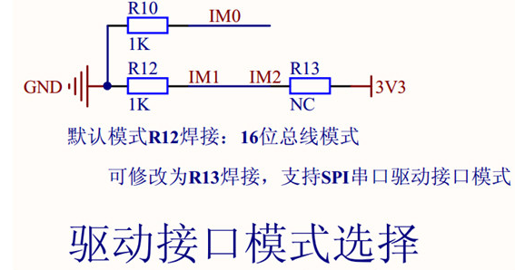
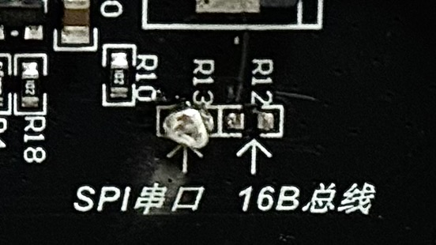
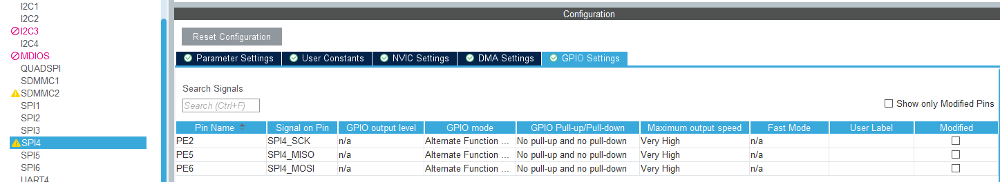
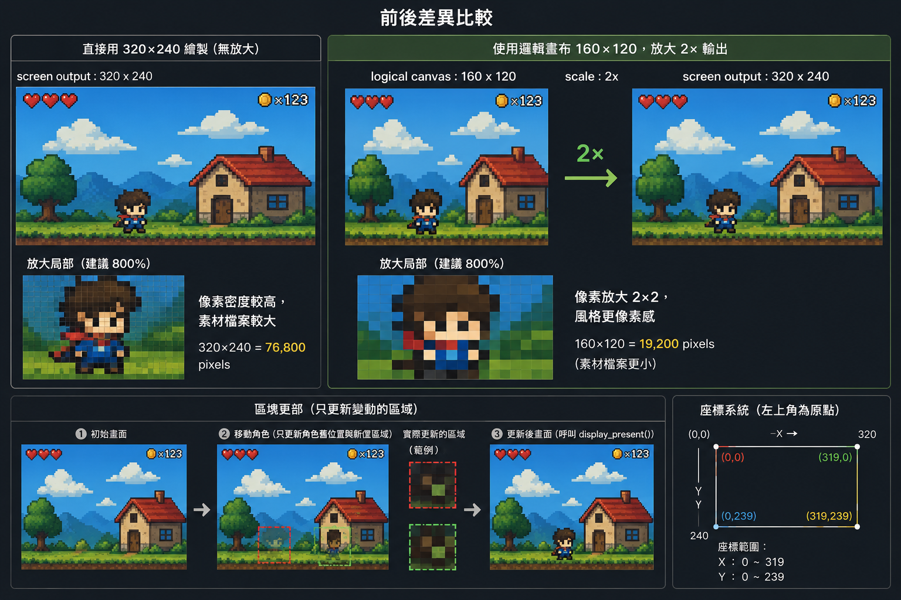
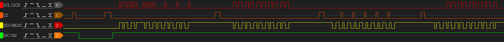
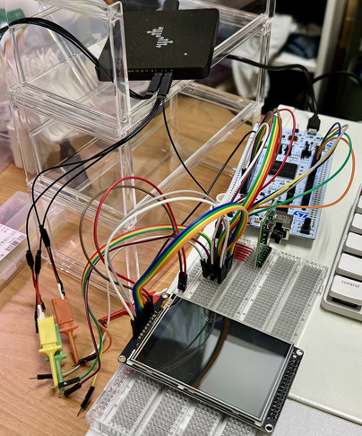
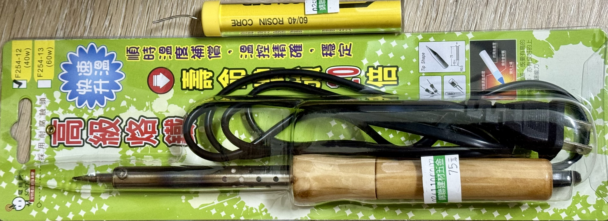

終於結束了兩章痛苦的 Input System，接下來就是我覺得最有趣的 Display System!!
畢竟可以實際的看到成果呢!!

<!-- more -->
# Display System：ILI9341 TFT、SPI 與像素繪圖
## 系列文章

- 
- 
- 
- 
- 
- Part 6：Display System：ILI9341 TFT、SPI 與像素繪圖
<!-- -  -->

---

## 本篇目標
- 使用 SPI 驅動 ILI9341 TFT LCD
- 設定 TFT 需要的控制腳位：CS、DC、BL
- 完成 ILI9341 初始化流程
- 實作基本繪圖 API：`draw_pixel()`、`fill_rect()`、`draw_bitmap()`
- 初步規劃像素風畫面更新方式
- 預留未來 TFT 與 W25Q128 共用 SPI bus 時的 `spi_bus_mutex` 設計

---
## 專案下載

本篇文章對應的完整範例專案已整理在 GitHub Release 中，
如果想直接對照程式碼或跳過環境建立流程，可以從以下連結下載

[🍦下載本篇範例專案-Part 6🍦](https://github.com/likeyou600/gb_project/releases/tag/Part6)

---

## SPI (Serial Peripheral Interface) 基礎
SPI，是一種同步序列通訊介面，簡單來說，就是資料一個 bit 接著一個 bit 傳送，而且傳送雙方會靠同一個 SCK 時脈訊號來對齊資料節奏。

相較於 UART 的非同步一對一通訊，以及 I2C 的雙線多裝置通訊，SPI 通常速度更快，但需要較多訊號線。

它很常出現在 MCU 和外部周邊之間，例如：TFT 螢幕、SPI Flash、EEPROM。

這一篇會用 SPI 來驅動 ILI9341 TFT LCD。
此章節的 SPI 圖片來源是 [Joyous 工程師の師](https://www.youtube.com/watch?v=FzT-EdlYVo8)，畫得超專業!!
### SPI 訊號線

SPI 常見會有四條主要訊號線：

| Master/Slave 角度            | 晶片角度                | 功能                     |
| ---------------------------- | ----------------------- | ------------------------ |
| `MOSI (Master Out Slave In)` | `SDI (Serial Data In)`  | Master 傳資料給 Slave    |
| `MISO (Master In Slave Out)` | `SDO (Serial Data Out)` | Slave 傳資料給 Master    |
| `SCK (Serial Clock)`         | `SCLK (Serial Clock)`   | SPI 時脈，由 Master 產生 |
| `SS (Slave Select)`          | `CS (Chip Select)`      | 選擇要通訊的 Slave       |

在這次的 TFT 螢幕裡，STM32 會作為 SPI Master，ILI9341 會作為 SPI Slave。

大部分時間 STM32 只會透過 `MOSI` 把 command / pixel data 寫進螢幕，因此 `MISO` 不一定會用到。

如果模組同時有 XPT2046 觸控晶片，觸控讀取才比較會需要從 slave 讀資料回來。

### SPI 傳輸流程

SPI 的基本流程如下：
1. 原始的 CS = HIGH
2. Master 將目標 Slave 的 **SS 拉低**
3. Master 開始送出 **SCK**
4. Master 透過 **MOSI 傳送資料**
5. Slave 可以同時透過 **MISO 回傳資料**
7. 每個 clock 傳送 1 bit
8. 傳完資料後，Master 將 **CS 拉高**，結束傳輸

### SPI Clock Mode

SPI 有四種 clock mode，主要由 `CPOL` 和 `CPHA` 決定。

- `CPOL`：Clock Polarity / Clock idle level
  - `CPOL = 0 / LOW`：SCK 閒置時為低電位
  - `CPOL = 1 / HIGH`：SCK 閒置時為高電位

- `CPHA`：Clock Phase / Sample edge
  - `CPHA = 0 / 1 Edge`：資料在第一個 clock edge 被取樣
  - `CPHA = 1 / 2 Edge`：資料在第二個 clock edge 被取樣

實際使用哪一種 mode 要看 datasheet 才能確認，就以等等使用的 ILI9341 TFT 舉例。

`The data is applied on the rising edge of the SCL signal.`
這句話只能鎖定「取樣邊緣是 rising edge」，所以會對應到 Mode 0 或 Mode 3。

目前測試下來，兩種 Mode 都可以正常運行

---

## TFT 電阻式觸控螢幕

常見 ILI9341 SPI 模組會需要幾個控制腳位：

| TFT 腳位     | 功能                  |
| ------------ | --------------------- |
| `VCC`        | 3.3v                  |
| `GND`        | GND                   |
| `SDI / MOSI` | SPI write data        |
| `SCL / SCK`  | SPI clock             |
| `CS / SS`    | LCD chip select       |
| `SDO / MISO` | SPI read data，可選   |
| `D/C / RS`   | command / data select |
| `BLK / BL`   | 背光控制              |

### ILI9341 & XPT2046
TFT 模組可能同時包含兩個部分：
- `ILI9341`
  - LCD display controller，負責接收 MCU 傳來的 command / pixel data，並控制 TFT 面板顯示。
  - [ILI9341 datasheet](找不到韌體工作之亡羊補牢專案/spec/ILI9341_spi_screen.pdf)
- `XPT2046`
  - 負責電阻式觸控
  - [XPT2046 datasheet](找不到韌體工作之亡羊補牢專案/spec/XPT2046_spi_screen_touch.pdf)

### 顯示解析度與顏色格式

這塊螢幕的實體解析度是：


320 x 240


ILI9341 常見會使用 RGB565，也就是每個 pixel 使用 16-bit：


R: 5 bits
G: 6 bits
B: 5 bits


例如可以先定義幾個常用顏色：


#define RGB565_BLACK  0x0000
#define RGB565_WHITE  0xFFFF
#define RGB565_RED    0xF800
#define RGB565_GREEN  0x07E0
#define RGB565_BLUE   0x001F


### 驅動
本專案的 ILI9341 driver 並不是直接整包移植某一份現成 driver，
而是參考兩個來源後，整理成適合目前專案架構的版本：

- 賣家提供的 TFT 範例程式
  - [TFT 範例程式](找不到韌體工作之亡羊補牢專案/spec/STM32F405RG-TOUCH-GBK.zip)
  - 主要參考 LCD 初始化序列、SPI mode、RGB565 顯示方式
  - 也用來確認這塊 DevEBox TFT 模組的特殊設定，例如 R12/R13 需要切到 SPI 模式

- ST 官方 stm32-ili9341 component
  - [stm32-ili9341](https://github.com/STMicroelectronics/stm32-ili9341?tab=readme-ov-file)
  - 主要參考 ILI9341 指令命名、BSP component 的分層方式
  - 不直接搬整包，因為官方版本依賴 `LCD_IO_*` 這類 BSP 介面，和目前專案的 `Board/` 架構不完全一樣

### 調整 TFT 模組為 SPI 介面

這塊 TFT 模組同時支援 16-bit parallel bus 和 SPI serial interface。  
根據賣家提供的說明，預設是 `R12` 焊接，對應 16-bit bus 模式。  
如果要改成 SPI serial interface，需要改成 `R13` 焊接。

---
## 0. TFT 顯示資料流


🌕Init side:🌕
    MX_GPIO_Init()
        |
        | 設定 LCD control pins
        |
        | LCD_CS  -> GPIO Output
        | LCD_DC  -> GPIO Output
        | LCD_BL  -> GPIO Output
        |
        v
    LCD GPIO ready
-----------
    MX_SPI4_Init()
        |
        | 設定 SPI4
        |
        | PE2 -> SPI4_SCK
        | PE6 -> SPI4_MOSI
        | PE5 -> SPI4_MISO，可選
        |
        | ILI9341 目前使用 SPI mode 0：
        |   CPOL = Low
        |   CPHA = 1Edge
        |
        | 資料格式：
        |   8-bit
        |   MSB first
        v
    SPI4 ready
------------------------
🌗Display Init side:🌗

    display_task
        |
        | display_service_init()
        v
    display_service
        |
        | ili9341_init()
        v
    ili9341 driver
        |
        | board_lcd_init()
        |   -> board_lcd_unselect()
        |      -> LCD_CS = HIGH
        |
        |   -> board_lcd_backlight_off()
        |      -> LCD_BL = ON
        |
        | ILI9341 init sequence
        |   Software reset
        |   Power / timing 相關設定
        |   Pixel Format = RGB565
        |   Memory Access Control = landscape
        |   Gamma 設定
        |   Sleep Out
        |   Display On
        v
    ILI9341 ready

------------------------
🌓Draw Command side:🌓

    display_task
        |
        | display_service_draw_test_pattern()
        v
    display_service
        |
        | ili9341_fill_screen(color)
        | ili9341_fill_rect(x, y, w, h, color)
        v
    ili9341 driver
        |
        | ili9341_set_address_window(x, y, w, h)
        |
        |   -> CASET / Column Address Set
        |   -> PASET / Page Address Set
        |   -> RAMWR / Memory Write
        |
        | 接著送 RGB565 pixel data
        v
    board_lcd wrapper
        |
        | board_lcd_write_command(...)
        | board_lcd_write_data(...)
        | board_lcd_write_command_data(...)
        v
    GPIO + SPI transfer
        |
        | LCD_CS = LOW
        |
        | command:
        |   LCD_DC = LOW
        |   HAL_SPI_Transmit(&hspi4, command, ...)
        |
        | data:
        |   LCD_DC = HIGH
        |   HAL_SPI_Transmit(&hspi4, data, ...)
        |
        | LCD_CS = HIGH
        v
    TFT receives command / pixel data

------------------------
🌚Panel side:🌚

    ILI9341 controller
        |
        | 根據 MADCTL 決定 GRAM 對應到面板的方向
        |
        | 目前設定：
        |   MADCTL = MY | MV | BGR
        |
        |   MY  -> 修正上下/左右方向，讓角落顏色對到你的實際螢幕方向
        |   MV  -> x/y 軸交換，進入橫向 landscape
        |   BGR -> 使用 BGR 色彩順序
        |
        | 代表目前採用 landscape 座標：
        |   width  = 320
        |   height = 240
        |
        | 座標概念：
        |   x = 0 ~ 319
        |   y = 0 ~ 239
        v
    GRAM updated
        |
        | pixel data 寫入 LCD internal memory
        | 寫入順序由 CASET / PASET / RAMWR 決定
        v
    TFT panel shows image
    


---
## 1. 資料夾結構

gb_f767zi/
    ├─ App/
    │    ├─ Services/
    │    │  └─ Display/
    │    │     ├─ display_service.c
    │    │     └─ display_service.h
    │    └─ Tasks/
    │        ├─ Inc/
    │        │  └─ display_task.h
    │        └─ Src/
    │           └─ display_task.c 
    │  
    └─ Components
           └─ ili9341/
               ├─ Inc/
               │  └─ ili9341.h
               └─ Src/
                    └─ ili9341.c 


---
## 2. CubeMX SPI 設定

在 CubeMX 裡先啟用一組 SPI。這邊我選擇使用 `SPI4`，主要原因是 NUCLEO-F767ZI 板子左側排針剛好有一組 SPI4 相關腳位集中在一起，接線比較方便。

在 CubeMX 設定大概如下：


Mode
    Mode                : Full-Duplex Master
    Hardware NSS Signal : Disable
------
Basic Parameters
    Frame Format        : Motorola
    Data Size           : 8 Bits
    First Bit           : MSB First
------
Clock Parameters
    Prescaler           : 2
    Clock Mode          : CPOL = Low, CPHA = 1 Edge 或是 CPOL = High, CPHA = 2 Edge
------
Advanced Parameters
    CRC Calculation     : Disabled
    NSSP Mode           : Enabled
    NSS Signal Type     : Software


### Mode

這次是 STM32 主動控制 TFT，所以 STM32 要設定成 Master，
`Full-Duplex Master` 代表 SPI 可以同時送出資料和接收資料。

Mode = Full-Duplex Master


如果只想傳資料給螢幕，也可以選 `Transmit Only Master`。  
但我這裡先用 `Full-Duplex Master`，之後如果同一條 SPI bus 上還有觸控控制器或其他需要讀資料的裝置，會比較有彈性。

#### Hardware NSS Signal

這裡設定為：

Hardware NSS Signal = Disable


如果啟用 hardware NSS，STM32 的 SPI peripheral 會控制固定的 NSS 腳位。  
這比較適合一組 SPI 只接一顆 slave 的情況。

但這個專案之後可能會在同一條 SPI bus 上接多個裝置，例如：
- ILI9341 TFT
- XPT2046 觸控控制器
- W25Q128 SPI Flash

這些裝置可以共用 `SCK`、`MOSI`、`MISO`，但每顆 slave 都需要自己的 `CS` 腳位：


SPI4_SCK  -> TFT / Touch / Flash 共用
SPI4_MOSI -> TFT / Touch / Flash 共用
SPI4_MISO -> Touch / Flash 共用

LCD_CS    -> ILI9341 TFT
TOUCH_CS  -> XPT2046
FLASH_CS  -> W25Q128


所以這裡不使用 hardware NSS，而是使用 **Software NSS**。  
也就是把 `CS` 當成一般 GPIO，由 firmware 自己控制。

LCD 的選取和取消選取可以先包成兩個 board-level function：


void board_lcd_select(void)
{
    HAL_GPIO_WritePin(LCD_CS_GPIO_Port, LCD_CS_Pin, GPIO_PIN_RESET);
}

void board_lcd_unselect(void)
{
    HAL_GPIO_WritePin(LCD_CS_GPIO_Port, LCD_CS_Pin, GPIO_PIN_SET);
}


之後 ILI9341 driver 在傳送 command 或 data 前，先呼叫 `board_lcd_select()`；  
傳輸結束後，再呼叫 `board_lcd_unselect()`。


board_lcd_select();

HAL_SPI_Transmit(&hspi4, data, len, HAL_MAX_DELAY);

board_lcd_unselect();


這樣之後如果要加入 Flash 或 Touch，只要各自再準備不同的 CS 控制函式即可，不需要為了每顆 SPI 裝置都啟用一組新的 SPI peripheral。

### Basic Parameters
#### Frame Format

這裡設定為：


Frame Format = Motorola


SPI 這個介面最早就是由 Motorola 提出的，所以在一些 MCU 設定工具裡，會把一般標準 SPI 傳輸格式稱為 `Motorola` format。
對這次的 ILI9341 TFT 來說，它使用的就是一般 SPI serial interface，所以這裡維持 `Motorola` 即可。
一般使用 SPI TFT、SPI Flash、感測器時，大多也都是使用這個格式。

#### Data Size

ILI9341 datasheet 在 interface mode 的描述中有提到 **4-wire 8-bit serial data interface**，也就是這次要使用的 SPI 顯示介面。

這裡設定為：


Data Size = 8 Bits


這裡的 `8 Bits` 指的是 SPI peripheral 每次傳輸一個 8-bit frame，也就是一個 byte。

ILI9341 的 command 通常就是以 8-bit 為單位傳送，例如：


#define ILI9341_SWRESET 0x01U
#define ILI9341_DISPON 0x29U


而 pixel data 雖然常用 RGB565，也就是一個 pixel 16-bit，但實際透過 SPI 傳輸時，通常還是拆成兩個 byte 傳：


RGB565 pixel = 16 bits = high byte + low byte


例如紅色 `0xF800`：


uint16_t color = 0xF800;   // red
uint8_t data[2];

data[0] = color >> 8;      // high byte
data[1] = color & 0xFF;    // low byte


所以 SPI `Data Size` 設成 `8 Bits` 最直覺，也比較容易搭配 ILI9341 的 command / data 傳輸流程。

之後 driver 大概會像這樣送資料：


ili9341_write_command(0x2C);      // Memory Write
ili9341_write_data(data, len);    // RGB565 pixel bytes


#### First Bit

這裡設定為：


First Bit = MSB First


`MSB First` 代表每個 byte 會先傳最高位元。

例如 `0xA5`：


0xA5 = 1010 0101
       ^
       先從最左邊的 bit 開始送


ILI9341 這類 SPI display controller 通常使用 `MSB First`。  
如果 bit order 設錯，螢幕收到的 command 會完全不對，常見現象是螢幕沒有反應或顯示異常。

### Clock Parameters

#### Prescaler / Baud Rate

目前畫面上設定為：


Prescaler = 2
Baud Rate = 48.0 MBits/s


Prescaler 越小，SPI clock 越快；Prescaler 越大，SPI clock 越慢。

TFT 顯示需要傳大量 pixel data，所以 SPI 速度越快，畫面更新越快。  

如果遇到以下狀況：螢幕完全沒反應、顏色錯亂、初始化偶爾成功、偶爾失敗、邏輯分析儀看到波形品質不好、杜邦線太長造成訊號不穩

可以先把 prescaler 調大，例如：

Prescaler = 8
Prescaler = 16
Prescaler = 32


#### Clock Polarity / Clock Phase

目前設定為：


Clock Polarity (CPOL) = Low
Clock Phase (CPHA)    = 1 Edge


這就是常見的 SPI Mode 0：


CPOL = 0
CPHA = 0


意思是：

- SCK 閒置時是低電位
- 資料在第一個 clock edge 被取樣

SPI 的 clock mode 如果設錯，資料位元可能會在錯誤的時間點被取樣。  
這時候邏輯分析儀可能看起來有 clock、有資料，但 TFT 仍然沒有正確反應。

所以如果之後螢幕不亮，除了檢查接線和 CS / DC / RST，也要回來確認 SPI mode 是否符合 driver / 模組需求。

### Advanced Parameters
#### CRC Calculation

這裡設定為：


CRC Calculation = Disabled


SPI 本身可以選擇啟用 CRC，但一般驅動 ILI9341 TFT 時不會開 SPI CRC。

原因是 ILI9341 的 command / data protocol 本身沒有要求 STM32 SPI peripheral 自動加 CRC。  
如果開啟 CRC，反而可能讓傳輸內容和 ILI9341 預期的不一樣。

### GPIO Settings
SPI4 啟用後，CubeMX 會自動把對應腳位設定成 Alternate Function。

這些腳位不是一般 GPIO output，而是交給 SPI peripheral 控制。

會看到：

SPI4_SCK
SPI4_MISO
SPI4_MOSI


### NVIC Settings

如果第一版使用 blocking transmit：


HAL_SPI_Transmit(&hspi4, data, len, timeout);


那 SPI interrupt 可以先不開。

如果之後要改成 interrupt：


HAL_SPI_Transmit_IT(...)


才需要回到 `NVIC Settings` 開啟對應的 SPI interrupt。

先用 blocking transmit 會比較簡單，也比較容易 debug。

### DMA Settings
等 blocking 版本穩定後，再來優化傳輸效能。
之後如果要加速整張圖或 bitmap 傳輸，可以考慮：


HAL_SPI_Transmit_DMA(&hspi4, data, len);


DMA 比較適合大量 pixel data，例如：
- fill screen
- draw bitmap
- 局部畫面更新
- sprite 更新

但 DMA 會多出同步問題，例如要知道傳輸何時完成，以及 display task 什麼時候可以送下一筆資料。  

## 3. 額外控制 GPIO 腳位：CS / DC / BL

除了 SPI 本身的 `SCK`、`MOSI`、`MISO` 之外，ILI9341 TFT 還需要幾個額外的 GPIO 控制腳位。

這些腳位不是 SPI peripheral 自動控制的，而是由 firmware 在傳輸前後手動切換。

目前 SPI4 腳位規劃如下：

| TFT 腳位     | STM32 腳位          | 功能                  |
| ------------ | ------------------- | --------------------- |
| `VCC`        | `3.3v`              | 3.3v                  |
| `GND`        | `GND`               | GND                   |
| `SDI / MOSI` | `PE6 / SPI4_MOSI`   | SPI write data        |
| `SCL / SCK`  | `PE2 / SPI4_SCK`    | SPI clock             |
| `CS / SS`    | `PE4 / GPIO Output` | LCD chip select       |
| `SDO / MISO` | `PE5 / SPI4_MISO`   | SPI read data，可選   |
| `D/C / RS`   | `PG1 / GPIO Output` | command / data select |
| `BLK / BL`   | `PG0 / GPIO Output` | 背光控制              |

### CubeMX GPIO 設定建議

這幾個控制腳在 CubeMX 裡可以設定成：

| User Label | STM32 腳位 | GPIO mode        | Output level | Pull-up / Pull-down         | Speed |
| ---------- | ---------- | ---------------- | ------------ | --------------------------- | ----- |
| `LCD_BL`   | `PG0`      | Output Push Pull | High         | No pull-up and no pull-down | Low   |
| `LCD_CS`   | `PE4`      | Output Push Pull | High         | No pull-up and no pull-down | High  |
| `LCD_DC`   | `PG1`      | Output Push Pull | Low          | No pull-up and no pull-down | High  |

簡單來說：

- `LCD_BL` 預設 High，讓背光先打開
- `LCD_CS` 預設 High，避免一開機就選到 LCD，等 driver 要傳 command 或 data 時再拉低。
- `LCD_DC` 預設 Low，先停在 command mode

`CS` 和 `DC` 會跟著 SPI 傳輸頻繁切換，所以 speed 可以設高一點。  
`BL` 只會偶爾切換，所以 speed 用 Low 就可以。

### CS：Chip Select

`CS` 用來選擇目前要通訊的 SPI 裝置。

因為前面選擇 Hardware NSS Signal = Disable
所以 `LCD_CS` 會當作一般 GPIO 手動控制。


LCD_CS = Low  -> 選取 LCD，開始 SPI 傳輸
LCD_CS = High -> 取消選取 LCD，結束 SPI 傳輸


### DC：Data / Command Select

`DC` 是 ILI9341 driver 裡很重要的控制腳。

它用來告訴 LCD：現在 SPI 傳過去的是 command，還是 data。


LCD_DC = Low  -> 傳 command
LCD_DC = High -> 傳 data



static void board_lcd_write_bytes(const uint8_t *data, uint32_t size)
{
  while (size > 0U)
  {
    uint16_t chunk = (size > 0xFFFFU) ? 0xFFFFU : (uint16_t)size;

    (void)HAL_SPI_Transmit(&hspi4, (uint8_t *)data, chunk, BOARD_LCD_SPI_TIMEOUT_MS);
    data += chunk;
    size -= chunk;
  }
}

static void board_lcd_write_command_selected(uint8_t command)
{
  HAL_GPIO_WritePin(LCD_DC_GPIO_Port, LCD_DC_Pin, GPIO_PIN_RESET);
  board_lcd_write_bytes(&command, 1U);
}

static void board_lcd_write_data_selected(const uint8_t *data, uint32_t size)
{
  if ((data == NULL) || (size == 0U))
  {
    return;
  }

  HAL_GPIO_WritePin(LCD_DC_GPIO_Port, LCD_DC_Pin, GPIO_PIN_SET);
  board_lcd_write_bytes(data, size);
}



第一版先用 blocking `HAL_SPI_Transmit()`，等 driver 穩定後再考慮改成 DMA。

### BL：Backlight
`BL` 是背光控制腳位，用來控制 LCD 背光是否打開。

這塊 TFT 模組實測後發現背光是 **active low**：


LCD_BL = Low  -> 背光開啟
LCD_BL = High -> 背光關閉


因此設定上要顛倒過來

void board_lcd_backlight_on(void)
{
  HAL_GPIO_WritePin(LCD_BL_GPIO_Port, LCD_BL_Pin, GPIO_PIN_RESET);
}
void board_lcd_backlight_off(void)
{
  HAL_GPIO_WritePin(LCD_BL_GPIO_Port, LCD_BL_Pin, GPIO_PIN_SET);
}


未來如果想控制亮度，可以把 `LCD_BL` 從 GPIO Output 改成 PWM 輸出。

---
## 4. Init command sequence

ILI9341 不是 SPI 接好就會直接顯示畫面。  
上電後需要送一串初始化 command，設定 LCD controller 的工作狀態。

這段主要參考賣家提供的 TFT 範例程式，再整理成目前專案的 `ili9341_init()`。
程式碼可參考 firmware/gb_f767zi/Components/ili9341/Src/ili9341.c

目前初始化流程大致如下：

1. Board layer 初始化
   - 設定 `CS` 預設為不選取狀態
   - 關閉背光

2. Software reset
   - `ILI9341_SWRESET` command 進行 software reset

3. Power / timing 相關設定
   - Power Control
   - Power Sequence
   - Driver Timing Control
   - Pump Ratio Control
   - Frame Rate Control
   - Display Function Control

4. Pixel format
   - 設定成 `RGB565`
   - 每個 pixel 使用 16-bit 顏色資料

5. Memory access control
   - 設定畫面方向
   - 目前使用 landscape：
     - width = 320
     - height = 240
   - 同時設定 RGB / BGR 色彩順序

6. Gamma 設定
   - 設定 positive gamma correction
   - 設定 negative gamma correction
   - 這部分先沿用賣家範例提供的參數

7. Sleep out
   - 送出 `SLEEP_OUT`
   - 等待 LCD controller 離開 sleep mode

8. Display on
   - 送出 `DISPLAY_ON`
   - 最後開啟背光

---
## 5. fill screen 測試

剛開始的目標不是畫圖，而是填滿整個螢幕以及部分填色。

例如：


LOG_INFO("display", "display_task started");

LOG_INFO("display", "display init begin");
display_service_init();
LOG_INFO("display", "display init done");

LOG_INFO("display", "fill red");
display_service_fill_screen(ILI9341_COLOR_RED);
osDelay(500U);
LOG_INFO("display", "fill green");
display_service_fill_screen(ILI9341_COLOR_GREEN);
osDelay(500U);
LOG_INFO("display", "fill blue");
display_service_fill_screen(ILI9341_COLOR_BLUE);
osDelay(500U);

LOG_INFO("display", "draw corner pattern");
ili9341_fill_rect(0U, 0U, 40U, 40U, ILI9341_COLOR_RED);
ili9341_fill_rect(280U, 0U, 40U, 40U, ILI9341_COLOR_GREEN);
ili9341_fill_rect(0U, 200U, 40U, 40U, ILI9341_COLOR_BLUE);
ili9341_fill_rect(280U, 200U, 40U, 40U, ILI9341_COLOR_WHITE);



如果可以看到紅、綠、藍出現，接著四色填螢幕，代表 pixel data 可以正確寫入螢幕

---
## 6. 基本繪圖 API

螢幕成功 fill screen 後，再往上做簡單繪圖 API。

### draw_pixel

最底層的繪圖函式是畫一個 pixel：


void ili9341_draw_pixel(uint16_t x, uint16_t y, uint16_t color);


概念是：

1. 設定繪圖 window 到 `(x, y)`
2. 傳入一個 RGB565 pixel

雖然 `draw_pixel()` 最直覺，但大量呼叫會很慢。  
後面畫圖會盡量改成一次傳一塊區域。

### fill_rect

`fill_rect()` 是更常用的基本函式：


void ili9341_fill_rect(uint16_t x,
                       uint16_t y,
                       uint16_t w,
                       uint16_t h,
                       uint16_t color);

//四個角落填色
ili9341_fill_rect(0U, 0U, 40U, 40U, ILI9341_COLOR_RED);
ili9341_fill_rect(280U, 0U, 40U, 40U, ILI9341_COLOR_GREEN);
ili9341_fill_rect(0U, 200U, 40U, 40U, ILI9341_COLOR_BLUE);
ili9341_fill_rect(280U, 200U, 40U, 40U, ILI9341_COLOR_WHITE);


它可以拿來畫：

- 背景區塊
- UI panel
- 進度條
- 測試方塊
- 像素風 tile

### draw_bitmap

像素風畫面會需要顯示 bitmap。

第一版先使用最直覺的 **RGB565 陣列**。  
也就是每一個 pixel 直接用一個 `uint16_t` 表示顏色。

目前在 ILI9341 driver 裡提供：


void ili9341_draw_bitmap(uint16_t x,
                         uint16_t y,
                         uint16_t width,
                         uint16_t height,
                         const uint16_t *bitmap);


`bitmap` 的資料格式是 row-major：


bitmap[0] -> row 0, col 0
bitmap[1] -> row 0, col 1
bitmap[2] -> row 0, col 2
...
下一列接在後面


例如一張 `2 x 2` bitmap：


static const uint16_t test_bitmap[] = {
    ILI9341_COLOR_RED,  ILI9341_COLOR_GREEN,
    ILI9341_COLOR_BLUE, ILI9341_COLOR_WHITE,
};

ili9341_draw_bitmap(10, 10, 2, 2, test_bitmap);


畫面結果會是：


RED    GREEN
BLUE   WHITE


目前 `ili9341_draw_bitmap()` 內部會做幾件事：

- 檢查 `bitmap` 是否為 `NULL`
- 檢查座標是否超出螢幕
- 如果 bitmap 超出右邊或下邊，會自動裁切
- 使用 `ili9341_set_address_window()` 設定寫入範圍
- 將 `uint16_t RGB565` 轉成 ILI9341 需要的 high byte / low byte 順序
- 分批透過 SPI 寫入，不使用逐點 `draw_pixel()`

未來可以再優化成：
- palette index bitmap
- 1-bit / 2-bit / 4-bit tile
- RLE 壓縮
- 從 SPI Flash 讀取素材
- DMA SPI 傳輸

但 Part 6 先讓 RGB565 bitmap 能穩定顯示出來就好。

---

## 7. 像素風畫面規劃

這塊 TFT 是 320×240，但如果直接用 320×240 畫像素風，素材會比較大。

我想先用比較像 Game Boy 的邏輯畫布，例如：


logical canvas : 160 x 120
scale          : 2x
screen output  : 320 x 240


這樣每個邏輯 pixel 放大成 2×2，畫面就會比較有像素感。

#define DISPLAY_SERVICE_LOGICAL_WIDTH 160U
#define DISPLAY_SERVICE_LOGICAL_HEIGHT 120U
#define DISPLAY_SERVICE_LOGICAL_SCALE 2U

display_service_draw_logical_pixel(uint16_t x, uint16_t y, uint16_t color)
display_service_fill_logical_rect(uint16_t x, uint16_t y, uint16_t width, uint16_t height, uint16_t color)
display_service_draw_logical_bitmap(uint16_t x, uint16_t y, uint16_t width, uint16_t height, const uint16_t *bitmap)
display_service_draw_logical_test_pattern(void)


未來 display service 可以提供：

display_draw_tile(x, y, tile_id);
display_draw_sprite(x, y, sprite_id);
display_present();


---

## 8. SPI Debug 與共用 Bus 規劃

### 邏輯分析儀觀察 SPI 訊號

這次也可以把 DSLogic 拿出來看 SPI 波形。

從這張 DSLogic 波形可以看到，SPI 端確實有在送資料：

- `SCK` 有出現多段 clock burst，代表 MCU 端有啟動 SPI 傳輸。
- `CS` 在傳輸期間有被拉低，傳輸結束後再拉高，片選行為看起來正常。
- `MOSI` 在 `SCK` clock 期間有資料變化，代表資料線不是固定卡在 high 或 low。
- `DC/RS` 一開始有維持在 low，之後切到 high，符合「先送 command，再送 data」的顯示器通訊流程。

若螢幕仍然沒有反應，下一步比較可能要檢查：
- SPI mode 是否正確，例如 CPOL / CPHA。
- command sequence 是否符合該 LCD driver。
- `DC/RS` 切換時機是否和 command / data byte 對齊。
- CS 是否需要整段初始化期間維持低電位，而不是每幾個 byte 切一次。

### 未來的 spi_bus_mutex

目前 Part 6 只有 TFT 使用 SPI，所以暫時不一定需要 `spi_bus_mutex`。

但之後如果 W25Q128 Flash 也接在同一組 SPI bus 上，TFT 和 Flash 就會變成共享 SPI 資源。

例如：


display_task -> ILI9341 -> SPI bus
storage_task -> W25Q128 -> SPI bus


到時候就需要保護 SPI bus，確保同一時間只有一個 driver 在操作 SPI。

概念上會像這樣：


osMutexAcquire(spi_bus_mutex, osWaitForever);

/* SPI transaction */

osMutexRelease(spi_bus_mutex);


這一篇先不實作 `spi_bus_mutex`，只先把這個需求記下來。  
等之後接 W25Q128 時再正式整理 SPI bus manager。

---

## 本篇小結
怎麼覺得每一篇都比上一篇更多災多難呢，
這次做 TFT 螢幕好多，除了基本 spi 線四條，還有兩條控制的 GPIO，還有3.3v與 GND。
為了同時接上邏輯分析儀，已經變得一團亂了🍵

為了改螢幕的顯示模式，還跑去買了75元，40w的烙鐵
話說本來想買控溫一組接近1000的那種，發現也根本用不太到ㄏㄏ
