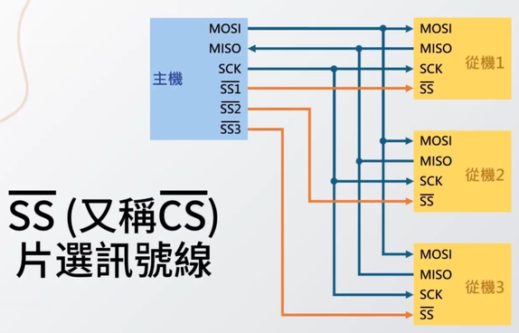
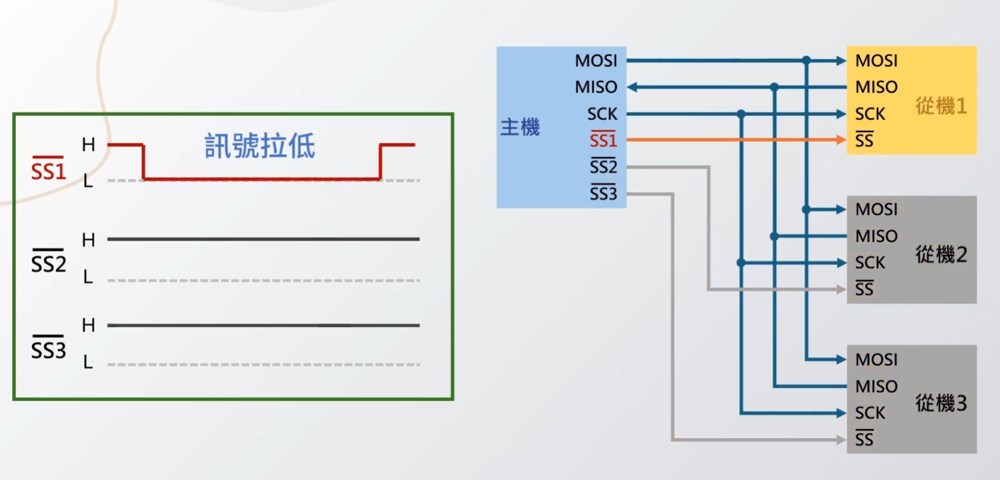
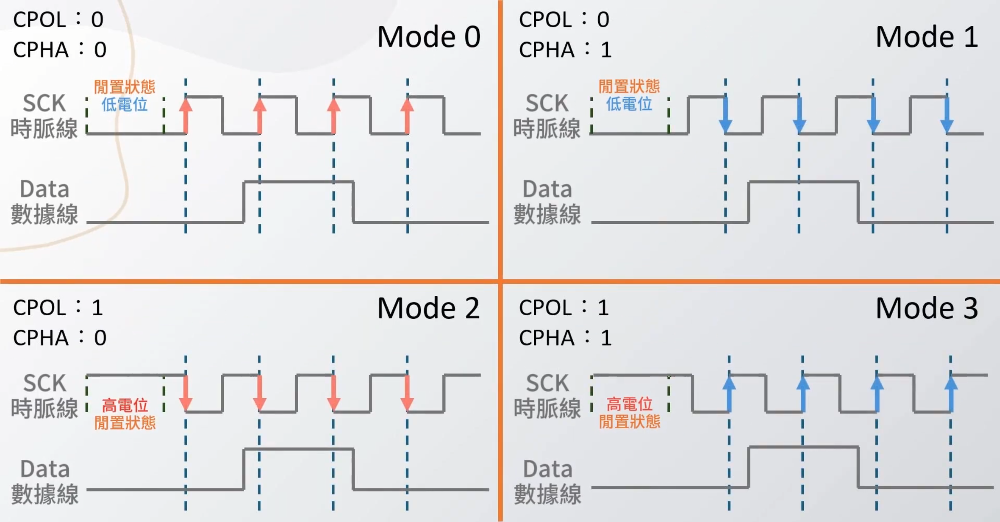
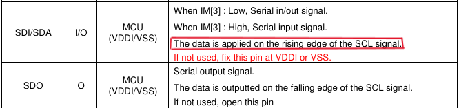
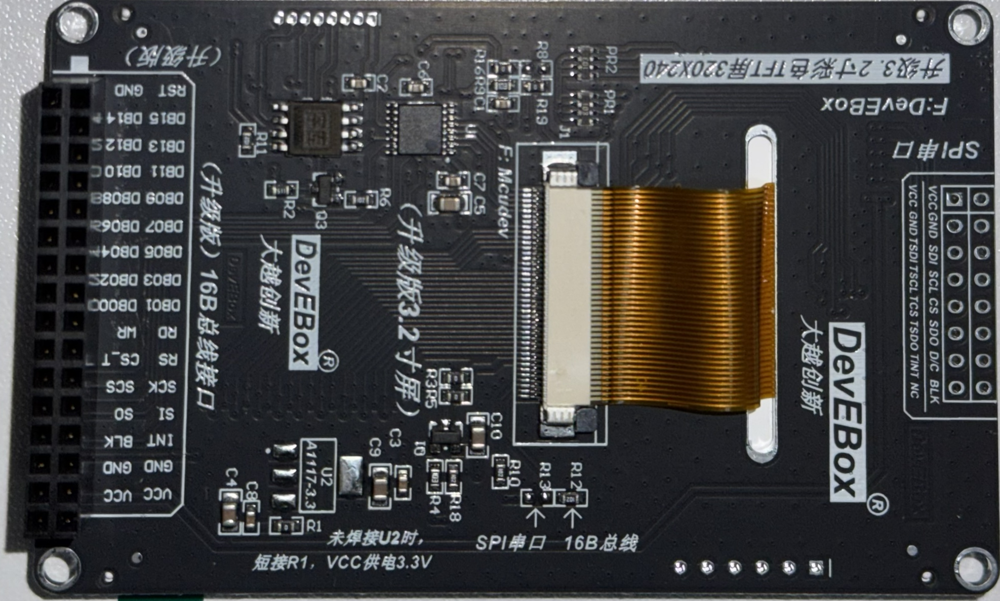
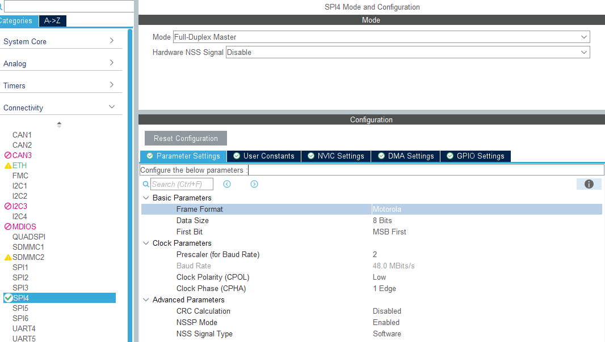
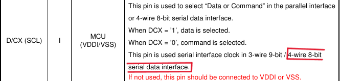
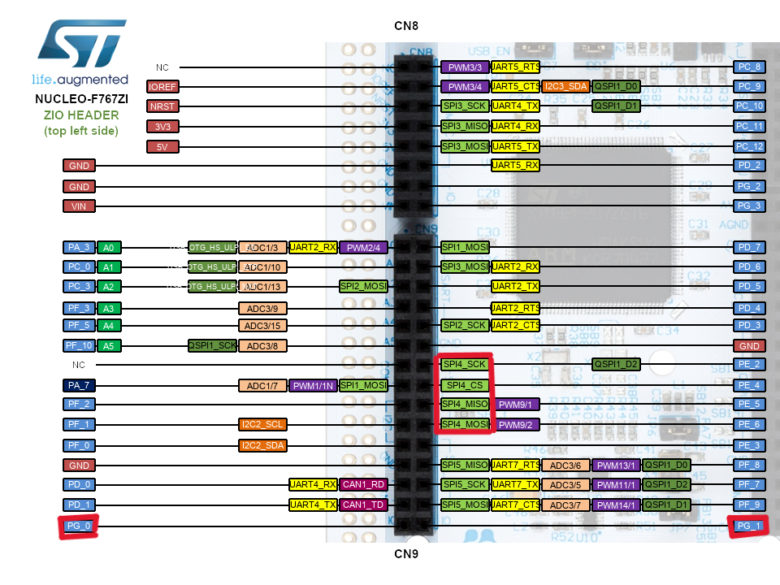
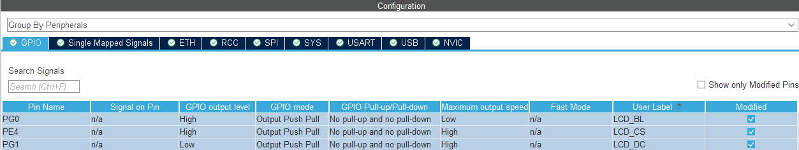

終於結束了兩章痛苦的 Input System，接下來就是我覺得最有趣的顯示系統!!
畢竟可以實際的看到成果呢!!

<!-- more -->
# 顯示系統：ILI9341 TFT、SPI 與像素繪圖
## 系列文章

- 
- 
- 
- 
- 
- Part 6：顯示系統：ILI9341 TFT、SPI 與像素繪圖
- 

---

## 本篇目標
- 使用 SPI 驅動 ILI9341 TFT LCD
- 設定 TFT 需要的控制腳位：CS、DC、RST、BL
- 完成 ILI9341 初始化流程
- 實作基本繪圖 API：`draw_pixel()`、`fill_rect()`、`draw_bitmap()`
- 使用 Part 3 的 `logger_task` 記錄 display bring-up 過程
- 使用邏輯分析儀觀察 SPI 訊號
- 初步規劃像素風畫面更新方式
- 預留未來 TFT 與 W25Q128 共用 SPI bus 時的 `spi_bus_mutex` 設計

---

## SPI (Serial Peripheral Interface) 基礎
SPI，是一種同步序列通訊介面，簡單來說，就是資料一個 bit 接著一個 bit 傳送，而且傳送雙方會靠同一個 SCK 時脈訊號來對齊資料節奏。

相較於 UART 的非同步一對一通訊，以及 I2C 的雙線多裝置通訊，SPI 通常速度更快，但需要較多訊號線。

它很常出現在 MCU 和外部周邊之間，例如：TFT 螢幕、SPI Flash、EEPROM。

這一篇會用 SPI 來驅動 ILI9341 TFT LCD。
此章節的 SPI 圖片來源是 [Joyous 工程師の師](https://www.youtube.com/watch?v=FzT-EdlYVo8)，畫得超專業!!
### SPI 訊號線

SPI 常見會有四條主要訊號線：

| Master/Slave 角度            | 晶片角度                | 功能                     |
| ---------------------------- | ----------------------- | ------------------------ |
| `MOSI (Master Out Slave In)` | `SDI (Serial Data In)`  | Master 傳資料給 Slave    |
| `MISO (Master In Slave Out)` | `SDO (Serial Data Out)` | Slave 傳資料給 Master    |
| `SCK (Serial Clock)`         | `SCLK (Serial Clock)`   | SPI 時脈，由 Master 產生 |
| `SS (Slave Select)`          | `CS (Chip Select)`      | 選擇要通訊的 Slave       |

在這次的 TFT 螢幕裡，STM32 會作為 SPI Master，ILI9341 會作為 SPI Slave。

大部分時間 STM32 只會透過 `MOSI` 把 command / pixel data 寫進螢幕，因此 `MISO` 不一定會用到。

如果模組同時有 XPT2046 觸控晶片，觸控讀取才比較會需要從 slave 讀資料回來。

### SPI 傳輸流程

SPI 的基本流程如下：
1. 原始的 CS = HIGH
2. Master 將目標 Slave 的 **SS 拉低**
3. Master 開始送出 **SCK**
4. Master 透過 **MOSI 傳送資料**
5. Slave 可以同時透過 **MISO 回傳資料**
7. 每個 clock 傳送 1 bit
8. 傳完資料後，Master 將 **CS 拉高**，結束傳輸

### SPI Clock Mode

SPI 有四種 clock mode，主要由 `CPOL` 和 `CPHA` 決定。

- `CPOL`：Clock Polarity / Clock idle level
  - `CPOL = 0 / LOW`：SCK 閒置時為低電位
  - `CPOL = 1 / HIGH`：SCK 閒置時為高電位

- `CPHA`：Clock Phase / Sample edge
  - `CPHA = 0 / 1 Edge`：資料在第一個 clock edge 被取樣
  - `CPHA = 1 / 2 Edge`：資料在第二個 clock edge 被取樣

實際使用哪一種 mode 要看 datasheet 才能確認，就以等等使用的 ILI9341 TFT 舉例。
[ILI9341 datasheet](找不到韌體工作之亡羊補牢專案/spec/ILI9341_spi_screen.pdf)

`The data is applied on the rising edge of the SCL signal.`
這句話只能鎖定「取樣邊緣是 rising edge」，所以會對應到 Mode 0 或 Mode 3。

目前測試下來，兩種 Mode 都可以正常運行

---

## TFT 電阻式觸控螢幕

常見 ILI9341 SPI 模組會需要幾個控制腳位：

| TFT 腳位     | 功能                  |
| ------------ | --------------------- |
| `VCC`        | 3.3v                  |
| `GND`        | GND                   |
| `SDI / MOSI` | SPI write data        |
| `SCL / SCK`  | SPI clock             |
| `CS / SS`    | LCD chip select       |
| `SDO / MISO` | SPI read data，可選   |
| `D/C / RS`   | command / data select |
| `BLK / BL`   | 背光控制              |

### ILI9341 & XPT2046
TFT 模組可能同時包含兩個部分：
- `ILI9341`
  - LCD display controller，負責接收 MCU 傳來的 command / pixel data，並控制 TFT 面板顯示。
  - [ILI9341 datasheet](找不到韌體工作之亡羊補牢專案/spec/ILI9341_spi_screen.pdf)
- `XPT2046`
  - 負責電阻式觸控
  - [XPT2046 datasheet](找不到韌體工作之亡羊補牢專案/spec/XPT2046_spi_screen_touch.pdf)

### 顯示解析度與顏色格式

這塊螢幕的實體解析度是：


320 x 240


ILI9341 常見會使用 RGB565，也就是每個 pixel 使用 16-bit：


R: 5 bits
G: 6 bits
B: 5 bits


例如可以先定義幾個常用顏色：


#define RGB565_BLACK  0x0000
#define RGB565_WHITE  0xFFFF
#define RGB565_RED    0xF800
#define RGB565_GREEN  0x07E0
#define RGB565_BLUE   0x001F


### 驅動
本專案的 ILI9341 driver 並不是直接整包移植某一份現成 driver，
而是參考兩個來源後，整理成適合目前專案架構的版本：

- 賣家提供的 TFT 範例程式
  - [TFT 範例程式](找不到韌體工作之亡羊補牢專案/spec/STM32F405RG-TOUCH-GBK.zip)
  - 主要參考 LCD 初始化序列、SPI mode、RGB565 顯示方式
  - 也用來確認這塊 DevEBox TFT 模組的特殊設定，例如 R12/R13 需要切到 SPI 模式

- ST 官方 stm32-ili9341 component
  - [stm32-ili9341](https://github.com/STMicroelectronics/stm32-ili9341?tab=readme-ov-file)
  - 主要參考 ILI9341 指令命名、BSP component 的分層方式
  - 不直接搬整包，因為官方版本依賴 `LCD_IO_*` 這類 BSP 介面，和目前專案的 `Board/` 架構不完全一樣

---
## 0. TFT 顯示資料流


🌕Init side:🌕
    MX_GPIO_Init()
        |
        | 設定 LCD control pins
        |
        | LCD_CS  -> GPIO Output
        | LCD_DC  -> GPIO Output
        | LCD_BL  -> GPIO Output
        |
        v
    LCD GPIO ready
-----------
    MX_SPI4_Init()
        |
        | 設定 SPI4
        |
        | PE2 -> SPI4_SCK
        | PE6 -> SPI4_MOSI
        | PE5 -> SPI4_MISO，可選
        |
        | ILI9341 目前使用 SPI mode 3：
        |   CPOL = High
        |   CPHA = 2Edge
        |
        | 資料格式：
        |   8-bit
        |   MSB first
        v
    SPI4 ready
------------------------
🌗Display Init side:🌗

    display_task
        |
        | display_service_init()
        v
    display_service
        |
        | ili9341_init()
        v
    ili9341 driver
        |
        | board_lcd_init()
        |   -> board_lcd_unselect()
        |      -> LCD_CS = HIGH
        |
        |   -> board_lcd_backlight_on()
        |      -> LCD_BL = ON
        |
        |   -> board_lcd_reset()
        |      -> 目前只 delay
        |      -> 不再拉 LCD_RST 腳位
        v
    LCD board layer ready
        |
        | ili9341 software reset
        |
        | ili9341_write_command(ILI9341_SWRESET)
        | board_lcd_delay(...)
        v
    ILI9341 reset by command
        |
        | ILI9341 init sequence
        |
        | Sleep Out
        | Pixel Format = RGB565
        | Memory Access Control = landscape
        | Display On
        v
    ILI9341 ready

------------------------
🌓Draw Command side:🌓

    display_task
        |
        | display_service_fill_screen(color)
        | display_service_draw_test_pattern()
        v
    display_service
        |
        | ili9341_fill_screen(color)
        | ili9341_fill_rect(x, y, w, h, color)
        v
    ili9341 driver
        |
        | ili9341_set_address_window(x, y, w, h)
        |
        |   -> CASET / Column Address Set
        |   -> PASET / Page Address Set
        |   -> RAMWR / Memory Write
        |
        | 接著送 RGB565 pixel data
        v
    board_lcd wrapper
        |
        | board_lcd_write_command(...)
        | board_lcd_write_data(...)
        | board_lcd_write_command_data(...)
        v
    GPIO + SPI transfer
        |
        | LCD_CS = LOW
        |
        | command:
        |   LCD_DC = LOW
        |   HAL_SPI_Transmit(&hspi4, command, ...)
        |
        | data:
        |   LCD_DC = HIGH
        |   HAL_SPI_Transmit(&hspi4, data, ...)
        |
        | LCD_CS = HIGH
        v
    TFT receives command / pixel data

------------------------
🌚Panel side:🌚

    ILI9341 controller
        |
        | 根據 MADCTL 決定畫面方向
        |
        | 目前設定為 landscape：
        |   width  = 320
        |   height = 240
        |
        | 座標概念：
        |   x = 0 ~ 319
        |   y = 0 ~ 239
        v
    GRAM updated
        |
        | pixel data 寫入 LCD internal memory
        v
    TFT panel shows image


簡單講這次的分層是：
- display_task
  - 負責決定「現在要畫什麼」

- display_service
  - 負責提供比較高層的畫面 API

- ili9341 driver
  - 負責 ILI9341 指令、座標視窗、RGB565 pixel data

- board_lcd
  - 負責 STM32 這塊板子的 SPI / GPIO 實作

---
## ILI9341 Bring-up

這一段先讓螢幕活起來。

Bring-up 的目標是：

1. CubeMX SPI 設定完成
2. GPIO 控制腳位設定完成
3. ILI9341 reset sequence 正常
4. init command sequence 正常
5. 可以 fill screen 顯示單色畫面

### CubeMX SPI 設定

在 CubeMX 裡先啟用一組 SPI。  
這邊我選擇使用 `SPI4`，主要原因是 NUCLEO-F767ZI 板子左側排針剛好有一組 SPI4 相關腳位集中在一起，接線比較方便。

在 CubeMX 裡的設定位置：

1. 打開 `.ioc`
2. 進入 `Pinout & Configuration`
3. 左側選擇：
   - `Connectivity`
   - `SPI4`

目前畫面設定大概如下：

這次 SPI4 的主要用途是 STM32 主動把 command / pixel data 傳給 ILI9341 TFT。  
所以 STM32 會是 SPI Master，ILI9341 會是 SPI Slave。

常見設定如下：


Mode        : Full-Duplex Master
Data Size   : 8 Bits
First Bit   : MSB First
Clock Mode  : CPOL = High, CPHA = 2 Edge
NSS         : Software
Prescaler   : 2
Baud Rate   : 48.0 MBits/s


第一版 bring-up 不一定要一開始就追求最快速度。  
如果螢幕沒有反應，或邏輯分析儀看到 SPI 波形怪怪的，可以先把 prescaler 調大，讓 SPI clock 慢一點，確認初始化流程穩定後再加速。

#### Mode

這裡設定為：


Mode = Full-Duplex Master


SPI 通訊裡通常會有一個 Master 和一個或多個 Slave。  
Master 負責產生 clock，也負責控制什麼時候開始傳輸。

這次是 STM32 主動控制 TFT，所以 STM32 要設定成 Master。

`Full-Duplex Master` 代表 SPI 可以同時送出資料和接收資料：

- `MOSI`：STM32 傳資料給 TFT
- `MISO`：TFT 或其他 SPI slave 傳資料回 STM32
- `SCK`：STM32 產生 clock
- `CS`：STM32 選擇要操作的 slave

不過對 ILI9341 顯示來說，大部分情況都是 STM32 把 command / pixel data 寫進螢幕，通常只會大量使用 `MOSI`。  
`MISO` 不一定會用到。

如果只想傳資料給螢幕，也可以選 `Transmit Only Master`。  
但我這裡先用 `Full-Duplex Master`，之後如果同一條 SPI bus 上還有觸控控制器或其他需要讀資料的裝置，會比較有彈性。

#### Hardware NSS Signal

這裡設定為：


Hardware NSS Signal = Disable


`NSS` 也就是常說的 `CS / SS`，用來選擇目前要通訊的 SPI slave。

這裡不使用硬體 NSS，而是用一般 GPIO 自己控制 LCD 的 `CS` 腳位。  
原因是之後如果同一條 SPI bus 上有多個裝置，例如：

- ILI9341 TFT
- XPT2046 觸控控制器
- W25Q128 SPI Flash

每個裝置都會有自己的 CS 腳位。  
用 GPIO 手動控制 CS 會比較直覺，也比較容易管理不同裝置的傳輸流程。

概念會像這樣：


LCD_CS_LOW();
HAL_SPI_Transmit(&hspi4, data, len, timeout);
LCD_CS_HIGH();


所以這裡選擇：


NSS Signal Type = Software


#### Frame Format

這裡設定為：


Frame Format = Motorola


SPI 常見的 frame format 就是 Motorola SPI format。  
一般使用 SPI TFT、SPI Flash、感測器時，大多都是使用這個格式。

這個設定通常不需要特別改，維持預設的 `Motorola` 即可。

#### Data Size
在 datasheet 中提到

這裡設定為：


Data Size = 8 Bits


ILI9341 的 command 通常是以 8-bit 為單位傳送。  
Pixel data 雖然是 RGB565，也就是一個 pixel 16-bit，但實際透過 SPI 傳輸時，通常還是拆成兩個 byte 傳：


RGB565 pixel = 16 bits = high byte + low byte


例如：


uint16_t color = 0xF800;   // red
uint8_t data[2];

data[0] = color >> 8;
data[1] = color & 0xFF;


所以 SPI data size 設成 `8 Bits` 最直覺，也比較容易搭配 command / data 傳輸。

#### First Bit

這裡設定為：


First Bit = MSB First


`MSB First` 代表每個 byte 會先傳最高位元。

例如 `0xA5`：


0xA5 = 1010 0101
       ^
       先從最左邊的 bit 開始送


ILI9341 這類 SPI display controller 通常使用 `MSB First`。  
如果 bit order 設錯，螢幕收到的 command 會完全不對，常見現象是螢幕沒有反應或顯示異常。

#### Prescaler / Baud Rate

目前畫面上設定為：


Prescaler = 2
Baud Rate = 48.0 MBits/s


Prescaler 會影響 SPI clock 速度。  
Prescaler 越小，SPI clock 越快；Prescaler 越大，SPI clock 越慢。

TFT 顯示需要傳大量 pixel data，所以 SPI 速度越快，畫面更新越快。  
但是 bring-up 第一版不一定要直接跑最快。

如果遇到以下狀況：

- 螢幕完全沒反應
- 顏色錯亂
- 初始化偶爾成功、偶爾失敗
- 邏輯分析儀看到波形品質不好
- 杜邦線太長造成訊號不穩

可以先把 prescaler 調大，例如：


Prescaler = 8
Prescaler = 16
Prescaler = 32


等確認 ILI9341 初始化和基本繪圖都穩定後，再慢慢把 SPI clock 提高。

#### Clock Polarity / Clock Phase

目前設定為：


Clock Polarity (CPOL) = Low
Clock Phase (CPHA)    = 1 Edge


這就是常見的 SPI Mode 0：


CPOL = 0
CPHA = 0


意思是：

- SCK 閒置時是低電位
- 資料在第一個 clock edge 被取樣

SPI 的 clock mode 如果設錯，資料位元可能會在錯誤的時間點被取樣。  
這時候邏輯分析儀可能看起來有 clock、有資料，但 TFT 仍然沒有正確反應。

所以如果之後螢幕不亮，除了檢查接線和 CS / DC / RST，也要回來確認 SPI mode 是否符合 driver / 模組需求。

#### CRC Calculation

這裡設定為：


CRC Calculation = Disabled


SPI 本身可以選擇啟用 CRC，但一般驅動 ILI9341 TFT 時不會開 SPI CRC。

原因是 ILI9341 的 command / data protocol 本身沒有要求 STM32 SPI peripheral 自動加 CRC。  
如果開啟 CRC，反而可能讓傳輸內容和 ILI9341 預期的不一樣。
#### GPIO Settings

SPI4 啟用後，CubeMX 會把對應腳位設定成 Alternate Function。

這些腳位不是一般 GPIO output，而是交給 SPI peripheral 控制。

常見會看到類似：


SPI4_SCK
SPI4_MISO
SPI4_MOSI


實際腳位要依照 CubeMX pinout 和 NUCLEO-F767ZI 板子接線為準。

另外 LCD 的控制腳位，例如：


LCD_CS
LCD_DC
LCD_RST
LCD_BL


通常不會交給 SPI peripheral，而是設定成一般 GPIO Output，由 driver 手動控制。

#### NVIC Settings

如果第一版使用 blocking transmit：


HAL_SPI_Transmit(&hspi4, data, len, timeout);


那 SPI interrupt 可以先不開。

如果之後要改成 interrupt 或 DMA 傳輸，例如：


HAL_SPI_Transmit_IT(...)
HAL_SPI_Transmit_DMA(...)


才需要回到 `NVIC Settings` 開啟對應的 SPI interrupt。

第一版 bring-up 先用 blocking transmit 會比較簡單，也比較容易 debug。

#### DMA Settings

第一版也先不急著開 DMA。

因為目前最重要的是確認：

- SPI 有 clock
- MOSI 有資料
- CS / DC / RST 控制正確
- ILI9341 init sequence 正確
- fill screen 可以成功

等 blocking 版本穩定後，再來優化傳輸效能。

之後如果要加速整張圖或 bitmap 傳輸，可以考慮：


HAL_SPI_Transmit_DMA(&hspi4, data, len);


DMA 比較適合大量 pixel data，例如：

- fill screen
- draw bitmap
- 局部畫面更新
- sprite 更新

但 DMA 會多出同步問題，例如要知道傳輸何時完成，以及 display task 什麼時候可以送下一筆資料。  
所以 Part 6 先不急著做 DMA。

### GPIO 腳位：CS / DC / RST / BL

除了 SPI 本身的 `SCK`、`MOSI`、`MISO` 之外，ILI9341 TFT 還需要幾個額外的 GPIO 控制腳位。

這些腳位不是 SPI peripheral 自動控制的，而是由 firmware 在傳輸前後手動切換。

目前 SPI4 腳位規劃如下：

| TFT 腳位     | STM32 腳位          | 功能                  |
| ------------ | ------------------- | --------------------- |
| `VCC`        | `3.3v`              | 3.3v                  |
| `GND`        | `GND`               | GND                   |
| `SDI / MOSI` | `PE6 / SPI4_MOSI`   | SPI write data        |
| `SCL / SCK`  | `PE2 / SPI4_SCK`    | SPI clock             |
| `CS / SS`    | `PE4 / GPIO Output` | LCD chip select       |
| `SDO / MISO` | `PE5 / SPI4_MISO`   | SPI read data，可選   |
| `D/C / RS`   | `PG1 / GPIO Output` | command / data select |
| `BLK / BL`   | `PG0 / GPIO Output` | 背光控制              |

這裡 `SCK / MOSI / MISO` 會由 SPI4 peripheral 控制。  
而 `CS / DC / RST / BL` 則設定成一般 GPIO Output，由 ILI9341 driver 手動控制。

#### CubeMX GPIO 設定建議

這幾個控制腳在 CubeMX 裡可以設定成：

| User Label | STM32 腳位 | GPIO mode        | Output level | Pull-up / Pull-down         | Speed |
| ---------- | ---------- | ---------------- | ------------ | --------------------------- | ----- |
| `LCD_BL`   | `PG0`      | Output Push Pull | High         | No pull-up and no pull-down | Low   |
| `LCD_CS`   | `PE4`      | Output Push Pull | High         | No pull-up and no pull-down | High  |
| `LCD_DC`   | `PG1`      | Output Push Pull | Low          | No pull-up and no pull-down | High  |

簡單來說：

- `LCD_CS` 預設 High，避免一開機就選到 LCD
- `LCD_DC` 預設 Low，先停在 command mode
- `LCD_RST` 預設 High，避免一直 reset
- `LCD_BL` 預設 High，讓背光先打開

`CS` 和 `DC` 會跟著 SPI 傳輸頻繁切換，所以 speed 可以設高一點。  
`RST` 和 `BL` 只會偶爾切換，所以 speed 用 Low 就可以。

#### CS：Chip Select

`CS` 用來選擇目前要通訊的 SPI 裝置。

這次雖然 CubeMX 的 SPI4 有看到 `SPI4_CS`，但我在 SPI 設定裡選擇使用 software NSS。  
所以 `LCD_CS` 會當作一般 GPIO 手動控制。


LCD_CS = Low  -> 選取 LCD，開始 SPI 傳輸
LCD_CS = High -> 取消選取 LCD，結束 SPI 傳輸


目前規劃：


LCD_CS -> PE4


初始化時建議讓 `LCD_CS` 預設為 High。  
也就是開機後先不要選到 LCD，等 driver 要傳 command 或 data 時再拉低。

#### DC：Data / Command Select

`DC` 是 ILI9341 driver 裡很重要的控制腳。

它用來告訴 LCD：現在 SPI 傳過去的是 command，還是 data。


LCD_DC = Low  -> 傳 command
LCD_DC = High -> 傳 data


例如：


command: 0x2A  -> 設定 column address
data   : x0/x1 -> column address 的參數


目前規劃：


LCD_DC -> PE3


也就是說，ILI9341 driver 最核心的兩個底層函式會是：


static void ili9341_write_command(uint8_t cmd);
static void ili9341_write_data(const uint8_t *data, size_t len);


概念上會像這樣：


static void ili9341_write_command(uint8_t cmd)
{
    LCD_CS_LOW();
    LCD_DC_LOW();

    HAL_SPI_Transmit(&hspi4, &cmd, 1, HAL_MAX_DELAY);

    LCD_CS_HIGH();
}

static void ili9341_write_data(const uint8_t *data, size_t len)
{
    LCD_CS_LOW();
    LCD_DC_HIGH();

    HAL_SPI_Transmit(&hspi4, (uint8_t *)data, len, HAL_MAX_DELAY);

    LCD_CS_HIGH();
}


第一版先用 blocking `HAL_SPI_Transmit()`，等 driver 穩定後再考慮改成 DMA。

#### RST：LCD Reset

`RST` 用來重置 ILI9341。

目前規劃：


LCD_RST -> PE7


初始化時會先把 `RST` 拉低一段時間，再拉高，讓 LCD controller 回到已知狀態。

概念如下：


HAL_GPIO_WritePin(LCD_RST_GPIO_Port, LCD_RST_Pin, GPIO_PIN_RESET);
osDelay(20);

HAL_GPIO_WritePin(LCD_RST_GPIO_Port, LCD_RST_Pin, GPIO_PIN_SET);
osDelay(120);


這個步驟很重要。  
如果 reset 時序不穩，可能會出現 LCD 偶爾初始化成功、偶爾失敗的情況。

#### BL：Backlight

`BL` 是背光控制腳位。

目前規劃：


LCD_BL -> PE8


第一版先把 `BL` 當作一般 GPIO Output 使用：


LCD_BL = High -> 背光開啟
LCD_BL = Low  -> 背光關閉


常見 TFT 模組的背光多半是 High enable，但不同模組不一定完全一樣。  
如果程式有正常初始化、SPI 也有資料，但螢幕完全黑，可以檢查 `BL` 是否需要拉高或拉低。

未來如果想控制亮度，可以把 `LCD_BL` 改成 PWM 輸出。  
目前 Part 6 先不做亮度調整，只要能開關背光即可。

#### 小結

這一段設定完成後，LCD driver 大概會用這幾個底層操作：


LCD_CS_LOW();
LCD_CS_HIGH();

LCD_DC_LOW();   // command
LCD_DC_HIGH();  // data

LCD_RST_LOW();
LCD_RST_HIGH();

LCD_BL_ON();
LCD_BL_OFF();


接下來 ILI9341 driver 就可以透過這些 GPIO 控制腳，搭配 SPI4 傳送 command 和 pixel data。

### Reset sequence

ILI9341 初始化前，通常會先做硬體 reset。

概念如下：


HAL_GPIO_WritePin(LCD_RST_GPIO_Port, LCD_RST_Pin, GPIO_PIN_RESET);
HAL_Delay(20);

HAL_GPIO_WritePin(LCD_RST_GPIO_Port, LCD_RST_Pin, GPIO_PIN_SET);
HAL_Delay(120);


這裡先用 `HAL_Delay()`，之後如果要更 RTOS 化，可以改成 `osDelay()`。

### Init command sequence

ILI9341 需要一串初始化 command，設定：

- power control
- pixel format
- memory access control
- display inversion
- sleep out
- display on

這一段最容易出錯，所以建議每個階段都加上 log：


LOG_INFO("LCD", "ili9341 init start");

ili9341_reset();
ili9341_write_command(0x01);  // software reset
osDelay(5);

/* init command sequence */

LOG_INFO("LCD", "ili9341 init done");


如果畫面沒亮，至少可以先知道程式跑到哪一步。

### fill screen 測試

bring-up 的第一個目標不是畫圖，而是填滿整個螢幕。

例如：


ili9341_fill_screen(RGB565_RED);
osDelay(500);

ili9341_fill_screen(RGB565_GREEN);
osDelay(500);

ili9341_fill_screen(RGB565_BLUE);
osDelay(500);


如果可以看到紅、綠、藍輪流出現，代表：

- SPI 基本可用
- CS / DC / RST 大致正確
- ILI9341 init 成功
- pixel data 可以正確寫入螢幕

---
## 基本繪圖 API

螢幕成功 fill screen 後，再往上做簡單繪圖 API。

### draw_pixel

最底層的繪圖函式是畫一個 pixel：


void ili9341_draw_pixel(uint16_t x, uint16_t y, uint16_t color);


概念是：

1. 設定繪圖 window 到 `(x, y)`
2. 傳入一個 RGB565 pixel

雖然 `draw_pixel()` 最直覺，但大量呼叫會很慢。  
後面畫圖會盡量改成一次傳一塊區域。

### fill_rect

`fill_rect()` 是更常用的基本函式：


void ili9341_fill_rect(uint16_t x,
                       uint16_t y,
                       uint16_t w,
                       uint16_t h,
                       uint16_t color);


它可以拿來畫：

- 背景區塊
- UI panel
- 進度條
- 測試方塊
- 像素風 tile

### draw_bitmap

像素風畫面會需要 bitmap。

第一版可以先用 RGB565 陣列：


void ili9341_draw_bitmap(uint16_t x,
                         uint16_t y,
                         uint16_t w,
                         uint16_t h,
                         const uint16_t *bitmap);


未來可以再優化成：

- palette index bitmap
- 1-bit / 2-bit / 4-bit tile
- RLE 壓縮
- 從 SPI Flash 讀取素材

但 Part 6 先讓 bitmap 顯示出來就好。

---

## 像素風畫面規劃

這塊 TFT 是 320×240，但如果直接用 320×240 畫像素風，素材會比較大。

我想先用比較像 Game Boy 的邏輯畫布，例如：


logical canvas : 160 x 120
scale          : 2x
screen output  : 320 x 240


這樣每個邏輯 pixel 放大成 2×2，畫面就會比較有像素感。

未來 display service 可以提供：


display_draw_tile(x, y, tile_id);
display_draw_sprite(x, y, sprite_id);
display_present();


但 Part 6 先不急著做完整遊戲畫面，只先確認：

- bitmap 可以顯示
- 區塊更新可以運作
- 畫面座標系統是正確的

---

## SPI Debug 與共用 Bus 規劃

### logger_task 記錄初始化流程

Part 3 做的 `logger_task` 在這裡開始變得很有用。

LCD bring-up 時，建議每個階段都印 log：


[00001234][INFO ][LCD] spi init done
[00001250][INFO ][LCD] reset done
[00001300][INFO ][LCD] init sequence start
[00001420][INFO ][LCD] display on
[00001500][INFO ][LCD] fill screen red


這樣如果螢幕沒亮，至少可以先分辨是：

- SPI 沒初始化
- reset 沒做
- init sequence 沒跑完
- fill screen 沒送出
- 還是硬體接線問題

### 邏輯分析儀觀察 SPI 訊號

這次也可以把 DSLogic 拿出來看 SPI 波形。

最基本可以看：

- `SCK` 有沒有 clock
- `MOSI` 有沒有資料
- `CS` 是否在傳輸期間被拉低
- `DC` 是否在 command / data 間切換
- SPI mode 是否看起來合理

如果螢幕沒有反應，但邏輯分析儀上完全沒有 clock，那問題可能在 SPI 初始化或程式流程。  
如果有 clock 但資料怪怪的，可能是 SPI mode、byte order 或 command sequence 問題。

### 未來的 spi_bus_mutex

目前 Part 6 只有 TFT 使用 SPI，所以暫時不一定需要 `spi_bus_mutex`。

但之後如果 W25Q128 Flash 也接在同一組 SPI bus 上，TFT 和 Flash 就會變成共享 SPI 資源。

例如：


display_task -> ILI9341 -> SPI bus
storage_task -> W25Q128 -> SPI bus


到時候就需要保護 SPI bus，確保同一時間只有一個 driver 在操作 SPI。

概念上會像這樣：


osMutexAcquire(spi_bus_mutex, osWaitForever);

/* SPI transaction */

osMutexRelease(spi_bus_mutex);


這一篇先不實作 `spi_bus_mutex`，只先把這個需求記下來。  
等之後接 W25Q128 時再正式整理 SPI bus manager。

---

## Lopaka 與後續 UI 工具

最近看到一個工具叫做 Lopaka，可以用比較視覺化的方式設計 embedded screen UI。

- [Lopaka GitHub](https://github.com/sbrin/lopaka)

不過 Part 6 不會一開始就導入這類工具。  
目前還是先手刻基本繪圖 API，理解 ILI9341、SPI、bitmap 和畫面更新流程。

等 display driver 穩定後，再研究是否用工具輔助產生 UI 或 bitmap data。

---

## 本篇小結

